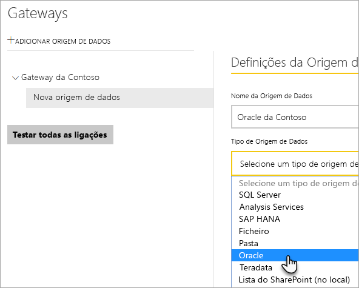
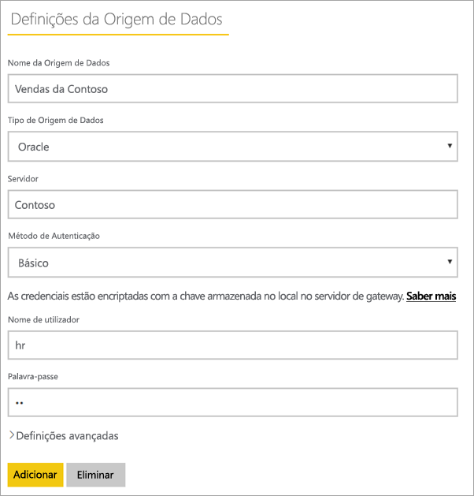
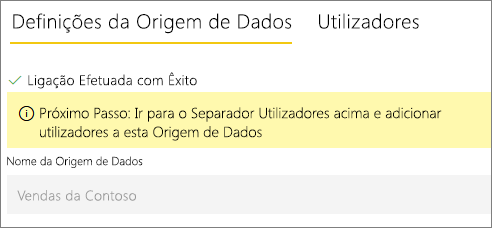
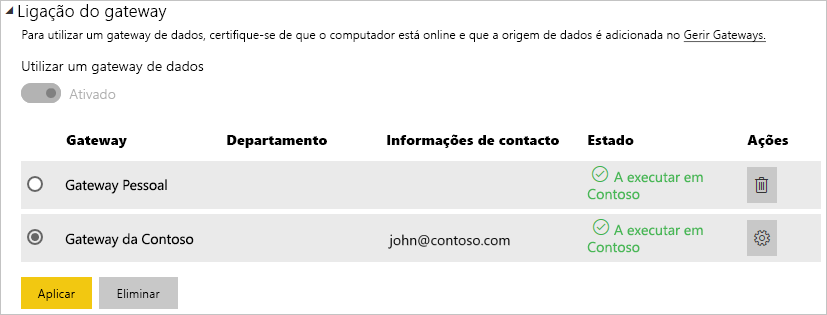

# Gerir a origem de dados – Oracle

[!INCLUDE [gateway-rewrite](../includes/gateway-rewrite.md)]

Depois de [instalar o gateway de dados no local](/data-integration/gateway/service-gateway-install), tem de [adicionar origens de dados](service-gateway-data-sources.md#add-a-data-source) que podem ser utilizadas com o gateway. Este artigo aborda como trabalhar com gateways e origens de dados do Oracle para uma atualização agendada ou para o DirectQuery.

## Ligar a uma base de dados Oracle
Para se ligar a uma base de dados do Oracle com o gateway de dados no local, tem de ser instalado o software cliente Oracle correto no computador que está a executar o gateway. O software cliente Oracle que utiliza depende da versão do servidor Oracle, mas irá corresponder sempre ao gateway de 64 bits.

Versões do Oracle suportadas: 
- Oracle Server 9 e posterior
- Software Oracle Data Access Client (ODAC) 11.2 e posterior

## Instalar o cliente Oracle
- [Transferir e instalar o cliente Oracle de 64 bits](https://www.oracle.com/database/technologies/odac-downloads.html).

> [!NOTE]
> Selecione uma versão do Oracle Data Access Client (ODAC) que seja compatível com o Oracle Server. Por exemplo, o ODAC 12.X nem sempre suporta a versão 9 do Oracle Server.
> Selecione o instalador do Windows do Cliente Oracle.
> Durante a configuração do cliente Oracle, certifique-se de que ativa a opção *Configurar ODP.NET e/ou Fornecedores Oracle para ASP.NET ao nível do computador* ao selecionar a caixa de verificação correspondente no assistente de configuração. Algumas versões do assistente do cliente Oracle selecionam a caixa de verificação por predefinição, outras não. Certifique-se de que a caixa de verificação está selecionada, para que o Power BI possa ligar-se à sua base de dados Oracle.
 
Após a instalação do cliente e a configuração adequada do ODAC, recomendamos que utilize o Power BI Desktop ou outro cliente de teste para verificar se instalou e configurou o Gateway corretamente.

## Adicionar uma origem de dados

Para obter mais informações sobre como adicionar uma origem de dados, veja [Adicionar uma origem de dados](service-gateway-data-sources.md#add-a-data-source). Em **Tipo de Origem de Dados**, selecione **Oracle**.

Após selecionar o tipo de origem de dados Oracle, preencha as informações **Servidor** e **Base de dados** referentes à origem de dados. 

Em **Método de Autenticação**, pode selecionar **Windows** ou **Básico**. Selecione **Básico** se quiser utilizar uma conta criada no Oracle em vez da autenticação do Windows. Em seguida, introduza as credenciais que serão utilizadas para esta origem de dados.

> [!NOTE]
> Todas as consultas à origem de dados serão executadas com estas credenciais. Para saber mais sobre a forma como as credenciais são armazenadas, veja [Armazenar credenciais encriptadas na cloud](service-gateway-data-sources.md#store-encrypted-credentials-in-the-cloud).

Depois de preencher todos os campos, selecione **Adicionar.** Agora, pode utilizar esta origem de dados para a atualização agendada ou o DirectQuery num servidor Oracle que esteja no local. Verá *Ligação Estabelecida com Êxito* se tiver êxito.

### Definições avançadas

Opcionalmente, pode configurar o nível de privacidade da sua origem de dados. Esta definição controla a forma como os dados podem ser combinados. É utilizada apenas para a atualização agendada. A definição do nível de privacidade não se aplica ao DirectQuery. Para saber mais sobre os níveis de privacidade da sua origem de dados, veja [Níveis de privacidade (Power Query)](https://support.office.com/article/Privacy-levels-Power-Query-CC3EDE4D-359E-4B28-BC72-9BEE7900B540).

## Utilizar a origem de dados

Depois de criar a origem de dados, esta fica disponível para utilização com as ligações do DirectQuery ou através da atualização agendada.

> [!WARNING]
> Os nomes do servidor e da base de dados têm de corresponder entre o Power BI Desktop e a origem de dados no gateway de dados no local.

A ligação entre o conjunto de dados e a origem de dados no gateway é baseada no nome do servidor e no nome da base de dados. Estes nomes têm de corresponder. Por exemplo, se fornecer um endereço IP ao nome do servidor, no Power BI Desktop, terá de utilizar o endereço IP para a origem de dados na configuração do gateway. Este nome também tem de corresponder ao alias definido no ficheiro tnsnames.ora. Para obter mais informações sobre o ficheiro tnsnames.ora, veja [Instalar o cliente Oracle](#install-the-oracle-client).

Este requisito aplica-se ao DirectQuery e à atualização agendada.

### Utilizar a origem de dados com ligações do DirectQuery

Certifique-se de que os nomes do servidor e da base de dados no Power BI Desktop e na origem de dados configurada para o gateway correspondem. Também terá de se certificar de que o utilizador está listado no separador **Utilizadores** da origem de dados para publicar conjuntos de dados do DirectQuery. Para o DirectQuery, a seleção ocorre no Power BI Desktop quando importa dados pela primeira vez. Para obter mais informações sobre como utilizar o DirectQuery, veja [Utilizar o DirectQuery no Power BI Desktop](desktop-use-directquery.md).

Depois de publicar, a partir do Power BI Desktop ou de **Obter Dados**, os seus relatórios devem começar a funcionar. Poderá demorar vários minutos, depois de criar a origem de dados no gateway, para a ligação ser utilizável.

### Utilizar a origem de dados com a atualização agendada

Se estiver listado no separador **Utilizadores** da origem de dados configurada no gateway e o nome do servidor e da base de dados corresponderem, verá o gateway como uma opção a utilizar com a atualização agendada.

## Resolução de problemas

Poderá deparar-se com vários erros do Oracle quando a sintaxe de nomenclatura estiver incorreta ou não estiver configurada corretamente:

* ORA-12154: TNS: não foi possível resolver o identificador de ligação especificado.
* ORA-12514: TNS: o serviço de escuta não conhece atualmente o serviço pedido no descritor de ligação.
* ORA-12541: TNS: nenhum serviço de escuta.
* ORA-12170: TNS: tempo limite da ligação excedido.
* ORA-12504: TNS: o serviço de escuta não foi atribuído a SERVICE_NAME em CONNECT_DATA.

Estes erros podem ocorrer se o cliente Oracle não estiver instalado ou se não estiver configurado corretamente. Se estiver instalado, certifique-se de que o ficheiro tnsnames.ora está configurado corretamente e está a utilizar o net_service_name adequado. Também terá de certificar-se de que o net_service_name é o mesmo entre o computador que está a utilizar o Power BI Desktop e o computador que está a executar o gateway. Para obter mais informações, veja [Instalar o cliente Oracle](#install-the-oracle-client).

Também poderá ocorrer um problema de compatibilidade entre a versão do servidor Oracle e a versão Oracle Data Access Client. Normalmente, pretende que estas versões correspondam, uma vez que algumas combinações são incompatíveis. Por exemplo, o ODAC 12.X não suporta a versão 9 do Oracle Server.

Para diagnosticar problemas de conectividade entre o servidor de origem de dados e o computador de gateway, recomendamos que instale um cliente (como o Power BI Desktop ou o Oracle ODBC Test) no computador de gateway. Pode utilizar o cliente para verificar a conectividade com o servidor de origem de dados.

Para obter informações adicionais de resolução de problemas relacionadas com o gateway, veja [Resolução de problemas do gateway de dados no local](/data-integration/gateway/service-gateway-tshoot).

## Próximos passos

* [Resolver problemas de gateways – Power BI](service-gateway-onprem-tshoot.md)
* [Power BI Premium](../admin/service-premium-what-is.md)

Mais perguntas? Experimente perguntar à [Comunidade do Power BI](https://community.powerbi.com/).
