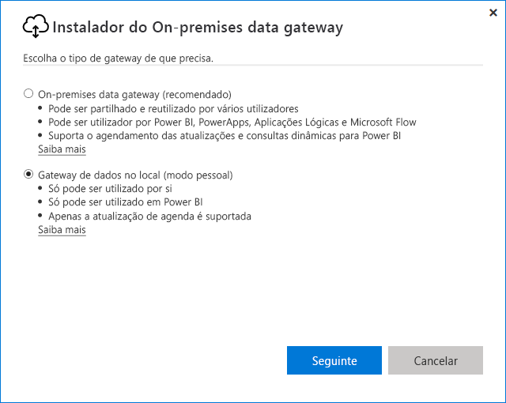

# <a name="use-personal-gateways-in-power-bi"></a>Utilizar gateways pessoais no Power BI

[!INCLUDE [gateway-rewrite](../includes/gateway-rewrite.md)]

O gateway de dados no local (modo pessoal) é uma versão do gateway de dados no local que só funciona com o Power BI. Pode utilizar um gateway pessoal para instalar um gateway no seu computador e obter acesso a dados no local.

> [!NOTE]
> Só pode ter um gateway de modo pessoal em execução para cada utilizador do Power BI. Se instalou outro gateway de modo pessoal para o mesmo utilizador, mesmo num computador diferente, a instalação mais recente substitui a instalação anterior.

## <a name="on-premises-data-gateway-vs-on-premises-data-gateway-personal-mode"></a>Gateway de dados no local vs. gateway de dados no local (modo pessoal)

A tabela seguinte descreve as diferenças entre um gateway de dados no local e um gateway de dados no local (modo pessoal).

|   |Gateway de dados no local | Gateway de dados no local (modo pessoal) |
| ---- | ---- | ---- |
|**Serviços na cloud suportados** |Power BI, PowerApps, Azure Logic Apps, Power Automate, Azure Analysis Services, fluxos de dados |Power BI |
|**Execuções** |Conforme configurado pelos utilizadores com acesso ao gateway |Conforme configurado pelo utilizador para autenticação do Windows e para outros tipos de autenticação |
|**Só é possível realizar instalações com privilégios de administrador do computador** |Sim |Não |
|**Gateway centralizado e gestão de origens de dados** |Sim |Não |
|**Importar dados e agendar atualização** |Sim |Sim |
|**Suporte para DirectQuery** |Sim |Não |
|**Suporte do LiveConnect para o Analysis Services** |Sim |Não |

## <a name="install-the-on-premises-data-gateway-personal-mode"></a>Instalar o gateway de dados no local (modo pessoal)

Para instalar o gateway de dados no local (modo pessoal):

1. [Transfira o gateway de dados no local](https://go.microsoft.com/fwlink/?LinkId=820925&clcid=0x409).

2. No instalador, selecione o gateway de dados no local (modo pessoal) e, em seguida, clique em **Seguinte**.

   

Os ficheiros do gateway são instalados em _"%localappdata%\Microsoft\On-premises data gateway (personal mode)_ . Após a instalação ser concluída com êxito e após iniciar sessão, verá o ecrã abaixo.


## <a name="use-fast-combine-with-the-personal-gateway"></a>Utilizar a opção de Combinação Rápida com o gateway pessoal

A Combinação Rápida num gateway pessoal ajuda-o a ignorar níveis de privacidade especificados ao executar consultas. Para ativar a Combinação Rápida para funcionar com o gateway de dados no local (modo pessoal):

1. No Explorador de Ficheiros, abra o ficheiro seguinte:

   `%localappdata%\Microsoft\On-premises data gateway (personal mode)\Microsoft.PowerBI.DataMovement.Pipeline.GatewayCore.dll.config`

2. Na parte inferior do ficheiro, adicione o seguinte texto:

    ```xml
    <setting name="EnableFastCombine" serializeAs="String">
       <value>true</value>
    </setting>
    ```

3. Após a conclusão, a definição entra em vigor em cerca de um minuto. Para verificar se está a funcionar corretamente, experimente uma atualização a pedido no serviço do Power BI para confirmar que a Combinação Rápida está a funcionar.

## <a name="frequently-asked-questions-faq"></a>Perguntas Frequentes (FAQ)

**Pergunta:** Posso executar o gateway de dados no local (modo pessoal) lado a lado com o gateway de dados no local (anteriormente conhecido como a versão Empresarial do gateway)?
  
**Resposta:** Sim, ambos os gateways podem ser executados em simultâneo.

**Pergunta:** Posso executar o gateway de dados no local (modo pessoal) como um serviço?
  
**Resposta:** Não. O gateway de dados no local (modo pessoal) só pode ser executado como uma aplicação. Se precisar de executar o gateway como um serviço ou no modo de administrador, terá de considerar o [gateway de dados no local](/data-integration/gateway/service-gateway-onprem) (anteriormente conhecido como o gateway Empresarial).

**Pergunta:** Com que frequência é atualizado o gateway de dados no local (modo pessoal)?
  
**Resposta:** Pretendemos atualizar o gateway pessoal mensalmente.

**Pergunta:** Por que razão é-me pedido para atualizar as minhas credenciais?
  
**Resposta:** Muitas situações podem desencadear um pedido de credenciais. A mais comum prende-se com o facto de ter instalado novamente o gateway de dados no local (modo pessoal) num computador diferente do gateway pessoal do Power BI. Também pode ser um problema na origem de dados e o Power BI não ter conseguido realizar uma ligação de teste, ter alcançado o tempo limite ou ocorrido um erro de sistema. Para atualizar as suas credenciais no serviço Power BI, selecione o ícone de engrenagem e selecione **Definições** > **Conjuntos de Dados**. Localize o conjunto de dados em questão e selecione **Credenciais da origem de dados**.

**Pergunta:** Quanto tempo estarão os meus gateways pessoais anteriores offline durante a atualização?
  
**Resposta:** Atualizar o gateway pessoal para a nova versão deve demorar apenas alguns minutos.

**Pergunta:** Estou a utilizar scripts R e Python. São suportados?
  
**Resposta:** Os scripts R e Python são suportados no modo pessoal.

## <a name="next-steps"></a>Próximos passos

* [Adicionar ou remover uma origem de dados do gateway](service-gateway-data-sources.md)
* [Configurar definições de proxy para o gateway de dados no local](/data-integration/gateway/service-gateway-proxy)  

Mais perguntas? Experimente perguntar à [Comunidade do Power BI](https://community.powerbi.com/).
