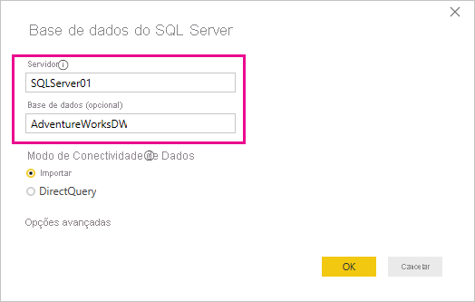
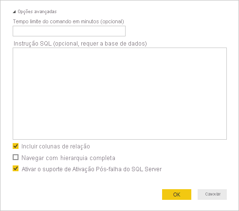
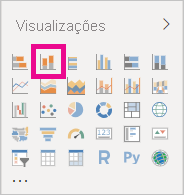
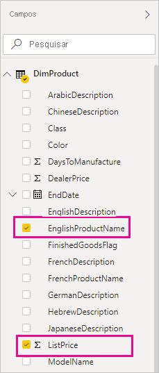
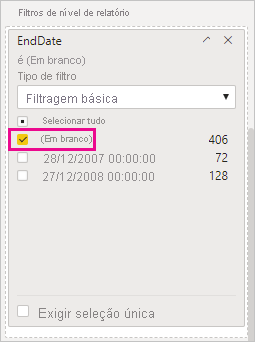
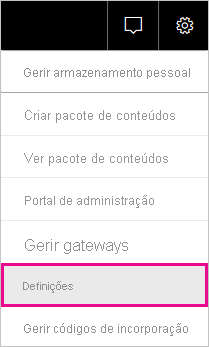
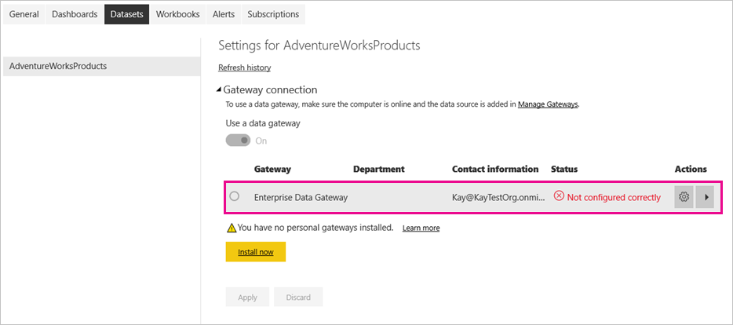
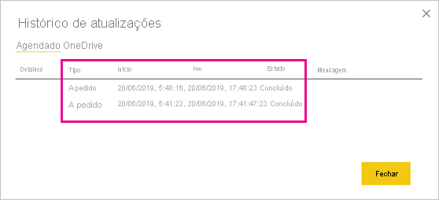

# <a name="refresh-data-from-an-on-premises-sql-server-database"></a>Atualizar dados de uma base de dados do SQL Server no local

Neste tutorial, irá explorar de que forma pode atualizar um conjunto de dados do Power BI proveniente de uma base de dados relacionais no local que está na sua rede local. Este tutorial utiliza uma base de dados do SQL Server de exemplo, a que o Power BI tem de aceder através de um gateway de dados no local.

Neste tutorial, irá concluir os seguintes passos:

> [!div class="checklist"]
> * Criar e publicar um ficheiro do Power BI Desktop (.pbix) que importe dados de uma base de dados do SQL Server no local.
> * Configurar as definições de origens e conjuntos de dados no Power BI para obter conectividade do SQL Server através de um gateway de dados.
> * Configurar uma data e uma hora de atualização para garantir que o seu conjunto de dados do Power BI tem dados recentes.
> * Efetuar uma atualização a pedido do seu conjunto de dados.
> * Rever o histórico de atualizações para analisar os resultados dos últimos ciclos de atualização.
> * Limpar recursos ao eliminar os artefactos criados neste tutorial.

## <a name="prerequisites"></a>Pré-requisitos

- Se ainda não tiver uma [versão de avaliação gratuita do Power BI](https://app.powerbi.com/signupredirect?pbi_source=web), inscreva-se numa antes de começar.
- [Instale o Power BI Desktop](https://powerbi.microsoft.com/desktop/) num computador local.
- [Instale o SQL Server](/sql/database-engine/install-windows/install-sql-server) num computador local e restaure a [base de dados de exemplo a partir de uma cópia de segurança](https://github.com/Microsoft/sql-server-samples/releases/download/adventureworks/AdventureWorksDW2017.bak). Para obter mais informações sobre a AdventureWorks, veja [AdventureWorks installation and configuration](/sql/samples/adventureworks-install-configure) (Instalação e configuração da AdventureWorks).
- [Instale um gateway de dados no local](service-gateway-onprem.md) no mesmo computador local do SQL Server (normalmente, na fase de produção, seria um computador diferente).

> [!NOTE]
> Se não for um administrador de gateways e não quiser instalar um gateway, contacte um administrador de gateways na sua organização. Este poderá criar a definição de origem de dados necessária para ligar o seu conjunto de dados à sua base de dados do SQL Server.

## <a name="create-and-publish-a-power-bi-desktop-file"></a>Criar e publicar um ficheiro do Power BI Desktop

Utilize o procedimento seguinte para criar um relatório básico do Power BI com a base de dados de exemplo AdventureWorksDW. Publique o relatório no serviço Power BI para obter um conjunto de dados no Power BI que poderá configurar e atualizar nos passos subsequentes.

1. No Power BI Desktop, no separador **Home Page**, selecione **Obter Dados** \> **SQL Server**.

2. Na caixa de diálogo **Base de dados do SQL Server**, introduza os nomes do **Servidor** e da **Base de dados (opcional)** , certifique-se de que o modo de **Conectividade de Dados** é **Importar** e, em seguida, selecione **OK**.

    

    Não estamos a utilizar as **Opções avançadas** neste tutorial, mas note que pode especificar uma instrução SQL e definir outras opções como utilizar a [Ativação Pós-falha do SQL Server](/sql/database-engine/availability-groups/windows/failover-clustering-and-always-on-availability-groups-sql-server).

    

3. Verifique as suas **credenciais** e, em seguida, selecione **Ligar**.

    > [!NOTE]
    > Se não conseguir efetuar a autenticação, certifique-se de que selecionou o método de autenticação correto e utilize uma conta com acesso de base de dados. Em ambientes de teste, poderá utilizar Autenticação de base de dados com um nome de utilizador e uma palavra-passe explícitos. Em ambientes de produção, é normalmente utilizada a autenticação do Windows. Veja o artigo [Resolver problemas de atualização](refresh-troubleshooting-refresh-scenarios.md) e contacte o seu administrador da base de dados para obter mais ajuda.

1. Se a caixa de diálogo **Suporte de Encriptação** for apresentada, selecione **OK**.

2. Na caixa de diálogo **Navegador**, selecione a tabela **DimProduct** e, em seguida, selecione **Carregar**.

    

3. Na vista **Relatório** do Power BI Desktop, no painel **Visualizações**, selecione o **Gráfico de colunas empilhadas**.

    

4. Com o gráfico de colunas selecionado na tela do relatório, no painel **Campos**, selecione os campos **EnglishProductName** e **ListPrice**.

    

5. Arraste a **EndDate** para **Filtros de nível de relatório** e, em **Filtragem básica**, selecione apenas a caixa de verificação de **(Vazio)** .

    

    O gráfico deverá passar a ter este aspeto.

    

    Repare que os cinco produtos **Road-250** têm o preço mais elevado da lista. Esta situação irá mudar quando atualizar os dados e atualizar o relatório numa fase posterior deste tutorial.

6. Guarde o relatório com o nome "ProdutosAdventureWorks.pbix".

7. No separador **Home Page**, selecione **Publicar** \> **A Minha Área de Trabalho** \> **Selecionar**. Caso lhe seja solicitado, inicie sessão no serviço Power BI.

8. No ecrã **Com êxito**, selecione **Abrir "ProdutosAdventureWorks.pbix" no Power BI**.

    [Publicar no Power BI](./media/service-gateway-sql-tutorial/publish-to-power-bi.png)

## <a name="connect-a-dataset-to-a-sql-server-database"></a>Ligar um conjunto de dados a uma base de dados do SQL Server

No Power BI Desktop, ligou diretamente à sua base de dados do SQL Server no local, mas o serviço Power BI exige um gateway de dados que sirva de ponte entre a cloud e a sua rede no local. Siga estes passos para adicionar a sua base de dados do SQL Server no local como uma origem de dados a um gateway e, em seguida, ligue o seu conjunto de dados a esta origem de dados.

1. Inicie sessão no Power BI. No canto superior direito, selecione o ícone de engrenagem das definições e, em seguida, selecione **Definições**.

    

2. No separador **Conjuntos de dados**, selecione o conjunto de dados **ProdutosAdventureWorks** para poder ligar à sua base de dados do SQL Server no local através de um gateway de dados.

3. Expanda a **Ligação de gateway** e certifique-se de que está listado pelo menos um gateway. Se não tiver um gateway, veja a secção [Pré-requisitos](#prerequisites) apresentada anteriormente neste tutorial para obter uma ligação para a documentação de produto que explica como instalar e configurar um gateway.

    

4. Em **Ações**, expanda o botão de alternar para ver as origens de dados e selecione a ligação **Adicionar a um gateway**.

    

    > [!NOTE]
    > Se não for um administrador de gateways e não quiser instalar um gateway, contacte um administrador de gateways na sua organização. Este poderá criar a definição de origem de dados necessária para ligar o seu conjunto de dados à sua base de dados do SQL Server.

5. Na página de gestão **Gateways**, no separador **Definições da Origem de Dados**, introduza e verifique as seguintes informações e selecione **Adicionar**.

    | Opção | Value |
    | --- | --- |
    | Nome da Origem de Dados | ProdutosAdventureWorks |
    | Tipo de Origem de Dados | SQL Server |
    | Servidor | O nome da sua instância do SQL Server, como SQLServer01 (tem de ser idêntico ao que especificou no Power BI Desktop). |
    | Base de dados | O nome da sua base de dados do SQL Server, como AdventureWorksDW (tem de ser idêntico ao que especificou no Power BI Desktop). |
    | Método de Autenticação | Básico ou do Windows (normalmente, é o do Windows). |
    | Nome de Utilizador | A conta de utilizador que utiliza para ligar ao SQL Server. |
    | Password | A palavra-passe da conta que utiliza para ligar ao SQL Server. |

    

6. No separador **Conjuntos de dados**, expanda novamente a secção **Ligação do gateway**. Selecione o gateway de dados que configurou, que apresenta um **Estado** de execução no computador em que o instalou e selecione **Aplicar**.

    

## <a name="configure-a-refresh-schedule"></a>Configurar um agendamento de atualização

Agora que já ligou o seu conjunto de dados no Power BI à sua base de dados do SQL Server no local através de um gateway de dados, siga estes passos para configurar um agendamento de atualização. A atualização agendada do seu conjunto de dados ajuda a garantir que os seus relatórios e dashboards têm os dados mais recentes.

1. No painel de navegação, abra **A Minha Área de Trabalho** \> **Conjuntos de dados**. Selecione as reticências ( **. . .** ) do conjunto de dados **ProdutosAdventureWorks** e, em seguida, selecione **Agendar atualização**.

    > [!NOTE]
    > Certifique-se de que seleciona as reticências do conjunto de dados **ProdutosAdventureWorks** e não as reticências do relatório com o mesmo nome. O menu de contexto do relatório **ProdutosAdventureWorks** não inclui uma opção **Agendar atualização**.

2. Na secção **Atualização agendada**, em **Manter os dados atualizados**, defina a atualização para **Ativa**.

3. Selecione a **Frequência de atualização** mais adequada (**Diariamente**, neste exemplo) e, em seguida, em **Hora**, selecione **Adicionar outra hora** para especificar a hora de atualização pretendida (6:30 e 18:30, neste exemplo).

    

    > [!NOTE]
    > Pode configurar até 8 intervalos de tempo diários se o conjunto de dados estiver na capacidade partilhada ou 48 intervalos de tempo no Power BI Premium.

4. Deixe a caixa de verificação **Enviar-me notificação de falha de atualização por e-mail** selecionada e selecione **Aplicar**.

## <a name="perform-an-on-demand-refresh"></a>Efetuar uma atualização a pedido

Agora que configurou um agendamento de atualização, o Power BI irá atualizar o seu conjunto de dados na próxima hora agendada, com uma margem de 15 minutos. Se quiser atualizar os dados mais cedo, como para testar a configuração do gateway e da origem de dados, efetue uma atualização a pedido com a opção **Atualizar Agora** no menu do conjunto de dados no painel de navegação. As atualizações a pedido não afetam a hora de atualização agendada seguinte, mas contam para o limite diário de atualizações, mencionado na secção anterior.

Para fins de exemplificação, simule uma alteração aos dados de exemplo ao atualizar a tabela DimProduct na base de dados AdventureWorksDW com o SQL Server Management Studio (SSMS).

```sql

UPDATE [AdventureWorksDW].[dbo].[DimProduct]
SET ListPrice = 5000
WHERE EnglishProductName ='Road-250 Red, 58'

```

Agora, siga estes passos, para que os dados atualizados possam passar pela ligação do gateway para o conjunto de dados e os relatórios no Power BI.

1. No Serviço Power BI, no painel de navegação, selecione e expanda **A Minha Área de Trabalho**.

2. Em **Conjuntos de dados**, no conjunto de dados **ProdutosAdventureWorks**, selecione as reticências ( **. . .** ) e, em seguida, selecione **Atualizar agora**.

    

    Observe o canto superior direito e repare que o Power BI se está a preparar para realizar a atualização pedida.

3. Selecione **A Minha Área de Trabalho \> Relatórios \> ProdutosAdventureWorks**. Veja a forma como os dados atualizados passaram e observe que, agora, o produto com o preço mais elevado na lista é **Road-250 Red, 58**.

    

## <a name="review-the-refresh-history"></a>Rever o histórico de atualizações

É recomendada a verificação periódica dos resultados de ciclos de atualização anteriores no histórico de atualizações. As credenciais da base de dados podem ter expirado ou o gateway selecionado pode ter estado offline quando uma atualização agendada devia ter sido realizada. Siga estes passos para examinar o histórico de atualizações e verificar a existência de problemas.

1. No canto superior direito da interface de utilizador do Power BI, selecione o ícone de engrenagem das definições e, em seguida, selecione **Definições**.

2. Mude para **Conjuntos de dados** e selecione o conjunto de dados que pretende examinar, como **ProdutosAdventureWorks**.

3. Selecione a ligação **Histórico de atualizações** para abrir a caixa de diálogo **Histórico de atualizações**.

    

4. No separador **Agendado**, veja as últimas atualizações agendadas e a pedido com as suas horas de **Início** e **Fim** e o **Estado** **Concluído**, que indica que o Power BI realizou as atualizações com êxito. No caso das atualizações que falharam, poderá ver as mensagens de erro e examinar os detalhes dos erros.

    

    > [!NOTE]
    > O separador OneDrive só é relevante para conjuntos de dados ligados a ficheiros do Power BI Desktop, livros do Excel ou ficheiros CSV no OneDrive ou SharePoint Online, como é explicado mais detalhadamente em [Atualização de dados no Power BI](refresh-data.md).

## <a name="clean-up-resources"></a>Limpar recursos

Se já não quiser utilizar os dados de exemplo, elimine a base de dados do SQL Server Management Studio (SSMS). Se não quiser utilizar a origem de dados do SQL Server, remova a origem de dados do seu gateway de dados. Pondere a desinstalação do gateway de dados se o tiver instalado apenas para este tutorial. Também deve eliminar o conjunto de dados ProdutosAdventureWorks e o relatório ProdutosAdventureWorks que o Power BI criou quando carregou o ficheiro ProdutosAdventureWorks.pbix.

## <a name="next-steps"></a>Próximas etapas

Neste tutorial, descobriu como pode importar dados de uma base de dados do SQL Server no local para um conjunto de dados do Power BI e como pode atualizar este conjunto de dados de forma agendada e a pedido para manter os relatórios e dashboards que utilizam este conjunto de dados atualizados no Power BI. Agora, pode saber mais sobre a gestão de gateways de dados e origens de dados no Power BI. Também é recomendado rever o artigo conceptual Atualização de dados no Power BI.

- [Gerir um gateway de dados no local](/data-integration/gateway/service-gateway-manage)
- [Gerir a origem de dados – Atualização Importada/Agendada](service-gateway-enterprise-manage-scheduled-refresh.md)
- [Atualização de dados no Power BI](refresh-data.md)
