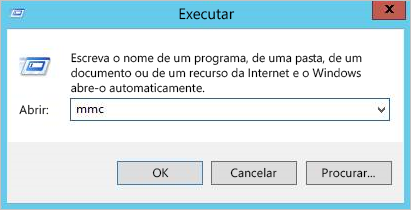
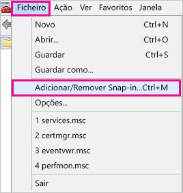
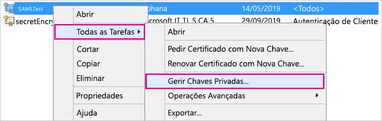
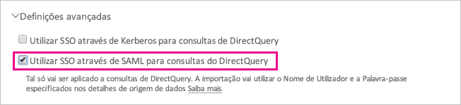

# <a name="use-security-assertion-markup-language-saml-for-sso-from-power-bi-to-on-premises-data-sources"></a>Utilizar o formato SAML (Security Assertion Markup Language) para SSO do Power BI em origens de dados no local

Ativar o SSO facilita a atualização de dados de origens no local em relatórios e dashboards do Power BI, ao mesmo tempo que respeita as permissões ao nível do utilizador configuradas nestas origens. Utilize o formato [SAML (Security Assertion Markup Language)](https://www.onelogin.com/pages/saml) para permitir uma conectividade de início de sessão único totalmente integrado. 

## <a name="supported-data-sources"></a>Supported data sources (Origens de dados suportadas)

Atualmente, suportamos a plataforma SAP HANA com SAML. Para obter mais informações sobre como configurar o início de sessão único na plataforma SAP HANA com SAML, veja [SAML SSO for BI Platform to HANA](https://wiki.scn.sap.com/wiki/display/SAPHANA/SAML+SSO+for+BI+Platform+to+HANA) (SSO do SAML entre a Plataforma de BI e HANA).

Suportamos origens de dados adicionais com o [Kerberos](service-gateway-sso-kerberos.md) (incluindo SAP HANA).

Para o SAP HANA, é recomendado ativar a encriptação antes de estabelecer uma ligação SSO do SAML. Para ativar a encriptação, configure o servidor HANA para aceitar ligações encriptadas e configurar o gateway para utilizar a encriptação para comunicar com o servidor HANA. Como o controlador ODBC do HANA não encripta asserções do SAML por predefinição, a asserção do SAML assinada é enviada do gateway para o servidor HANA *com luz verde* e está vulnerável à interceção e reutilização por terceiros.

> [!IMPORTANT]
> O SAP já não suporta o OpenSSL. Como resultado, a Microsoft também descontinuou o respetivo suporte. As ligações novas e existentes continuarão a funcionar até ao final de 2020, mas deixarão de funcionar a partir de 1 de janeiro de 2021. Utilize a biblioteca CommonCryptoLib.

## <a name="configuring-the-gateway-and-data-source"></a>Configurar o gateway e a origem de dados

Para utilizar o SAML, tem de estabelecer uma relação de confiança entre os servidores HANA para os quais quer ativar o SSO e o gateway. Neste cenário, o gateway serve de Fornecedor de Identidade (IdP) do SAML. Existem várias formas de estabelecer esta relação. O SAP recomenda utilizar a Biblioteca Criptográfica SAP (também conhecida como CommonCryptoLib ou sapcrypto) para concluir os passos de configuração em que estabelecemos a relação de confiança. Para obter mais informações, veja a documentação do SAP oficial.

Os seguintes passos descrevem como estabelecer uma relação de confiança entre um servidor HANA e o IdP do gateway ao assinar o certificado X509 do IdP do gateway com uma AC de Raiz considerada de confiança pelo servidor HANA. 

### <a name="create-the-certificates"></a>Criar os certificados

Siga os seguintes passos para criar os certificados:

1. No dispositivo que está a executar o SAP HANA, crie uma pasta vazia para armazenar os seus certificados e, em seguida, navegue para essa pasta.
2. Crie os certificados de raiz ao executar o seguinte comando:

   ```
   openssl req -new -x509 -newkey rsa:2048 -days 3650 -sha256 -keyout CA_Key.pem -out CA_Cert.pem -extensions v3_ca'''
   ```

    Tem de memorizar a frase de acesso para utilizar este certificado para assinar outros certificados.
    Os ficheiros *CA_Cert.pem* e *CA_Key.pem* serão criados.

   
3. Crie os certificados de IdP ao executar o seguinte comando:
 
    ```
    openssl req -newkey rsa:2048 -days 365 -sha256 -keyout IdP_Key.pem -out IdP_Req.pem -nodes
    ```
    Os ficheiros *IdP_Key.pem* e *IdP_Req.pem* serão criados.

4. Assine os certificados de IdP com os certificados de raiz:

    ```
    openssl x509 -req -days 365 -in IdP_Req.pem -sha256 -extensions usr_cert -CA CA_Cert.pem -CAkey CA_Key.pem -CAcreateserial -out IdP_Cert.pem
    ```
    Os ficheiros *CA_Cert.srl* e *IdP_Cert.pem* serão criados.
    Estamos preocupados apenas com o *IdP_Cert.pem* .    

### <a name="create-saml-identity-provider-certificate-mapping"></a>Criar o mapeamento de certificados do fornecedor de identidade SAML

Crie o mapeamento de certificados do fornecedor de identidade SAML ao seguir os seguintes passos.

1. No **SAP HANA Studio** , clique com o botão direito do rato no nome do servidor SAP HANA e, em seguida, navegue para **Security > Open Security Console > SAML Identity Provider** (Segurança > Abrir Consola de Segurança > Fornecedor de Identidade SAML).
2. Se a Biblioteca Criptográfica SAP não estiver selecionada, selecione-a. *Não* utilize a Biblioteca Criptográfica OpenSSL (a seleção à esquerda, na seguinte imagem), pois foi descontinuada pelo SAP.

    

3. Importe o certificado assinado *IdP_Cert.pem* ao clicar no botão para importar azul, apresentado na imagem seguinte.

    

Lembre-se de atribuir um nome ao *Nome do Fornecedor de Identidade* .

### <a name="import-and-create-the-signed-certificates-in-hana"></a>Importar e criar os certificados assinados no HANA

Em seguida, irá importar e criar os certificados assinados no HANA. Siga estes passos:

1. No **HANA Studio** , execute a consulta seguinte:

    ```
    CREATE CERTIFICATE FROM '<idp_cert_pem_certificate_content>'
    ```
    
    Eis um exemplo:

    ```
    CREATE CERTIFICATE FROM
    '-----BEGIN CERTIFICATE-----
    MIIDyDCCArCgA...veryLongString...0WkC5deeawTyMje6
    -----END CERTIFICATE-----
    '
    ```

2. Se não existir um PSE com SAML, crie um ao executar a seguinte consulta no **HANA Studio** :
    
    ```
    CREATE PSE SAMLCOLLECTION;<br>set pse SAMLCOLLECTION purpose SAML;<br>
    ```

3. Adicione o certificado assinado criado recentemente ao PSE com o seguinte comando:

    ```
    alter pse SAMLCOLLECTION add CERTIFICATE <certificate_id>;
    ```

    Por exemplo:
    ```
    alter pse SAMLCOLLECTION add CERTIFICATE 1978320;
    ```

    Pode verificar a lista de certificados criados com a seguinte consulta:
    ```
    select * from PUBLIC"."CERTIFICATES"
    ```

    O certificado está agora instalado corretamente. Pode executar a seguinte consulta para confirmar:
    ```
    select * from "PUBLIC"."PSE_CERTIFICATES"
    ```

### <a name="map-the-user"></a>Mapear o utilizador

Siga estes passos para mapear o utilizador:

1. No **SAP HANA Studio** , selecione a pasta **Security** (Segurança):

    

2. Expanda a secção **Users** (Utilizadores) e, em seguida, selecione o utilizador ao qual pretende mapear o utilizador do Power BI.

3. Selecione a caixa de verificação **SAML** e, em seguida, selecione **Configure** (Configurar), realçado na imagem seguinte.

    

4. Selecione o fornecedor de identidade que criou na secção [Criar o mapeamento de certificados do fornecedor de identidade SAML](#create-saml-identity-provider-certificate-mapping), anteriormente neste artigo. Em External Identity (Identidade Externa), introduza o UPN do utilizador do Power BI (normalmente, o endereço de e-mail com o qual o utilizador inicia sessão no Power BI) e selecione **Add** (Adicionar).  A imagem seguinte mostra as opções e seleções.

    

    Se tiver configurado o gateway para utilizar a opção de configuração *ADUserNameReplacementProperty* , introduza o valor que irá substituir o UPN original do utilizador do Power BI. Por exemplo, se definir *ADUserNameReplacementProperty* como *SAMAccountName* , introduza o atributo *SAMAccountName* do utilizador.

### <a name="configure-the-gateway"></a>Configurar o gateway

Agora que configurou o certificado e a identidade do gateway, converta o certificado num formato pfx e configure o gateway para utilizar o certificado ao seguir os seguintes passos.

1. Converta o certificado no formato pfx ao executar o seguinte comando. Este comando atribui o nome samlcert.pfx ao ficheiro .pfx resultante e define *root* como a respetiva palavra-passe:

    ```
    openssl pkcs12 -export -out samltest.pfx -in IdP_Cert.pem -inkey IdP_Key.pem -passin pass:root -passout pass:root
    ```

2. Copie o ficheiro pfx para a máquina do gateway:

    1. Faça duplo clique no *samltest.pfx* e, em seguida, selecione **Computador Local** > **Seguinte** .

    2. Introduza a palavra-passe e, em seguida, selecione **Next** (Seguinte).

    3. Selecione **Colocar todos os certificados no seguinte arquivo** e, em seguida, selecione **Procurar** > **Pessoal** > **OK** .

    4. Selecione **Seguinte** e, em seguida, **Concluir** .

       

3. Permita que a conta do serviço de gateway aceda à chave privada do certificado, com os seguintes passos:

    1. Na máquina do gateway, execute a Consola de Gestão da Microsoft (MMC).

        

    2. Em **Ficheiro** , selecione **Adicionar/Remover Snap-in** .

        

    3. Selecione **Certificados** > **Adicionar** e, em seguida, selecione **Conta do computador** > **Seguinte** .

    4. Selecione **Computador Local** > **Concluir** > **OK** .

    5. Expanda a secção **Certificados** > **Certificados** > **Pessoal** e procure o certificado.

    6. Clique com o botão direito do rato no certificado e navegue até **Todas as Tarefas** &gt; **Gerir Chaves Privadas** .

        

    1. Adicione a conta do serviço de gateway à lista. Por predefinição, a conta é **NT SERVICE\PBIEgwService** . Pode descobrir a conta que está a executar o serviço de Gateway ao executar **services.msc** e ao localizar o **Serviço de gateway de dados no local** .

        

Por fim, siga estes passos para adicionar o thumbprint do certificado à configuração do gateway:

1. Execute o seguinte comando do PowerShell para listar os certificados no seu computador:

    ```powershell
    Get-ChildItem -path cert:\LocalMachine\My
    ```

2. Copie o thumbprint para o certificado que criou.

3. Navegue até ao diretório do gateway que, por predefinição, é *C:\Programas\On-premises data gateway* .

4. Abra o *PowerBI.DataMovement.Pipeline.GatewayCore.dll.config* e localize a secção *SapHanaSAMLCertThumbprint* . Cole o thumbprint que copiou.

5. Reinicie o serviço de gateway.

## <a name="running-a-power-bi-report"></a>Executar um relatório do Power BI

Agora, pode utilizar a página **Gerir Gateways** no Power BI para configurar a origem de dados do SAP HANA. Em **Definições Avançadas** , ative o SSO via SAML. Assim, pode publicar relatórios e conjuntos de dados vinculados a essa origem de dados.

   

## <a name="troubleshooting"></a>Resolução de problemas

Depois de configurar o SSO baseado no SAML, poderá ver o seguinte erro no portal do Power BI: *Não pode utilizar as credenciais disponibilizadas para a origem SapHana.* Este erro indica que a credencial SAML foi rejeitada pelo SAP HANA.

Os rastreios de autenticação do lado do servidor proporcionam informações detalhadas para a resolução de problemas de credenciais no SAP HANA. Siga estes passos para configurar o rastreio para o seu servidor SAP HANA:

1. No servidor SAP HANA, ative o rastreio de autenticação ao executar a seguinte consulta:

    ```
    ALTER SYSTEM ALTER CONFIGURATION ('indexserver.ini', 'SYSTEM') set ('trace', 'authentication') = 'debug' with reconfigure 
    ```

1. Reproduza o problema.

1. No HANA Studio, abra a consola de administração e selecione o separador **Ficheiros de Diagnóstico** .

1. Abra o rastreio do servidor de índice mais recente e procure *SAMLAuthenticator.cpp* .

    Deve encontrar uma mensagem de erro detalhada que indica a causa raiz, por exemplo:

    ```
    [3957]{-1}[-1/-1] 2018-09-11 21:40:23.815797 d Authentication   SAMLAuthenticator.cpp(00091) : Element '{urn:oasis:names:tc:SAML:2.0:assertion}Assertion', attribute 'ID': '123123123123123' is not a valid value of the atomic type 'xs:ID'.
    [3957]{-1}[-1/-1] 2018-09-11 21:40:23.815914 i Authentication   SAMLAuthenticator.cpp(00403) : No valid SAML Assertion or SAML Protocol detected
    ```

1. Depois de a resolução de problemas estar concluída, desative o rastreio de autenticação ao executar a seguinte consulta:

    ```
    ALTER SYSTEM ALTER CONFIGURATION ('indexserver.ini', 'SYSTEM') UNSET ('trace', 'authentication');
    ```

## <a name="next-steps"></a>Próximos passos

Para obter mais informações sobre o gateway de dados no local e o DirectQuery, veja os seguintes recursos:

* [What is an on-premises data gateway?](/data-integration/gateway/service-gateway-onprem) (O que é um gateway de dados no local?)
* [DirectQuery no Power BI](desktop-directquery-about.md)
* [Origens de dados suportadas pelo DirectQuery](power-bi-data-sources.md)
* [DirectQuery and SAP HANA](desktop-directquery-sap-bw.md) (DirectQuery e SAP HANA)
* [DirectQuery and SAP HANA](desktop-directquery-sap-hana.md) (DirectQuery e SAP HANA)