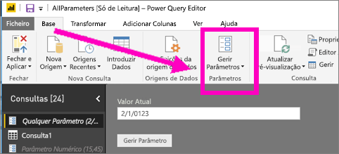
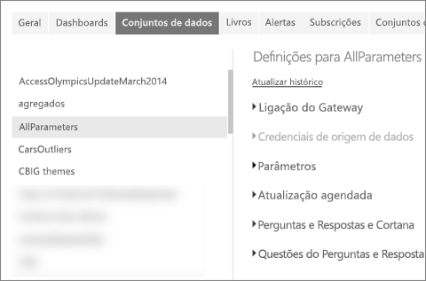
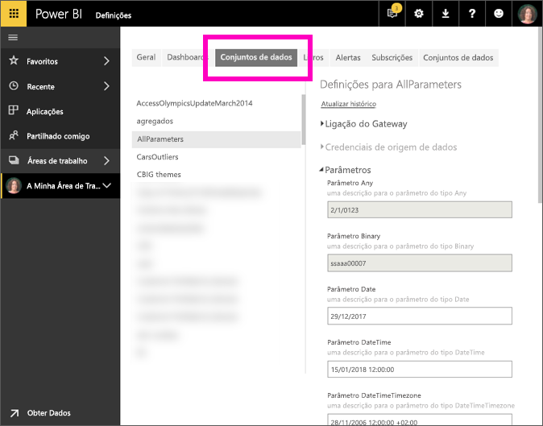

# Editar definições de parâmetro no serviço Power BI
Os criadores de relatórios adicionam parâmetros de consulta aos relatórios no Power BI Desktop. Os parâmetros permitem-lhes fazer com que certas partes dos relatórios dependam de um ou mais *valores* de parâmetro. Por exemplo, um criador de relatórios pode criar um parâmetro que restrinja os dados a um único país/região ou um parâmetro que defina os formatos de campo aceitáveis, tais como datas, hora e texto.

## Rever e editar parâmetros no serviço Power BI

Como criador de relatórios, pode definir parâmetros no Power BI Desktop. Quando [publicar esse relatório no serviço Power BI](../create-reports/desktop-upload-desktop-files.md), as definições de parâmetro e seleções também serão movidas. Pode rever e editar definições de parâmetros no serviço Power BI, mas não pode criá-las.

1. No serviço Power BI, selecione o ícone de engrenagem  para abrir as **Definições**.

2. Selecione o separador **Conjuntos de Dados** e realce um conjunto de dados na lista. 
    
    

3. Expanda a secção **Parâmetros**.  Se o conjunto de dados selecionado não tiver parâmetros, verá uma mensagem com uma ligação para Saber mais sobre parâmetros de consulta. Se o conjunto de dados tiver parâmetros, expandir a secção **Parâmetros** irá revelá-los. 

    

    Reveja as definições de parâmetros e faça alterações, se necessário. Os campos a cinzento não são editáveis. 

## Próximas etapas
Uma forma ad-hoc de adicionar parâmetros simples é ao [modificar o URL](../collaborate-share/service-url-filters.md).
