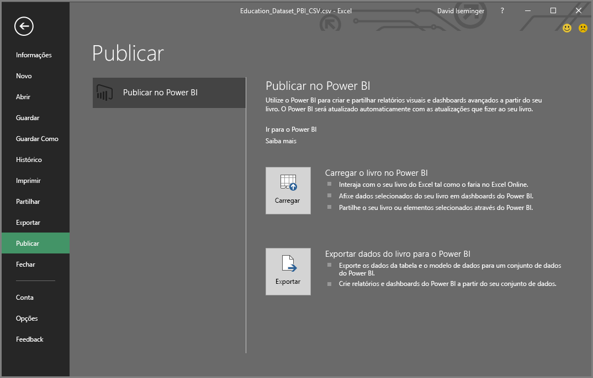
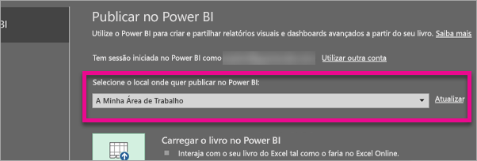
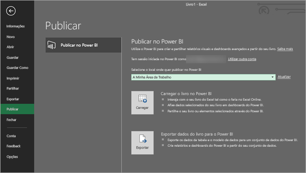
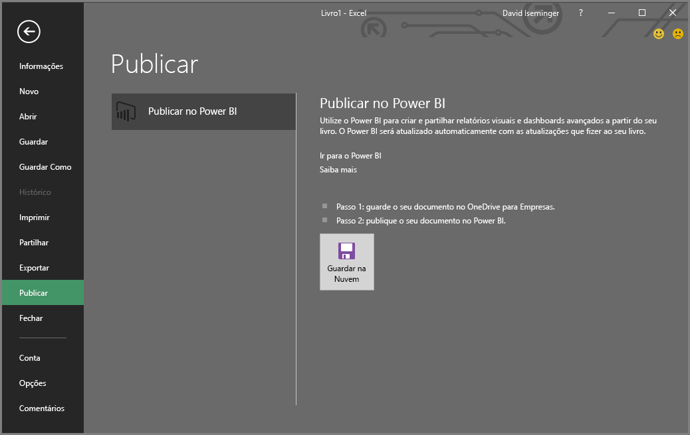
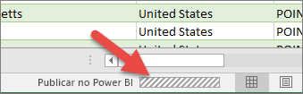

# Publicar no Power BI a partir do Microsoft Excel
Com o Microsoft Excel 2016 e versões posteriores, pode publicar livros do Excel diretamente na área de trabalho do [Power BI](https://powerbi.microsoft.com), na qual pode criar relatórios e dashboards altamente interativos com base nos dados do livro. Em seguida, pode partilhar ideias com outras pessoas na organização.

Ao publicar um livro no Power BI, há algumas coisas a ter em consideração:

* A conta utilizada para entrar no Office, no OneDrive para Empresas (se estiver a utilizar livros aí guardados) e no Power BI tem de ser a mesma.
* Não pode publicar livros vazios nem livros que não tenham conteúdo suportado pelo Power BI.
* Não é possível publicar livros encriptados ou protegidos por palavra-passe nem livros com Gestão de Proteção de Informação.
* A publicação no Power BI exige a ativação de uma autenticação moderna (padrão). Se estiver desativada, a opção Publicar não estará disponível no menu Ficheiro.

## Publicar o livro do Excel
Para publicar o livro do Excel, no Excel, selecione **Ficheiro** > **Publicar** e, em seguida, **Carregar** ou **Exportar**.

Se **Carregar** o livro no Power BI, poderá interagir com o livro tal como o faria ao utilizar o Excel Online. Também pode afixar seleções do livro nos dashboards do Power BI, bem como partilhar o livro ou elementos selecionados através do Power BI.

Se selecionar **Exportar**, poderá exportar dados de tabelas e o modelo de dados para um conjunto de dados do Power BI, que poderá utilizar para criar relatórios e dashboards do Power BI.

### Publicação de ficheiros locais
O Excel suporta a publicação de ficheiros do Excel locais. Não têm de ser guardados no OneDrive para Empresas ou no SharePoint Online.

> [!IMPORTANT]
> Só poderá publicar ficheiros locais se estiver a utilizar o Excel 2016 (ou posterior) com uma subscrição do Office 365. As instalações autónomas do Excel 2016 podem Publicar no Power BI, mas apenas quando o livro tiver sido guardado no OneDrive para Empresa ou no SharePoint Online.
> 

Ao selecionar **Publicar**, pode selecionar a área de trabalho na qual quer publicar. Se o seu ficheiro do Excel residir no OneDrive para Empresas, só poderá publicar em *A minha Área de Trabalho*. Se o seu ficheiro do Excel residir numa unidade local, pode publicar em *A minha Área de Trabalho* ou numa área de trabalho partilhada à qual tenha acesso.

Existem duas opções para inserir o livro no Power BI.

Uma vez publicado, o conteúdo do livro que publica é importado para o Power BI, em separado do ficheiro local. Se quiser atualizar o ficheiro no Power BI, terá de voltar a publicar a versão atualizada ou poderá atualizar os dados ao configurar uma atualização programada no livro ou no conjunto de dados no Power BI.

### Publicar a partir de uma instalação autónoma do Excel
Ao publicar a partir de uma instalação autónoma do Excel, o livro tem de ser guardado no OneDrive para Empresas. Clique em **Guardar na Cloud** e selecione um local no OneDrive para Empresas.

Assim que o livro for guardado no OneDrive para Empresas, ao selecionar **Publicar**, terá duas opções para inserir o livro no Power BI, **Carregar** ou **Exportar**:

#### Carregar o livro no Power BI
Ao escolher a opção **Carregar**, o livro será apresentado no Power BI, exatamente como apareceria no Excel Online. Mas, ao contrário do Excel Online, terá algumas opções que lhe permitem afixar elementos das folhas de cálculo nos dashboards.

Não é possível editar o livro no Power BI. Se precisar de fazer alterações aos dados, poderá selecionar **Editar** e, em seguida, escolher a opção para editar o livro no Excel Online ou abri-lo no Excel no computador. Todas as alterações feitas são guardadas no livro no OneDrive para Empresas.

Ao escolher **Carregar**, não é criado qualquer conjunto de dados no Power BI. O livro será apresentado em Relatórios, no painel de navegação da área de trabalho. Os livros carregados no Power BI têm um ícone especial do Excel, que os identifica como livros do Excel carregados.

Escolha a opção **Carregar** se tiver apenas dados em folhas de cálculo ou se quiser ver Tabelas Dinâmicas e Gráficos no Power BI.

No Excel, a utilização da opção Carregar em Publicar no Power BI é uma experiência semelhante a **Obter Dados > Ficheiro > OneDrive para Empresas > Ligar, Gerir e Ver o Excel no Power BI**, a partir do Power BI no browser.

#### Exportar dados do livro para o Power BI
Ao escolher a opção **Exportar**, todos os dados suportados em tabelas e/ou num modelo de dados são exportados para um novo conjunto de dados no Power BI. Todas as folhas do Power View existentes no livro são recriadas no Power BI como relatórios.

É possível continuar a editar o livro. Quando as alterações forem guardadas, serão sincronizadas com o conjunto de dados no Power BI, geralmente, em menos de uma hora. Se precisar de atualizações mais imediatas, poderá selecionar **Publicar** novamente no Excel para as alterações serem exportadas imediatamente. As visualizações nos relatórios e nos dashboards também serão atualizadas.

Escolha a opção **Publicar** caso tenha utilizado as funcionalidades Obter e Transformar dados ou o Power Pivot para carregar dados num modelo de dados ou se o livro tiver folhas de cálculo do Power View com visualizações que quer ver no Power BI.

A utilização da opção **Exportar** é muito semelhante à utilização de **Obter Dados > Ficheiro > OneDrive para Empresas > Exportar dados do Excel para o Power BI**, a partir do Power BI no browser.

## Publicar
Quando escolhe uma destas opções, o Excel inicia sessão no Power BI com a sua conta atual e, em seguida, publica o livro na área de trabalho do Power BI. Pode monitorizar a barra de estado no Excel para ver o progresso da publicação.

Quando estiver concluída, pode aceder ao Power BI diretamente do Excel.

## Próximos passos
[Dados do Excel no Power BI](service-excel-workbook-files.md)  
Mais perguntas? [Pergunte à Comunidade do Power BI](https://community.powerbi.com/)

