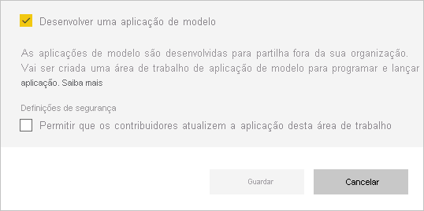
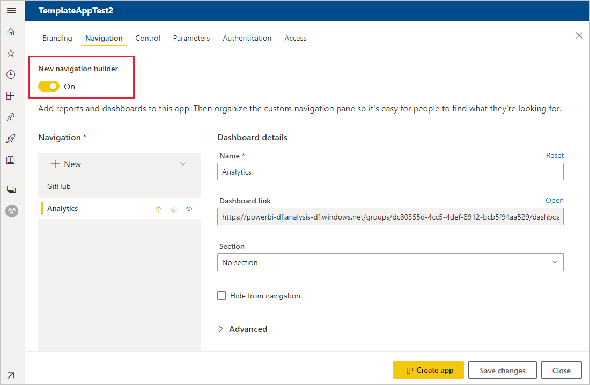
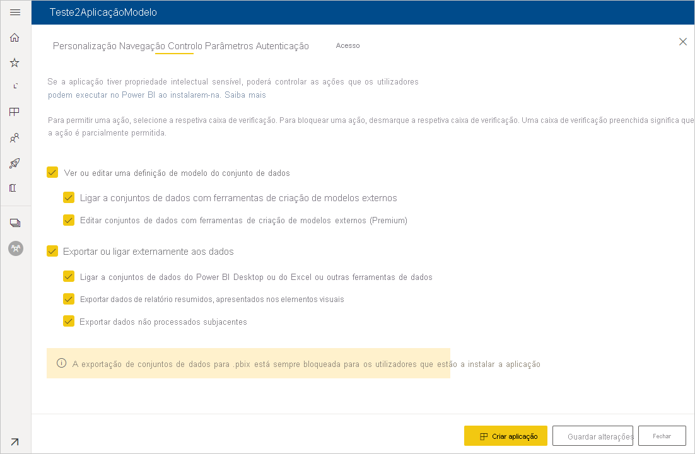
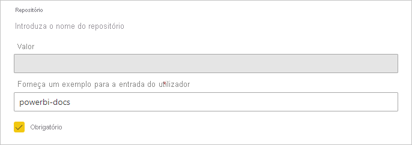
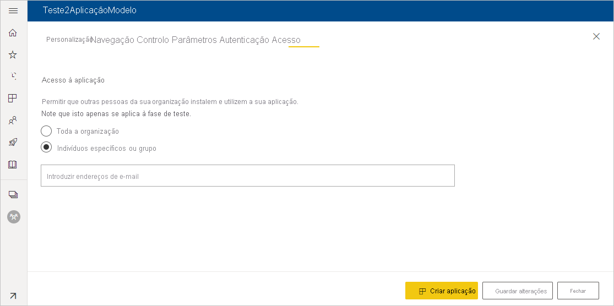
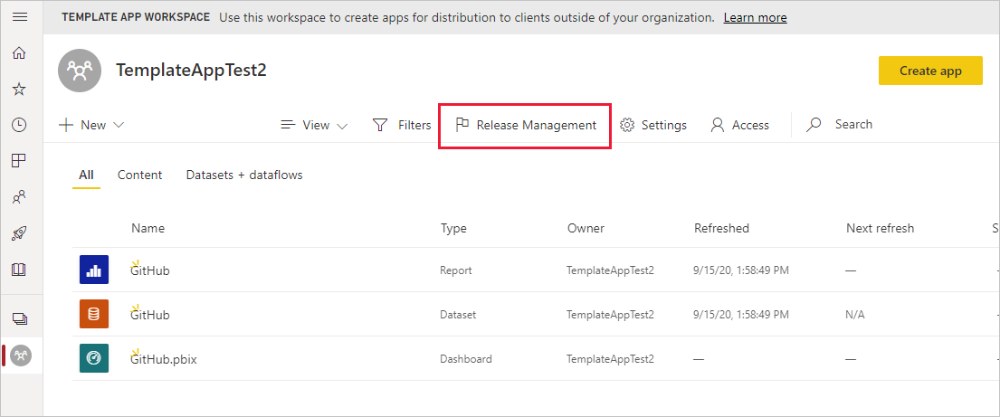

# Criar uma aplicação de modelo no Power BI

As *aplicações de modelo* do Power BI permitem que os parceiros do mesmo criem aplicações do Power BI com pouco ou nenhum código e que as implementem para qualquer cliente do Power BI.  Este artigo contém instruções passo a passo para criar uma aplicação de modelo do Power BI.

Se conseguir criar relatórios e dashboards do Power BI, pode tornar-se um *criador de aplicações de modelo* que cria e empacota conteúdos de análise numa *aplicação*. Pode implementar a sua aplicação noutros inquilinos do Power BI através de qualquer plataforma disponível, como o AppSource, ou ao utilizá-la no seu próprio serviço Web. Enquanto criador, pode criar um pacote de análise protegido para distribuição.

Os administradores do Power BI gerem e controlam quem na sua organização pode criar aplicações de modelo e quem pode instalá-las. Os utilizadores que tiverem autorização para tal podem instalar a aplicação de modelo e, em seguida, modificar e distribuí-la para os consumidores do Power BI na organização.

## Pré-requisitos

Eis os requisitos para a criação de uma aplicação de modelo:  

- Uma [licença do Power BI Pro](../fundamentals/service-self-service-signup-for-power-bi.md)
- Uma [instalação do Power BI Desktop](../fundamentals/desktop-get-the-desktop.md) (opcional)
- Conhecer os [conceitos básicos do Power BI](../fundamentals/service-basic-concepts.md)
- Permissões para partilhar publicamente uma aplicação de modelo (para obter mais informações, veja [portal de administração do Power BI, Definições das aplicações de modelo](../admin/service-admin-portal.md#template-apps-settings)

## Criar a área de trabalho de modelo

Para criar uma aplicação de modelo que possa distribuir para outros inquilinos do Power BI, terá de o fazer numa das novas áreas de trabalho.

1. No serviço Power BI, selecione **Áreas de trabalho** > **Criar uma área de trabalho**.

    

2. Em **Criar uma área de trabalho**, introduza um nome, uma descrição (opcional) e uma imagem de logótipo (opcional) para a sua área de trabalho.

    

4. Expanda a secção **Avançado** e selecione **Desenvolver uma aplicação de modelo**.

    

5. Selecione **Guardar**.
>[!NOTE]
>Necessita de permissões do administrador do Power BI para promover aplicações de modelo.

## Adicionar conteúdos à área de trabalho da aplicação de modelo

Tal como com uma área de trabalho normal do Power BI, o seu próximo passo é adicionar conteúdos à área de trabalho.  

- [Crie os seus conteúdos do Power BI](index.yml) na sua área de trabalho.

Se estiver a utilizar parâmetros no Power Query, certifique-se de que define corretamente os tipos (por exemplo, Texto). Os tipos Qualquer e Binário não são suportados.

O artigo [Tips for authoring template apps in Power BI](service-template-apps-tips.md) (Sugestões para a criação de aplicações de modelo no Power BI) apresenta sugestões a considerar ao criar relatórios e dashboards para a sua aplicação de modelo.

## Definir as propriedades da aplicação de modelo

Agora que tem conteúdos na sua área de trabalho, está tudo pronto para os empacotar numa aplicação de modelo. O primeiro passo é criar uma aplicação de modelo de teste que seja acessível apenas a partir do seu inquilino na sua organização.

1. Na área de trabalho de aplicação de modelo, selecione **Criar aplicação**.

    

    Neste passo, irá preencher as opções de criação adicionais da sua aplicação de modelo em seis separadores:

    **Imagem corporativa**

    
    - Nome da aplicação
    - Description
    - Site de suporte (a ligação é apresentada nas informações da aplicação, após a redistribuição da aplicação de modelo como aplicação de organização)
    - Logótipo da aplicação (limite de tamanho do ficheiro de 45 KB, proporção de 1:1, formatos .png, .jpg e .jpeg)
    - Cor do tema da aplicação

    **Navegação**

    Ative o **Novo construtor de navegação**, onde pode definir o painel de navegação da aplicação (veja [Conceber a experiência de navegação](../collaborate-share/service-create-distribute-apps.md#design-the-navigation-experience) neste artigo para obter detalhes).

   
    
    **Página de destino da aplicação:** se decidir desativar o construtor de navegação, terá a opção de selecionar a página de destino da aplicação. defina um relatório ou dashboard como página de destino da sua aplicação. Utilize uma página de destino que dê a impressão certa.

    **Controlo**

    Defina limites e restrições que os utilizadores da aplicação terão relativamente aos conteúdos da sua aplicação. Pode utilizar este controlo para proteger propriedades intelectuais na sua aplicação.

    

    >[!NOTE]
    >A exportação para o formato .pbix é sempre bloqueada aos utilizadores que instalam a aplicação.

    **Parâmetros**

    Os parâmetros são criados no ficheiro .pbix original (saiba mais sobre a [criação de parâmetros de consulta](https://powerbi.microsoft.com/blog/deep-dive-into-query-parameters-and-power-bi-templates/)). Pode utilizar as funcionalidades neste separador para ajudar o instalador da aplicação a configurar a aplicação após a instalação quando se ligam aos respetivos dados.

    Neste separador, também pode fornecer uma ligação para a documentação da aplicação.

    

    Cada parâmetro tem um nome e uma descrição, que vêm da consulta, assim como um campo de valor. Tem três opções para obter um valor para o parâmetro durante a instalação.

    * Pode pedir ao instalador que introduza um valor. Neste caso, pode fornecer um exemplo que o mesmo irá substituir. Para configurar um parâmetro desta forma, selecione a caixa de verificação **Obrigatório** e, em seguida, forneça um exemplo na caixa de texto que mostre ao utilizador que tipo de valor é esperado. Por exemplo:

       

    * Pode fornecer um valor pré-preenchido que o utilizador que instalar a aplicação não pode alterar. Um parâmetro configurado desta forma é ocultado da pessoa a instalar a aplicação. Deve utilizar este método apenas se tiver a certeza de que o valor pré-preenchido é válido para todos os utilizadores. Caso contrário, utilize o primeiro método mencionado acima, que requer uma entrada do utilizador.

       Para configurar um parâmetro desta forma, introduza o valor na caixa de texto **Valor** e, em seguida, clique no ícone de bloqueio. Isto fará com que o valor não possa ser alterado. Por exemplo:

       

    * Pode fornecer um valor predefinido que o utilizador possa alterar durante a instalação. Para configurar um parâmetro desta forma, introduza o valor predefinido pretendido na caixa texto **Valor** e deixe o ícone de bloqueio desbloqueado. Por exemplo:

      

    **Autenticação**
    
    Neste separador, selecione o método de autenticação que será utilizado. As opções que estão disponíveis dependem dos tipos de origem de dados que estão a ser utilizados.

    

    O nível de privacidade é configurado automaticamente:
   * Origem de dados única: configurada automaticamente como privada.
   * Várias origens de dados anónimas: configurada automaticamente como pública.

    **Acesso**
    
    Na fase de teste, decida quem mais na sua organização pode instalar e testar a sua aplicação. Não se preocupe, pode sempre voltar atrás e alterar estas definições mais tarde. A definição não afeta o acesso à aplicação de modelo distribuída.

    

2. Selecione **Criar aplicação**.

    Verá uma mensagem a informar que a aplicação de teste está pronta, com uma ligação para copiar e partilhar com os técnicos de teste da sua aplicação.

    

    Também já concluiu o primeiro passo do processo de gestão de versões que segue.

## Gerir a versão da aplicação de modelo

Antes de lançar esta aplicação de modelo publicamente, é importante garantir que está pronta para tal. O Power BI criou o painel de gestão de versões, onde pode acompanhar e inspecionar o caminho de versão completo da aplicação. Também pode acionar a transição de uma fase para outra. As fases comuns são:

- Gerar aplicação de teste: para testar apenas na sua organização.
- Promover o pacote de teste para a fase de pré-produção: testar fora da sua organização.
- Promover o pacote de pré-produção para Produção: versão de produção.
- Eliminar um pacote ou começar a partir da fase anterior.

O URL não sofre alterações à medida que avança nas fases de lançamento. A promoção não afeta o URL.

Vamos percorrer todas as fases:

1. Na área de trabalho de modelo, selecione **Gestão de Versões**.

    

2. Selecione **Obter ligação** se tiver criado a aplicação de teste na secção **Definir as propriedades da aplicação de teste** acima (como resultado, o ponto amarelo junto a **Teste** já está preenchido).

    Se não criou a aplicação, selecione **Criar aplicação**. Isto faz com que volte ao processo de criação de aplicação de modelo.

    

4. Para testar a experiência de instalação da aplicação, copie a ligação na janela de notificação e cole-a numa nova janela do browser.

    A partir daqui, estará a seguir o mesmo procedimento que seguirão os seus clientes. Veja [Instalar e distribuir aplicações de modelo na sua organização](service-template-apps-install-distribute.md).

5. Na caixa de diálogo, selecione **Instalar**.

    Quando a instalação for concluída com êxito, será apresentada uma notificação a informar que a nova aplicação está pronta.

6. Selecione **Ir para a aplicação**.
7. Em **Comece já com a sua nova aplicação**, verá a sua aplicação tal como os seus clientes a irão ver.

    
8. Selecione **Explorar a aplicação** para verificar a aplicação de teste com os dados de exemplo.
9. Para fazer alterações, volte à aplicação na área de trabalho original. Atualize a aplicação de teste até obter os resultados que pretende.
10. Quando estiver pronto para promover a sua aplicação para pré-produção para que sejam feitos testes adicionais fora do seu inquilino, regresse ao painel **Gestão de Versões** e selecione **Promover aplicação**.

    
    >[!NOTE]
    > Quando a aplicação é promovida, fica publicamente disponível fora da sua organização.

    Se não vir essa opção, contacte o seu administrador do Power BI para que lhe conceda [permissões para a programação de aplicações de modelo](../admin/service-admin-portal.md#template-apps-settings) no portal de administração.
11. Selecione **Promover** para confirmar a sua escolha.
12. Copie este novo URL para partilhar fora do seu inquilino para fins de teste. Esta ligação é a mesma que irá submeter para iniciar o processo de distribuição da aplicação no AppSource ao criar uma [nova oferta do Centro de parceiros](/azure/marketplace/partner-center-portal/create-power-bi-app-offer). Submeta apenas ligações de pré-produção ao Centro de parceiros. Só após a aplicação ser aprovada e receber uma notificação de que esta foi publicada no AppSource, poderá promover este pacote para produção no Power BI.
13. Quando a aplicação está pronta para produção ou partilha através do AppSource, regresse ao painel **Gestão de Versões** e selecione **Promover aplicação** junto a **Pré-produção**.
14. Selecione **Promover** para confirmar a sua escolha.

    Agora a sua aplicação está em produção e pronta para distribuição.

    

Para disponibilizar a sua aplicação para milhares de utilizadores do Power BI em todo o mundo, recomendamos que a submeta no AppSource. Veja a [Oferta da aplicação Power BI](/azure/marketplace/partner-center-portal/create-power-bi-app-offer) para obter detalhes.

## Passos seguintes

Veja como os seus clientes interagem com a sua aplicação de modelo em [Install, customize, and distribute template apps in your organization](service-template-apps-install-distribute.md) (Instalar, personalizar e distribuir aplicações de modelo na sua organização).

Veja a [Oferta da aplicação Power BI](/azure/marketplace/partner-center-portal/create-power-bi-app-offer) para obter detalhes sobre como distribuir a sua aplicação.