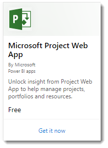
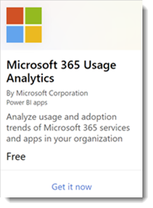
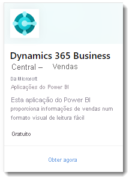
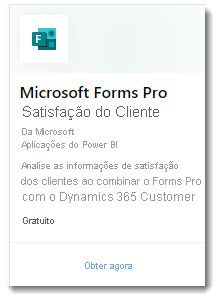

# O que são as aplicações de modelo do Power BI?

As novas *aplicações de modelo* do Power BI permitem que os parceiros do mesmo criem aplicações do Power BI com pouco ou nenhum código e que as implementem para qualquer cliente do Power BI.  Este artigo é uma descrição geral do programa de aplicações de modelo do Power BI.

Enquanto parceiro do Power BI, pode criar um conjunto de conteúdos prontos a utilizar para os clientes e publicá-los manualmente.  

Pode criar aplicações de modelo que permitam que os clientes estabeleçam ligação e criem instâncias nas próprias contas. Como especialistas de domínio, podem desbloquear os dados de forma a que seja fácil para os utilizadores empresariais consumirem.  

Pode submeter aplicações de modelo ao Centro de parceiros. Em seguida, as aplicações são disponibilizadas publicamente no [Marketplace de Aplicações do Power BI](https://app.powerbi.com/getdata/services) e no [Microsoft AppSource](https://appsource.microsoft.com/?product=power-bi). Eis uma descrição geral da experiência pública de criação de aplicações de modelo.

## Marketplace de Aplicações do Power BI

As Aplicações de Modelo do Power BI permitem que os utilizadores do Power BI Pro ou do Power BI Premium obtenham informações imediatas através de relatórios e dashboards previamente compactados que podem ser ligados a origens de dados em direto. Já se encontram disponíveis muitas Aplicações do Power BI no [Marketplace de Aplicações do Power BI](https://app.powerbi.com/getdata/services).

:::row:::
    :::column:::
        
    :::column-end:::
    :::column:::
        
    :::column-end:::
    :::column:::
        
    :::column-end:::
    :::column:::
        
    :::column-end:::
:::row-end:::

 > [!NOTE] 
 > As aplicações do Marketplace não estão disponíveis para instâncias da cloud do governo norte-americano. Para obter mais detalhes, veja [Power BI para clientes do governo norte-americano](../admin/service-govus-overview.md).

## Processo

O processo geral para desenvolver e submeter uma aplicação de modelo inclui várias fases. Algumas fases podem incluir mais do que uma atividade em simultâneo.

| Fase | Power BI Desktop |  |serviço Power BI  |  |Partner Center  |
|---|--------|--|---------|---------|---------|
| **Um** | Crie um modelo de dados e um relatório num ficheiro .pbix |  | Crie uma área de trabalho. Importe o ficheiro .pbix. Crie um dashboard complementar  |  | Registe-se como um parceiro |
| **Dois** |  |  | Crie um pacote de teste e execute uma validação interna        |  | |
| **Três** | |  | Promova o pacote de teste na pré-produção para validação fora do seu inquilino do Power BI e submeta-o no AppSource  |  | Crie uma oferta de aplicação de modelo do Power BI com o seu pacote de pré-produção e inicie o processo de validação |
| **Quatro** | |  | Promova o pacote de pré-produção para produção |  | Entrar em direto |

## Antes de começar

Para criar a aplicação de modelo, necessita de permissões para esse efeito. Veja as Definições de aplicação de modelo do portal de administração do Power BI para obter detalhes. 

Para publicar uma aplicação de modelo no serviço Power BI e no AppSource, tem de cumprir os requisitos para [se tornar num publicador do Centro de Parceiros](/azure/marketplace/become-publisher).
 
## Passos gerais

Eis os passos gerais. 

1. [Reveja os requisitos](#requirements) para se certificar de que os cumpre. 

2. Crie um relatório no Power BI Desktop. Utilize parâmetros para poder guardá-lo num ficheiro utilizável por outras pessoas. 

3. Crie uma área de trabalho para a aplicação de modelo no seu inquilino no serviço Power BI (app.powerbi.com). 

4. Importe o seu ficheiro .pbix e adicione conteúdos à sua aplicação, como um dashboard. 

5. Crie um pacote de teste para testar a aplicação de modelo na sua organização. 

6. Promova a aplicação de teste na pré-produção para submeter a aplicação para validação no AppSource e para testá-la fora do seu próprio inquilino. 

7. Submeta o conteúdo ao [Centro de parceiros](/azure/marketplace/partner-center-portal/create-power-bi-app-offer) para publicação. 

8. Altere o estado da sua oferta para "Em direto" no AppSource e mude a sua aplicação para produção no Power BI.

9. Agora pode começar a desenvolver a versão seguinte na mesma área de trabalho em pré-produção. 

## Requisitos

Para criar a aplicação de modelo, necessita de permissões para esse efeito. Veja as [Definições de aplicação de modelo do portal de administração](../admin/service-admin-portal.md#template-apps-settings) do Power BI para obter detalhes.

Para publicar uma aplicação de modelo no serviço Power BI e no AppSource, tem de cumprir os requisitos para [se tornar num publicador do Centro de Parceiros](/azure/marketplace/become-publisher).
 > [!NOTE] 
 > As submissões de aplicações de modelo são geridas no [Centro de Parceiros](/azure/marketplace/partner-center-portal/create-power-bi-app-offer). Utilize a mesma conta de registo do Centro de Programadores da Microsoft para iniciar sessão. Deve ter apenas uma conta Microsoft para as ofertas de AppSource. As contas não devem ser específicas de ofertas ou serviços individuais.

## Sugestões 

- Certifique-se de que a sua aplicação inclui dados de exemplo para que todos a comecem a utilizar com um simples clique. 
- Examine cuidadosamente a sua aplicação ao instalá-la no seu inquilino e num inquilino secundário. Certifique-se de que os clientes só veem aquilo que pretende. 
- Utilize o AppSource como loja online para alojar a sua aplicação. Desta forma, todas as pessoas que utilizarem o Power BI podem encontrar a sua aplicação. 
- Considere disponibilizar mais do que uma aplicação de modelo para cenários exclusivos separados. 
- Ative a personalização de dados, tal como uma ligação de suporte personalizada e a configuração de parâmetro por parte do instalador.
- Se for um ISV e estiver a distribuir a aplicação através do seu serviço Web, considere automatizar a configuração de parâmetros durante a instalação para facilitar a situação para os seus clientes e aumentar a probabilidade de uma instalação bem-sucedida. Para obter mais detalhes, veja [Configuração automatizada da instalação de uma aplicação de modelo](../developer/template-apps/template-apps-auto-install.md).

Veja [Tips for authoring template apps in Power BI](service-template-apps-tips.md) (Sugestões para criar aplicações de modelo no Power BI) para obter mais sugestões.

## Limitações conhecidas

| Funcionalidade | Limitação Conhecida |
|---------|---------|
|Conteúdos:  Conjuntos de Dados   | Deve estar presente exatamente um conjunto de dados. Só são permitidos conjuntos de dados criados no Power BI Desktop (ficheiros .pbix).  Não suportado: conjuntos de dados de outras aplicações de exemplo, conjuntos de dados de várias áreas de trabalho, relatórios paginados (ficheiros .rdl) e livros do Excel |
|Conteúdos: Dashboards | Não são permitidos mosaicos em tempo real (ou seja, não existe suporte para conjuntos de dados de emissão ou transmissão em fluxo) |
|Conteúdos: Fluxos de Dados | Não suportado: Fluxos de Dados |
|Conteúdos de ficheiros | Só são permitidos ficheiros PBIX.  Não suportado: ficheiros .rdl (relatórios paginados) e livros do Excel   |
| Origens de dados | São permitidas origens de dados suportadas para atualizações de Dados Agendadas da cloud.  Não suportado: <li>Ligações em direto (no Azure Analysis Services)</li> <li>Origens de dados no local (não são suportados gateways empresariais e pessoais)</li> <li>Em tempo real (não existe suporte para conjuntos de dados de emissão)</li> <li>Modelos compostos</li></ul> |
| Conjunto de dados: em várias áreas de trabalho | Não são permitidos conjuntos de dados em várias áreas de trabalho  |
| Parâmetros de consulta | Não suportado: parâmetros do tipo "Qualquer", "Data" ou "Binário" bloqueiam a operação de atualização do conjunto de dados |
| Elementos Visuais do Power BI | Só são suportados elementos visuais do Power BI disponíveis para o público. Não são suportados [elementos visuais do Power BI organizacionais](../developer/visuals/power-bi-custom-visuals-organization.md) |
| Clouds soberanas | As aplicações de modelos não estão disponíveis em clouds soberanas |

## Suporte
Para obter suporte durante o desenvolvimento, utilize [https://powerbi.microsoft.com/support](https://powerbi.microsoft.com/support). Monitorizamos e gerimos este site de forma ativa. Os incidentes dos clientes são rapidamente reencaminhados para a equipa adequada.

## Passos seguintes

[Create a template app](service-template-apps-create.md) (Criar uma aplicação de modelo)