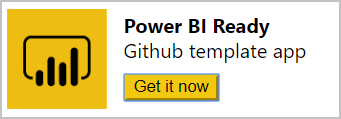

# Sugestões para criar aplicações de modelo no Power BI

Uma parte da [criação da sua aplicação de modelo](service-template-apps-create.md) no Power BI é a logística de criação, testes e produção da área de trabalho. No entanto, é evidente que a criação do relatório e do dashboard também é importante. Podemos resumir o processo de criação em quatro componentes principais. Trabalhar com esses componentes ajuda a criar a melhor aplicação de modelo possível:

* Com **consultas** , pode [ligar](desktop-connect-to-data.md) e [transformar](../transform-model/desktop-query-overview.md) os dados e definir [parâmetros](https://powerbi.microsoft.com/blog/deep-dive-into-query-parameters-and-power-bi-templates/). 
* No **modelo de dados** , cria [relações](../transform-model/desktop-create-and-manage-relationships.md), [medidas](../transform-model/desktop-measures.md) e melhorias de Perguntas e Respostas.  
* As **[páginas do relatório](../create-reports/desktop-report-view.md)** incluem elementos visuais e filtros para apresentar informações sobre os seus dados.  
* Os **[dashboards](../consumer/end-user-dashboards.md)** e os [mosaicos](../create-reports/service-dashboard-create.md) oferecem uma descrição geral das informações incluídas.
* Os dados de exemplo tornam a sua aplicação detetável imediatamente após a instalação.

Poderá estar familiarizado com cada peça como as funcionalidades existentes do Power BI. Ao criar uma aplicação de modelo, existem outros fatores a considerar em cada componente. Veja a secção abaixo para obter mais detalhes.

## Consultas
Para aplicações de modelo, são utilizadas consultas desenvolvidas no Power BI Desktop para ligar a sua origem de dados e importar dados. Estas consultas são necessárias para devolver um esquema consistente e são suportadas para atualizações de Dados Agendadas.

### Ligar à sua API
Para começar, terá de ligar à sua API a partir do Power BI Desktop para começar a criar as suas consultas.

Pode utilizar os Conectores de Dados disponíveis no Power BI Desktop para ligar à sua API. Pode utilizar o Conector de Dados da Web (Obter Dados -> Web) para ligar à API Rest ou ao conector de OData (Obter Dados -> Feed do OData) para ligar ao feed do OData.

> [!NOTE]
> Atualmente, as aplicações de exemplo não suportam conectores personalizados. É recomendável explorar com o Odatafeed Auth 2.0 como medida de mitigação para alguns dos casos de utilização de ligação ou submeter o seu conector para certificação. Para obter detalhes sobre como desenvolver e certificar um conector, veja a [documentação dos Conectores de Dados](https://aka.ms/DataConnectors).

### Considere a origem
As consultas definem os dados que serão incluídos no modelo de dados. Dependendo do tamanho do seu sistema, estas consultas também devem incluir filtros para garantir que os seus clientes estão a lidar com um tamanho gerível que se adequa ao seu cenário de negócio.

As aplicações de modelo do Power BI podem executar múltiplas consultas em paralelo e para múltiplos utilizadores em simultâneo.  Planeie a estratégia de limitação e simultaneidade com antecedência e pergunte-nos como tornar a sua aplicação de modelo tolerante a falhas.

### Imposição de esquema
Certifique-se de que as suas consultas são resilientes a alterações no seu sistema, as alterações no esquema de atualização podem interromper o modelo. Se a origem conseguir devolver resultados de esquema nulo ou em falta para algumas consultas, pondere devolver uma tabela vazia ou uma mensagem de erro personalizada relevante.

### Parâmetros
Os [parâmetros](https://powerbi.microsoft.com/blog/deep-dive-into-query-parameters-and-power-bi-templates/) no Power BI Desktop permitem que os utilizadores apresentem valores de entrada que personalizam os dados obtidos pelo utilizador. Considere os parâmetros inicialmente para evitar repetir trabalho após investir tempo para criar consultas ou relatórios detalhados.

> [!NOTE]
> As aplicações de modelo suportam todos os parâmetros exceto Qualquer e Binário.
>

### Sugestões de consulta adicionais

* Certifique-se de que todas as colunas foram introduzidas adequadamente.
* As colunas têm nomes informativos (veja as [Perguntas e Respostas](#qa)).  
* Para a lógica partilhada, pondere utilizar funções ou consultas.  
* Os níveis de privacidade não são atualmente suportados pelo serviço. Se receber um pedido sobre os níveis de privacidade, poderá ter de rescrever a consultar para utilizar caminhos relativos.  

## Modelos de dados

Um modelo de dados bem definido garante que os seus clientes podem interagir de forma fácil e intuitiva com a aplicação de modelo. Crie o modelo de dados no Power BI Desktop.

> [!NOTE]
> Deverá efetuar a maioria das operações básicas de modelação (escrita, nomes de colunas) nas [consultas](#queries).

### Perguntas e Respostas
A modelação também afeta a forma como as perguntas e respostas podem apresentar resultados aos seus clientes. Certifique-se de que adiciona sinónimos às colunas mais utilizadas e que atribuiu nomes adequados às suas colunas nas [consultas](#queries).

### Sugestões de modelos de dados adicionais

Certifique-se de que:

* Aplicou formatação a todas as colunas de valor. Aplica tipos na consulta.  
* Aplicou formatação a todas as medidas.
* Definiu o resumo predefinido. Principalmente "Não Resumir", quando aplicável (por exemplo, para valores exclusivos).  
* Define a categoria de dados, quando aplicável.  
* Define relações conforme necessário.  

## Relatórios
As páginas de relatórios oferecem informações adicionais sobre os dados incluídos na sua aplicação de modelo. Utilize as páginas dos relatórios para responder às principais perguntas empresariais que a sua aplicação de modelo está a tentar resolver. Crie o relatório com o Power BI Desktop.

### Sugestões de relatório adicionais

* Utilize mais do que um elemento visual por página para filtragem cruzada.  
* Alinhe os elementos visuais cuidadosamente (sem sobreposição).  
* A página está definida como o modo de esquema "4:3" ou "16:9".  
* Todas as agregações apresentadas têm um sentido numérico (médias, valores únicos).  
* A segmentação produz resultados racionais.  
* O logótipo encontra-se, pelo menos, no relatório principal.  
* Os elementos encontram-se no esquema de cores do cliente, na medida do possível.  

## Dashboards
O dashboard é o principal ponto de interação dos seus clientes com a aplicação de modelo. Deve incluir uma descrição geral do conteúdo incluído, especialmente as métricas importantes para o seu cenário de negócio.

Para criar um dashboard para a sua aplicação de modelo, carregue o PBIX através de Obter Dados > Ficheiros ou publique diretamente a partir do Power BI Desktop.

### Sugestões adicionais do dashboard

* Para que os mosaicos do seu dashboard fiquem consistentes, mantenha o mesmo tema quando afixar.  
* Afixe um logótipo ao tema para que os consumidores saibam a origem do pacote.  
* O esquema sugerido para funcionar com a maioria das resoluções de ecrã é de cinco a seis mosaicos pequenos de largura.  
* Todos os mosaicos do dashboard devem ter títulos/subtítulos adequados.  
* Pondere adicionar agrupamentos no dashboard para cenários diferentes, quer vertical ou horizontalmente.  

## Dados de exemplo
As aplicações de modelo, fazendo parte da fase de criação da aplicação, encapsulam os dados da cache na área de trabalho como parte da aplicação:

* Permitem que o instalador compreenda a funcionalidade e a finalidade da aplicação antes de ligar dados.
* Criam uma experiência que leva o instalador a explorar ainda mais as capacidades da aplicação, o que resulta na ligação do conjunto de dados da mesma.

Recomendamos ter dados de exemplo de qualidade antes de criar a aplicação. Garanta que o relatório e os dashboards da aplicação estão preenchidos com dados.

## Publicar no AppSource
As aplicações de modelo podem ser publicadas no AppSource. Siga estas diretrizes antes de submeter a sua aplicação para o AppSource:

* Certifique-se de que cria uma aplicação de modelo com dados de exemplo apelativos que podem ajudar o instalador a compreender o que a aplicação pode fazer (não são aprovados relatórios e dashboards vazios).
As aplicações de modelo suportam aplicações apenas de dados de exemplo, por isso, assegure-se de que seleciona a caixa de verificação de aplicação estática. [Saiba mais](./service-template-apps-create.md#define-the-properties-of-the-template-app)
* Tenha instruções que a equipa de validação deverá seguir, incluindo as credenciais e os parâmetros necessários para ligar aos dados.
* A aplicação tem de incluir um ícone de Aplicação no Power BI e na sua oferta CPP. [Saiba mais](./service-template-apps-create.md#define-the-properties-of-the-template-app)
* A página de destino está configurada. [Saiba mais](./service-template-apps-create.md#define-the-properties-of-the-template-app)
* Confirme que segue a documentação no [Centro de parceiros -> Oferta de aplicações do Power BI](/azure/marketplace/partner-center-portal/create-power-bi-app-offer).
* Caso um dashboard faça parte da sua aplicação, confirme que não está vazio.
* Instale a aplicação através da respetiva ligação antes de a enviar, confirme que pode ligar o conjunto de dados e verifique se a experiência da aplicação é aquela que esperava.
* Antes de carregar o pbix para a área de trabalho de modelo, certifique-se de que descarrega todas as ligações desnecessárias.
* Siga as [Melhores práticas de design para relatórios e elementos visuais](../visuals/power-bi-report-visualizations.md) do Power BI para conseguir o máximo impacto sobre os seus utilizadores e obter aprovação para distribuição.
<!--- * In general, only application with valuable functionality can be approved for general use on AppSource. Application with sample data content only must have either a guidance or statistical value.) -->

## Criar uma ligação para transferência da aplicação

Após publicar a aplicação de modelo no AppSource, pondere criar uma ligação para transferência a partir do seu site para:
* A página de transferência do AppSource pode ser visualizada publicamente, obtenha a ligação a partir da sua página do AppSource.
* Power BI – pode ser visualizado por um utilizador do Power BI.

Para redirecionar um utilizador para a ligação de transferência da aplicação no Power BI, veja o seguinte exemplo de código: [Repositório do GitHub](https://github.com/microsoft/Template-apps-examples).

## Próximos passos

[O que são as aplicações de modelo do Power BI?](service-template-apps-overview.md)
