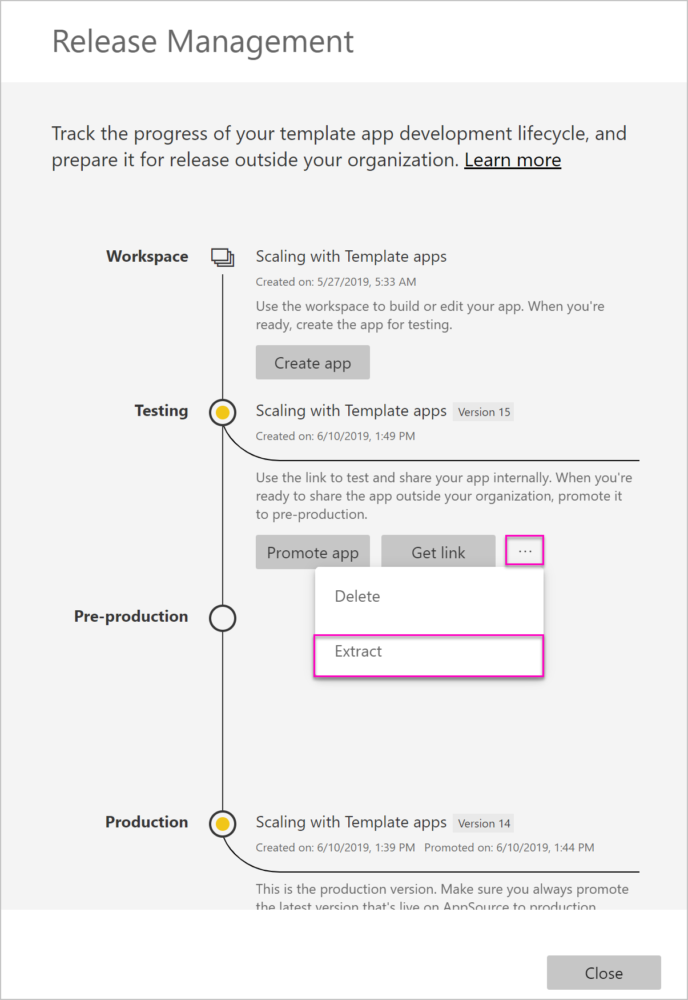
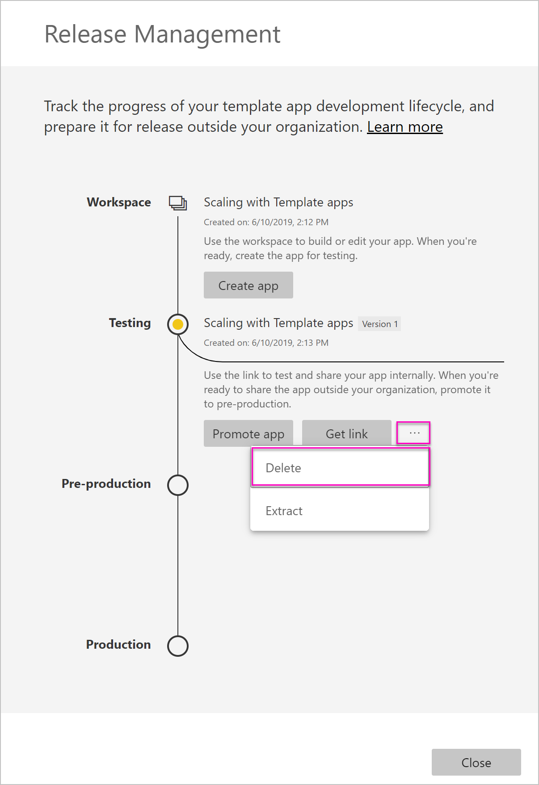

# Atualizar, eliminar e extrair uma aplicação de modelo

Agora que a aplicação está em produção, pode recomeçar a fase de teste sem interromper a aplicação em produção.
## Atualizar a sua aplicação

Se fez alterações no Power BI Desktop, comece pelo passo (1). Se não fez alterações no Power BI Desktop, comece pelo passo (4).

1. Carregue o conjunto de dados atualizado e substitua o conjunto de dados existente. **Certifique-se de que utiliza exatamente o mesmo nome do conjunto de dados**. Se utilizar um nome diferente, será criado um novo conjunto de dados para os utilizadores que estão a atualizar a aplicação.

1. Importe o ficheiro pbix do seu computador.

1. Confirme a substituição.

1. No painel **Gestão de Versões**, selecione **Criar aplicação**.
1. Repita o processo de criação de aplicações.
1. Após definir as categorias **Personalização**, **Conteúdo**, **Controlo** e **Acesso**, selecione novamente **Criar aplicação**.
1. Selecione **Fechar** e regresse ao painel **Gestão de Versões**.

   Verá que agora tem duas versões: A versão em produção e uma nova versão em modo de teste.

    

1. Quando estiver pronto para promover a sua aplicação para pré-produção para que sejam feitos testes adicionais fora do seu inquilino, regresse ao painel Gestão de Versões e selecione **Promover aplicação** junto a **Teste**.

   Tem agora uma versão em produção e uma versão em pré-produção.

   

   A ligação está agora ativada. **Repare que o botão Promover aplicação se encontra desativado na fase de pré-produção**. Isto é para evitar a substituição acidental da ligação de produção em direto à versão atual da aplicação antes de o Cloud Partner Portal validar e aprovar a nova versão da aplicação.

1. Submeta a ligação novamente no Cloud Partner Portal (CPP). Para tal, siga os passos descritos em [Atualização da oferta da aplicação Power BI](https://docs.microsoft.com/azure/marketplace/cloud-partner-portal/power-bi/cpp-update-existing-offer). No Cloud Partner Portal, tem de **publicar** novamente a oferta para ser validada e aprovada.

   Quando a sua oferta for aprovada, o botão Promover aplicação voltará a estar ativo. 
1. Promova a sua aplicação para a fase de produção.
   
### Comportamento de atualização

1. A atualização da aplicação permitirá ao instalador da aplicação de modelo [Atualizar uma aplicação de modelo](service-template-apps-install-distribute.md#update-a-template-app) na área de trabalho já instalada sem perder a configuração de ligação.
1. Veja o [comportamento de substituição](service-template-apps-install-distribute.md#overwrite-behavior) do instalador para saber de que forma é que as alterações no conjunto de dados afetam a aplicação de modelo instalada.
1. Ao atualizar (substituir) uma aplicação de modelo, esta reverte primeiro para os dados de exemplo e volta a ligar-se automaticamente com a configuração do utilizador (parâmetros e autenticação). Até à conclusão da atualização, os relatórios, os dashboards e a aplicação da organização apresentarão a faixa de dados de exemplo.
1. Se tiver adicionado um novo parâmetro de consulta ao conjunto de dados atualizado que exige entradas dos utilizadores, tem de selecionar a caixa de verificação *obrigatório*. Esta ação pedirá ao instalador a cadeia de ligação após a atualização da aplicação.
 

## Extrair a área de trabalho
Com a capacidade de extração, agora é mais fácil do que nunca reverter para a versão anterior de uma aplicação de modelo. Os passos seguintes permitem extrair uma versão específica, a partir das várias fases da versão, para uma nova área de trabalho:

1. No painel de gestão de versões, prima mais **(...)** e, em seguida, **Extrair**.

     
2. Na caixa de diálogo, introduza o nome da área de trabalho extraída. Será adicionada uma nova área de trabalho.

A nova versão da área de trabalho é reposta e pode continuar a desenvolver e a distribuir a aplicação de modelo a partir da área de trabalho recentemente extraída.

## Eliminar a versão da aplicação de modelo
Uma área de trabalho de modelo é a origem de dados de uma aplicação de modelo ativa. Para proteger os utilizadores da aplicação de modelo, não é possível eliminar uma área de trabalho sem primeiro remover todas as versões da aplicação criadas na área de trabalho.
Ao eliminar uma versão da aplicação, também elimina o URL da aplicação, que deixará de funcionar.

1. No painel de gestão de versões, prima para selecionar as reticências **(...)** e, em seguida, prima **Eliminar**.
 
 

>[!NOTE]
>Confirme que não elimina a versão da aplicação que está a ser utilizada pelos clientes ou pela **AppSource**. Caso contrário, a aplicação deixará de funcionar.

## Próximos passos

Veja como os seus clientes interagem com a sua aplicação de modelo em [Install, customize, and distribute template apps in your organization](service-template-apps-install-distribute.md) (Instalar, personalizar e distribuir aplicações de modelo na sua organização).

Veja a [Oferta da aplicação Power BI](https://docs.microsoft.com/azure/marketplace/cloud-partner-portal/power-bi/cpp-power-bi-offer) para obter detalhes sobre como distribuir a sua aplicação.
