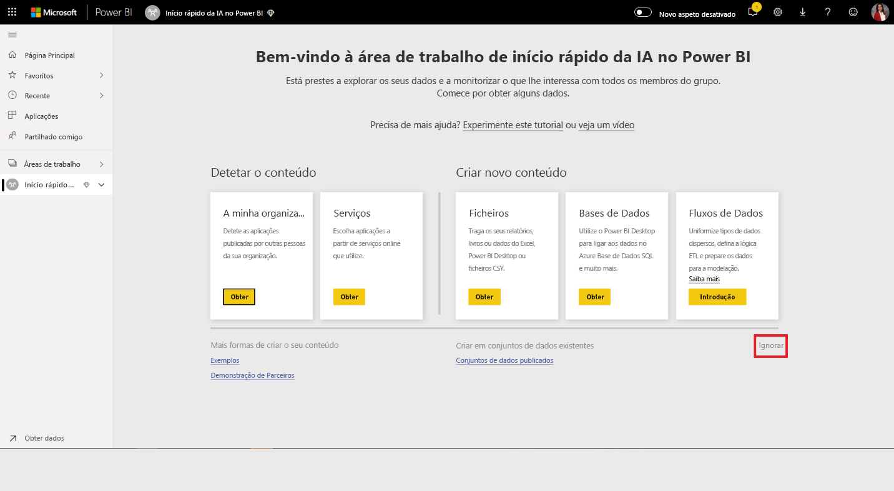
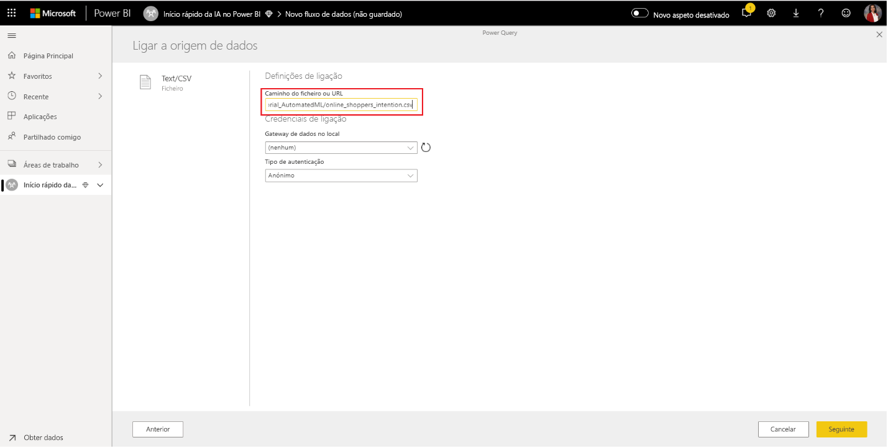

# Tutorial: Criar um modelo de Machine Learning no Power BI

Neste artigo de tutorial, será utilizada o **Machine Learning Automatizado** para criar e aplicar um modelo de predição binária no Power BI. O tutorial inclui orientações para a criação de um fluxo de dados do Power BI e a utilização das entidades definidas no fluxo de dados para preparar e validar um modelo de machine learning diretamente no Power BI. Em seguida, vamos utilizar esse modelo para classificar novos dados para gerar predições.

Em primeiro lugar, deverá criar um modelo de machine learning de Predição Binária para prever a intenção de compra dos compradores online com base num conjunto dos atributos de sessão online desses compradores. Para este exercício, é utilizado um conjunto de dados de machine learning de referência. Após a preparação de um modelo, o Power BI gerará automaticamente um relatório de validação que explica os resultados do modelo. Em seguida, pode rever o relatório de validação e aplicar o modelo aos seus dados para classificação.

Este tutorial consiste nos seguintes passos:
> [!div class="checklist"]

> * Criar um fluxo de dados com os dados de entrada
> * Criar e preparar um modelo de machine learning
> * Rever o relatório de validação do modelo
> * Aplicar o modelo a uma entidade de fluxo de dados
> * Utilizar a saída classificada do modelo num relatório do Power BI

## Criar um fluxo de dados com os dados de entrada

A primeira parte deste tutorial consiste em criar um fluxo de dados com os dados de entrada. Esse processo implica alguns passos, conforme indicado nas secções a seguir, e começa com a obtenção de dados.

### Obter dados

O primeiro passo na criação de um fluxo de dados é ter as origens de dados preparadas. No nosso caso, vamos utilizar um conjunto de dados de machine learning de um conjunto de sessões online, algumas das quais culminaram numa compra. O conjunto de dados contém um conjunto de atributos sobre essas sessões, que utilizaremos para a preparação do nosso modelo.

Pode transferir o conjunto de dados a partir do site da UC Irvine. Além disso, temos o conjunto disponível, para efeitos deste tutorial, na seguinte ligação: [online_shoppers_intention.csv](https://raw.githubusercontent.com/santoshc1/PowerBI-AI-samples/master/Tutorial_AutomatedML/online_shoppers_intention.csv).

### Criar as entidades

Para criar as entidades no seu fluxo de dados, inicie sessão no serviço Power BI e navegue para uma área de trabalho na sua capacidade dedicada que tenha a IA ativada.

Se ainda não tiver uma área de trabalho, poderá criar uma ao selecionar **Áreas de trabalho** no menu do painel de navegação do serviço Power BI e, em seguida, **Criar área de trabalho** na parte inferior do painel apresentado. Esta ação abre um painel no lado direito para introduzir os detalhes da área de trabalho. Introduza um nome de área de trabalho e selecione **Avançado**. Confirme se a área de trabalho utiliza uma Capacidade Dedicada com o botão de opção e se está atribuída a uma instância de capacidade dedicada que tenha a pré-visualização de IA ativada. Em seguida, selecione **Guardar**.

Após a criação da área de trabalho, pode selecionar **Ignorar** na parte inferior direita do ecrã Boas-vindas, conforme mostrado na imagem seguinte.

 Selecione o botão **Criar** na parte superior direita da área de trabalho e, em seguida, **Fluxo de dados**.

Selecione **Adicionar novas entidades**. Esta ação inicia um editor do **Power Query** no browser.

Selecione **Ficheiro de Texto/CSV** como uma origem de dados, conforme mostrado na imagem seguinte.

Na página **Ligar a uma origem de dados** apresentado em seguida, cole a seguinte ligação para _online_shoppers_intention.csv_ na caixa **URL ou caminho do ficheiro** e selecione **Seguinte**.

`https://raw.githubusercontent.com/santoshc1/PowerBI-AI-samples/master/Tutorial_AutomatedML/online_shoppers_intention.csv`

O Editor do Power Query mostra uma pré-visualização dos dados do ficheiro CSV. Pode mudar o nome da consulta para um nome mais amigável ao alterar o valor na caixa Nome no painel direito. Por exemplo, pode alterar o nome da consulta para _Visitantes Online_.

O Power Query infere automaticamente o tipo de colunas. Pode alterar o tipo de coluna ao clicar no ícone do tipo de atributo na parte superior do cabeçalho da coluna. Neste exemplo, alteramos o tipo da coluna Receita para Verdadeiro/Falso.

Selecione o botão **Guardar e fechar** para fechar o Editor do Power Query. Forneça um nome para o fluxo de dados e, em seguida, selecione **Guardar** na caixa de diálogo, conforme mostrado na seguinte imagem.

## Criar e preparar um modelo de machine learning

Para adicionar um modelo de machine learning, selecione o botão **Aplicar modelo de ML** na lista de **Ações** para a entidade base com os dados de preparação e as informações de etiqueta e, em seguida, selecione **Adicionar um modelo de machine learning**.

O primeiro passo para a criação do nosso modelo de machine learning é identificar os dados históricos, incluindo o campo de resultado que pretende prever. O modelo será criado através da aprendizagem desses dados.

No caso do conjunto de dados que estamos a utilizar, este é o campo **Revenue**. Selecione **Receita** como o valor do "campo Resultado" e, em seguida, **Seguinte**.

Em seguida, devemos selecionar o tipo de modelo de machine learning a criar. O Power BI analisa os valores no campo de resultado que identificou e sugere os tipos de modelos de machine learning que podem ser criados para prever esse campo.

Neste caso, uma vez que estamos a prever um resultado binário sobre se um utilizador efetuará ou não uma compra, Predição Binária é a opção recomendada. Como estamos interessados em prever os utilizadores que farão uma compra, selecione Verdadeiro como o resultado de Receita em que está mais interessado. Além disso, pode fornecer etiquetas amigáveis para os resultados a serem utilizados no relatório gerado automaticamente, que resumirá os resultados da validação do modelo. Em seguida, selecione Seguinte.

Em seguida, o Power BI faz uma verificação preliminar de uma amostra dos dados e sugere as entradas que podem produzir previsões mais precisas. Se o Power BI não recomendar um campo, será fornecida uma explicação junto ao mesmo. Tem a opção de alterar as seleções para incluir apenas os campos que pretende que o modelo estude ou pode selecionar todos os campos ao marcar a caixa de verificação junto ao nome da entidade. Selecione **Seguinte** para aceitar as entradas.

No passo final, vamos fornecer um nome para o modelo. Atribua o nome _Previsão de Intenção de Compra_ ao modelo. Pode optar por reduzir o tempo de preparação para ver resultados rápidos ou aumentar a quantidade de tempo gasto na preparação para obter o melhor modelo. Em seguida, selecione **Guardar e preparar** para começar a preparar o modelo.

O processo de preparação começará com a amostragem e a normalização dos dados históricos e com a divisão do conjunto de dados em duas novas entidades: _Purchase Intent Prediction Training Data_ e _Purchase Intent Prediction Testing Data_.

Dependendo do tamanho do conjunto de dados, o processo de preparação pode demorar de alguns minutos até ao tempo de preparação selecionado no ecrã anterior. Neste ponto, pode ver o modelo no separador **Modelos de machine learning** do fluxo de dados. O estado Pronto indica que o modelo foi colocado em fila para preparação ou está a ser preparado.

Pode confirmar que o modelo está a ser preparado e validado através do estado do fluxo de dados. Tal é apresentado como uma atualização de dados em curso no separador **Fluxo de dados** da área de trabalho.

Após a conclusão da preparação do modelo, o fluxo de dados apresenta um tempo de atualização atualizado. Pode confirmar que o modelo foi preparado ao aceder ao separador **Modelos de machine learning** no fluxo de dados. O modelo que criou deve apresentar o estado **Preparado** e a data/hora da **Última Preparação** deve estar agora atualizada.

## Rever o relatório de validação do modelo
Para rever o relatório de validação do modelo, no separador Modelos de machine learning, selecione o botão Ver relatório de preparação na coluna Ações do modelo. Este relatório descreve o desempenho provável do modelo de machine learning.

Na página **Desempenho do Modelo** do relatório, selecione **Ver principais previsões** para ver as principais previsões para o modelo. Pode selecionar uma das previsões para ver como a distribuição dos resultados está associada a essa previsão.

Pode utilizar a segmentação de dados **Limite de Probabilidade** na página Desempenho do Modelo para examinar a influência na Precisão e na Revocação do modelo.

As outras páginas do relatório descrevem as métricas estatísticas de desempenho do modelo.

O relatório também inclui uma página Detalhes da Preparação que descreve as diferentes iterações executadas, o modo de extração dos recursos das entradas e os hiperparâmetros utilizados para o modelo final.

## Aplicar o modelo a uma entidade de fluxo de dados

Selecione o botão **Aplicar modelo** na parte superior do relatório para invocar este modelo. Na caixa de diálogo **Aplicar**, pode especificar a entidade de destino com os dados de origem aos quais o modelo deve ser aplicado.

Quando pedido, deve **Atualizar** o fluxo de dados para pré-visualizar os resultados do modelo.

A aplicação do modelo criará duas novas entidades, com o sufixo **enriched <nome_do_modelo>** e **enriched <nome_do_modelo> explanations**. No nosso caso, aplicar o modelo à entidade **Visitantes Online** criará **Visitantes Online enriched Purchase Intent Prediction**, que inclui a saída prevista do modelo, e **Visitantes Online enriched Purchase Intent Prediction explanations**, que contém os principais influenciadores específicos do registo para a previsão. 

A aplicação de um modelo de Predição Binária adiciona quatro colunas com os resultados previstos, uma classificação de probabilidade, os principais influenciadores específicos do registo para a predição e o índice de explicação, cada um com um prefixo com o nome de coluna especificado.  

Após a conclusão da atualização do fluxo de dados, pode selecionar a entidade **Visitantes Online enriched Purchase Intent Prediction Preview** para ver os resultados.

## Utilizar a saída classificada do modelo num relatório do Power BI

Para utilizar a saída classificada do modelo de machine learning, pode ligar ao fluxo de dados a partir do Power BI Desktop através do conector de fluxos de dados. A entidade **Visitantes Online enriched Purchase Intent Prediction Preview** pode agora ser utilizada para incorporar as predições do modelo nos relatórios do Power BI.

## Próximos passos

Neste tutorial, criou e aplicou um modelo de predição binária no Power BI com estes passos:

* Criar um fluxo de dados com os dados de entrada
* Criar e preparar um modelo de machine learning
* Rever o relatório de validação do modelo
* Aplicar o modelo a uma entidade de fluxo de dados
* Utilizar a saída classificada do modelo num relatório do Power BI

Para obter mais informações sobre a automatização do Machine Learning no Power BI, veja [Machine Learning Automatizado no Power BI](../transform-model/service-machine-learning-automated.md).
