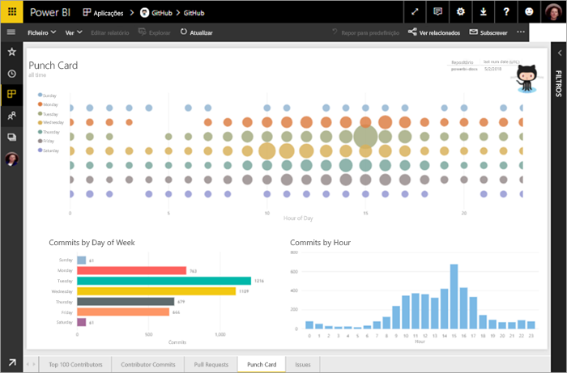
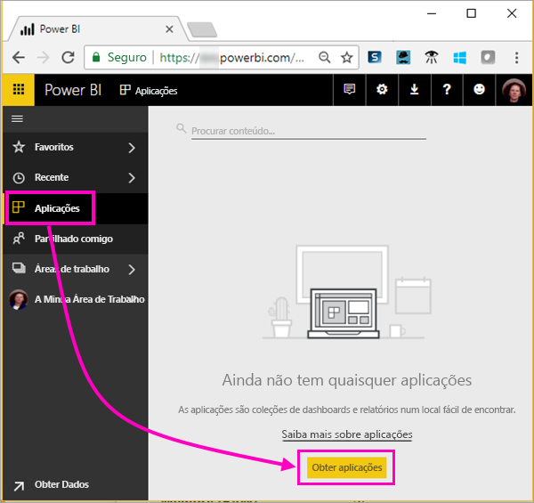
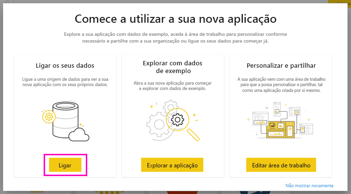
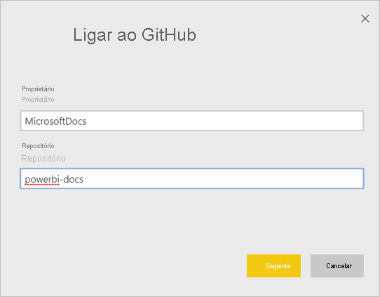
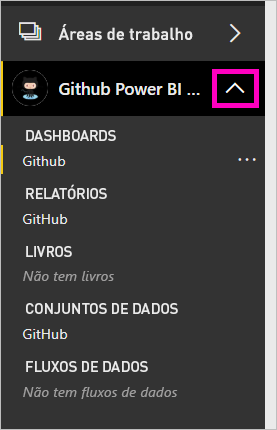
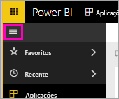
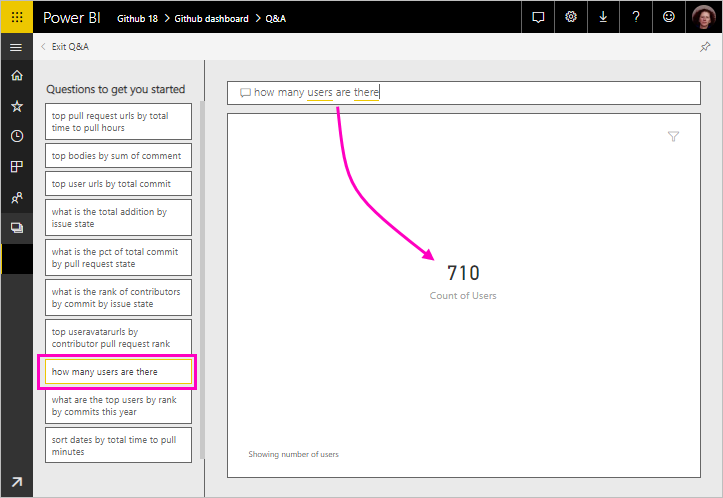
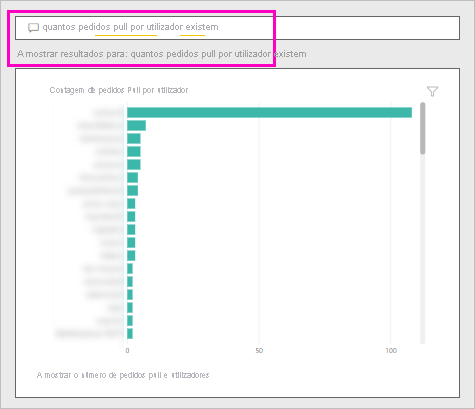
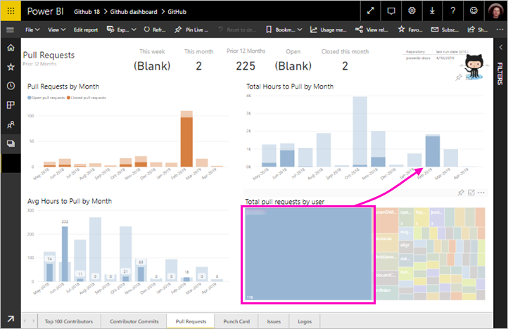
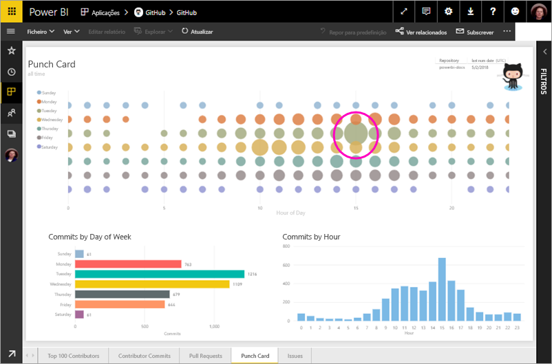

# Tutorial: ligar-se a um repositório do GitHub com o Power BI
Neste tutorial, irá ligar a dados reais no serviço GitHub com o Power BI e o Power BI criará automaticamente dashboards e relatórios. Vai ligar-se ao repositório de conteúdos públicos do Power BI (também conhecido como *repositório*) e ver respostas a perguntas como: Quantas pessoas contribuem para os conteúdos públicos do Power BI? Quem contribui mais? Que dia da semana tem mais contribuições? Entre outras perguntas. 

Neste tutorial, irá concluir os seguintes passos:

> [!div class="checklist"]
> * Inscrever-se numa conta do GitHub, se ainda não tiver uma 
> * Iniciar sessão na sua conta do Power BI ou inscrever-se, se ainda não tiver uma
> * Abrir o serviço Power BI
> * Localizar a aplicação GitHub
> * Introduzir as informações do repositório público do GitHub do Power BI
> * Ver o dashboard e o relatório com dados do GitHub
> * Limpar os recursos ao eliminar a aplicação

Se não estiver inscrito no Power BI, [inscreva-se para uma avaliação gratuita](https://app.powerbi.com/signupredirect?pbi_source=web) antes de começar.

## Pré-requisitos

Para concluir este tutorial, precisa de uma conta do GitHub, se ainda não tiver uma. 

- Inscreva-se numa [conta do GitHub](/contribute/get-started-setup-github).

## Como se ligar
1. Inicie sessão no serviço Power BI (`https://app.powerbi.com`). 
2. No painel de navegação, selecione **Aplicações** e, em seguida, **Obter aplicações**.
   
    

3. Selecione **Aplicações**, escreva **GitHub** na caixa de pesquisa > **Obter agora**.
   
    

4. Em **Instalar esta aplicação do Power BI?** , selecione **Instalar**.
5. Em **A sua nova aplicação está pronta**, selecione **Ir para a aplicação**.
6. Em **Comece já com a sua nova aplicação** , selecione **Ligar**.

    

7. Escreva o nome do repositório e também o seu proprietário. O URL deste repositório é https://github.com/MicrosoftDocs/powerbi-docs, pelo que o **Proprietário do Repositório** é **MicrosoftDocs** e o **Repositório** é **powerbi-docs**. 
   
    

5. Introduza as credenciais do GitHub que criou. O Power BI poderá ignorar este passo se já tiver iniciado sessão no GitHub no seu browser. 

6. Para **Método de Autenticação**, mantenha **oAuth2** selecionado \>**Iniciar Sessão**.

7. Siga os ecrãs de autenticação do GitHub. Conceda permissão ao Power BI para aceder aos dados do GitHub.
   
   Agora, o Power BI pode ligar ao GitHub e aos dados.  Os dados são atualizados uma vez por dia.

8. Após o Power BI importar os dados, verá os conteúdos da sua nova área de trabalho do GitHub. 
9. Selecione a seta junto ao nome da área de trabalho no painel de navegação. Verá que a área de trabalho contém um dashboard e um relatório. 

    

10. Selecione **Mais opções** (...) junto ao nome do dashboard > **Mudar o nome** > escreva **Dashboard do GitHub**.
 
     

8. Selecione o ícone de navegação global para minimizar o painel de navegação e ter mais espaço.

    

10. Selecione o dashboard do GitHub.
    
    O dashboard do GitHub contém dados dinâmicos, pelo que os valores apresentados poderão ser diferentes.

    

    

## Colocar uma pergunta

1. Coloque o cursor em **Colocar uma questão sobre os dados**. O Power BI oferece **Perguntas para começar**. 

1. Selecione **quantos utilizadores existem**.
 
    

13. Entre **quantos** e **utilizadores existem**, escreva **pedidos pull por**. 

     O Power BI cria um gráfico de barras que mostra o número de pedidos pull por pessoa.

    

13. Selecione o ícone de pino para afixar ao dashboard e, em seguida, **Sair das Perguntas e Respostas**.

## Ver o relatório do GitHub 

1. No dashboard do GitHub, selecione o gráfico de colunas **Pull Requests by Month** (Pedidos Pull Por Mês) para abrir o relatório relacionado.

    

2. Selecione um nome de utilizador no gráfico **Total pull requests by user** (Pedidos pull totais por utilizador). Neste exemplo, vemos que a maioria das horas ocorreu em fevereiro.

    

3. Selecione o separador **Punch Card** para ver a página seguinte no relatório. 
 
    

    Aparentemente, terças às 15:00 é a hora e o dia da semana mais comum para *consolidações*, quando as pessoas verificam o trabalho.

## Limpar recursos

Agora que concluiu o tutorial, pode eliminar a aplicação GitHub. 

1. No painel de navegação, selecione **Aplicações**.
2. Coloque o cursor sobre o mosaico do GitHub e selecione o caixote do lixo **Eliminar**.

    

## Próximos passos

Neste tutorial, ligou a um repositório público do GitHub e obteve dados, que o Power BI formatou num dashboard e num relatório. Respondeu a algumas questões sobre os dados ao explorar o dashboard e o relatório. Agora pode saber mais sobre como ligar a outros serviços, como o Salesforce, o Microsoft Dynamics e o Google Analytics. 
 
> [!div class="nextstepaction"]
> [Ligar aos serviços online que utiliza](service-connect-to-services.md)