# <a name="tutorial-use-cognitive-services-in-power-bi"></a>Tutorial: Utilizar os Serviços Cognitivos no Power BI

O Power BI fornece acesso a um conjunto de funções dos Serviços Cognitivos do Azure para enriquecer os seus dados na preparação personalizada de dados para Fluxos de Dados. Seguem-se os serviços suportados atualmente: [Análise de Sentimentos](/azure/cognitive-services/text-analytics/how-tos/text-analytics-how-to-sentiment-analysis), [Extração de Expressões-Chave](/azure/cognitive-services/text-analytics/how-tos/text-analytics-how-to-keyword-extraction), [Deteção de Idioma](/azure/cognitive-services/text-analytics/how-tos/text-analytics-how-to-language-detection) e [Etiquetagem de Imagens](/azure/cognitive-services/computer-vision/concept-tagging-images). As transformações são executadas no serviço Power BI e não precisam de uma subscrição dos Serviços Cognitivos do Azure. Esta funcionalidade precisa do Power BI Premium.

As transformações dos Serviços Cognitivos são suportadas na [Preparação Personalizada de Dados para Fluxos de Dados](https://powerbi.microsoft.com/blog/introducing-power-bi-data-prep-wtih-dataflows/). Utilize os exemplos passo a passo abaixo para a análise de texto e etiquetagem de imagens para começar.

Neste tutorial, vai aprender a:

> [!div class="checklist"]
> * Importar dados para um fluxo de dados
> * Classificar sentimentos e extrair expressões-chave de uma coluna de texto num fluxo de dados
> * Ligar aos resultados do Power BI Desktop


## <a name="prerequisites"></a>Pré-requisitos

Para concluir este tutorial, precisa do seguinte: 

- Uma conta do Power BI. Se não estiver inscrito no Power BI, [inscreva-se para uma avaliação gratuita](https://app.powerbi.com/signupredirect?pbi_source=web) antes de começar.
- Acesso a uma capacidade do Power BI Premium com a carga de trabalho de IA ativada. Esta carga de trabalho estará desativada por predefinição durante a pré-visualização. Se, apesar de ter uma capacidade Premium, as Informações de IA não aparecem, contacte o administrador da capacidade Premium para ativar a carga de trabalho de IA no portal de administração.

## <a name="text-analytics"></a>Análise de texto

Siga os passos descritos nesta secção para concluir a parte que diz respeito à análise de texto do tutorial.

### <a name="step-1-apply-sentiment-scoring-in-power-bi-service"></a>Passo 1: Aplicar a classificação de sentimento no serviço Power BI

Para começar, navegue para uma área de trabalho do Power BI com capacidade Premium e crie um novo fluxo de dados com o botão **Criar** apresentado na parte superior direita do ecrã.


A caixa de diálogo do fluxo de dados mostra as opções disponíveis para criar um novo fluxo de dados. Selecione **Adicionar novas entidades** . Em seguida, escolha **Texto/CSV** no menu de origens de dados.


Cole este URL no campo de URL: [https://pbiaitutorials.blob.core.windows.net/textanalytics/FabrikamComments.csv](https://pbiaitutorials.blob.core.windows.net/textanalytics/FabrikamComments.csv) e clique em **Seguinte**.

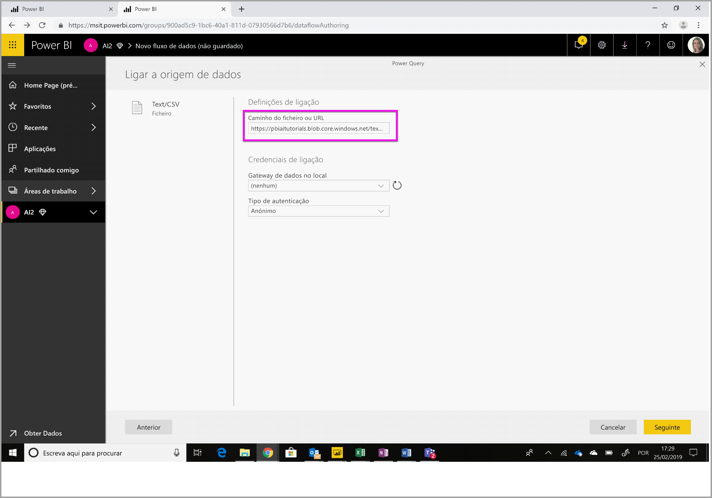

Os dados estão prontos para serem utilizados para efeitos de análise de texto, sendo possível utilizar a Classificação de Sentimento e a Extração de Expressões-Chave na coluna de comentários de clientes.

No Editor do Power Query, selecione **Informações de IA**

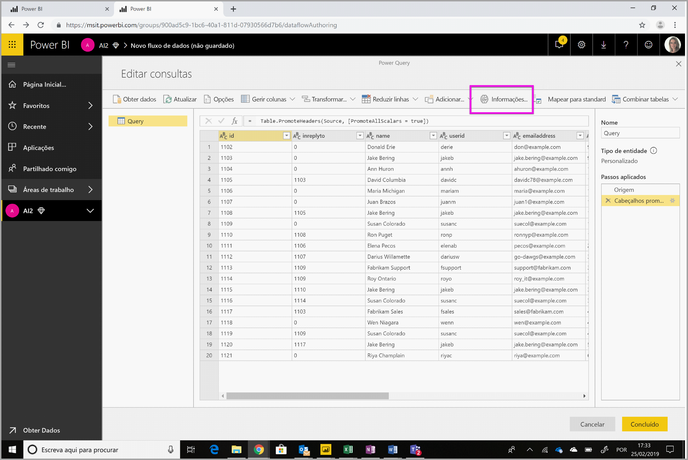

Expanda a pasta **Serviços Cognitivos** e selecione a função que quer utilizar. Este exemplo classifica o sentimento da coluna de comentários, mas pode seguir os mesmos passos para experimentar a Deteção de Idioma e a Extração de Expressões-Chave.

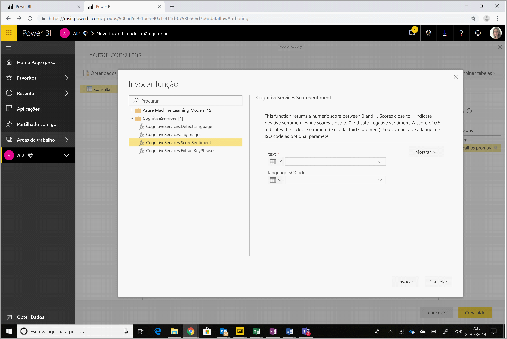

Os campos obrigatórios e opcionais serão apresentados após a seleção de uma função. Para classificar o sentimento das críticas de exemplo, selecione a coluna de críticas como entrada de texto. As informações de cultura são uma entrada opcional e têm de ter um formato ISO. Por exemplo, introduza "en" se quiser que o texto seja processado como estando em inglês. Quando o campo é deixado em branco, o primeiro passo do Power BI é detetar o idioma do valor de entrada antes de classificar o sentimento.

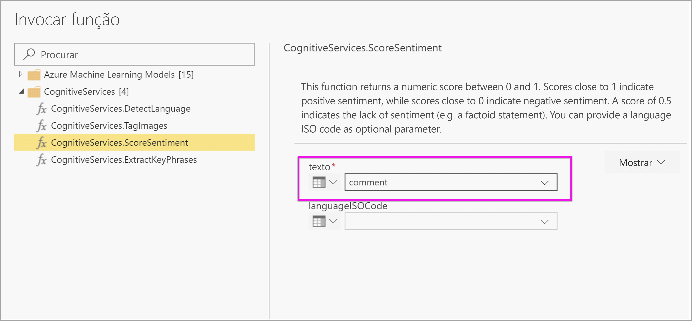

A seguir, selecione **Invocar** para executar a função. Uma nova coluna com a classificação de sentimento para cada linha é adicionada à tabela. Pode voltar a **Informações de IA** para extrair expressões-chave do texto da crítica da mesma forma.

Quando tiver terminado as transformações, altere o nome da consulta para "Comentários de clientes" e selecione **Concluído**.

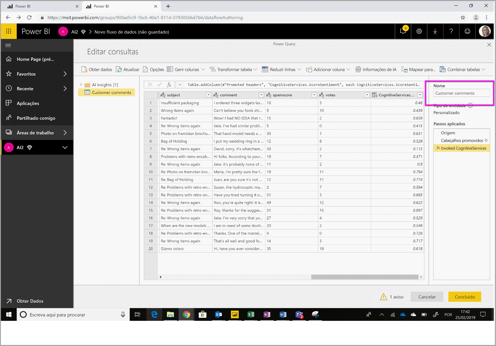

Em seguida, execute a ação **Guardar** o fluxo de dados e atribua-lhe o nome Fabrikam. Selecione o botão **Atualizar Agora** que aparece depois de guardar o fluxo de dados.

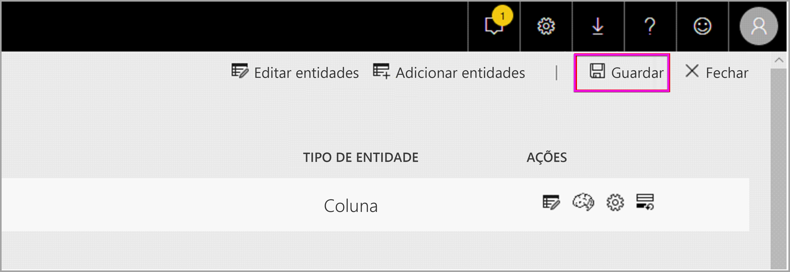

Assim que o fluxo de dados estiver guardado e atualizado, pode utilizá-lo num relatório do Power BI.

### <a name="step-2-connect-from-power-bi-desktop"></a>Passo 2: Ligar a partir do Power BI Desktop

Abra o Power BI Desktop. No friso Base, selecione **Obter Dados**.

Navegue para os **fluxos de dados do Power BI (Beta**) na secção Power BI e selecione **Ligar**.

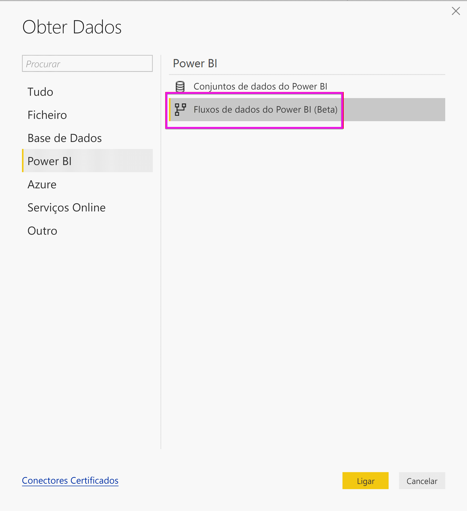

Por se tratar de uma funcionalidade de pré-visualização, o conector irá pedir-lhe para aceitar as condições da pré-visualização. Depois de as aceitar, inicie sessão com a sua conta da organização.

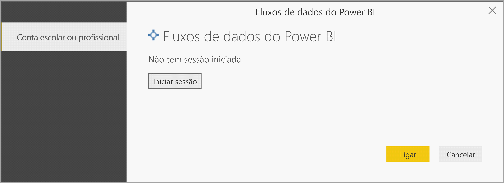

Selecione o fluxo de dados que acabou de criar. Navegue para a tabela de Comentários de clientes e clique em **Carregar**.

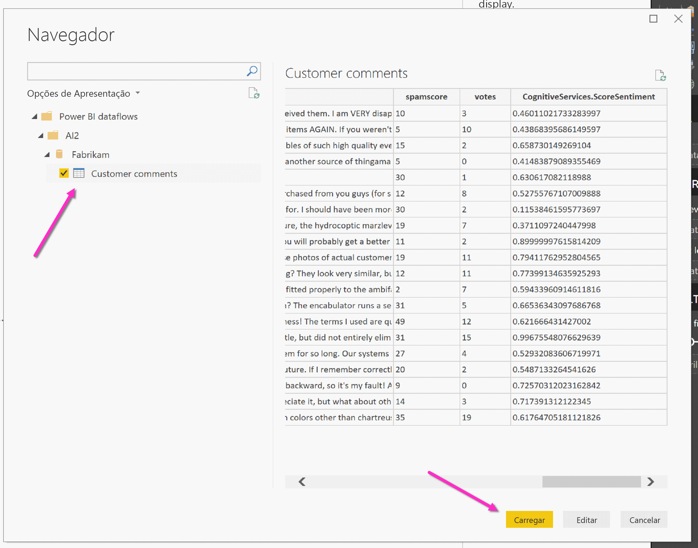

Agora que os dados estão carregados, pode começar a criar um relatório.

## <a name="image-tagging"></a>Etiquetagem de imagens

Navegue para uma área de trabalho do Power BI com capacidade Premium. Crie um novo fluxo de dados com o botão **Criar** apresentado na parte superior direita do ecrã.

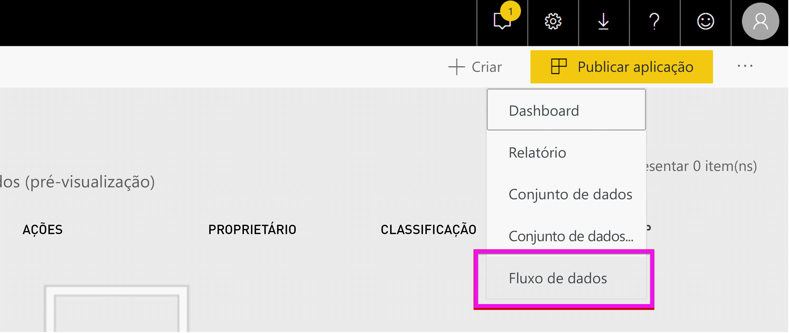

Selecione **Adicionar novas entidades**.


Quando lhe for pedido para escolher uma origem de dados, selecione **Consulta em branco**.

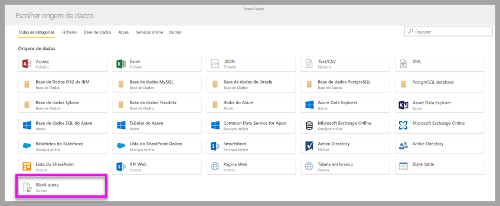

Copie a consulta abaixo no editor de consultas e clique em seguinte. Pode substituir os caminhos de URL abaixo por outras imagens ou adicionar mais linhas. A função *Web.Contents* importa o URL da imagem como binário. Se tiver uma origem de dados com imagens armazenadas como binário, também pode utilizá-la diretamente.


```python
let
  Source = Table.FromRows({
  { Web.Contents("https://images.pexels.com/photos/87452/flowers-background-butterflies-beautiful-87452.jpeg") },
  { Web.Contents("https://upload.wikimedia.org/wikipedia/commons/5/53/Colosseum_in_Rome%2C_Italy_-_April_2007.jpg") }}, { "Image" })
in
  Source
```

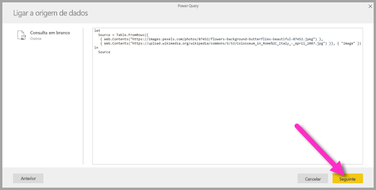

Quando lhe forem pedidas credenciais, selecione *anónimo*.

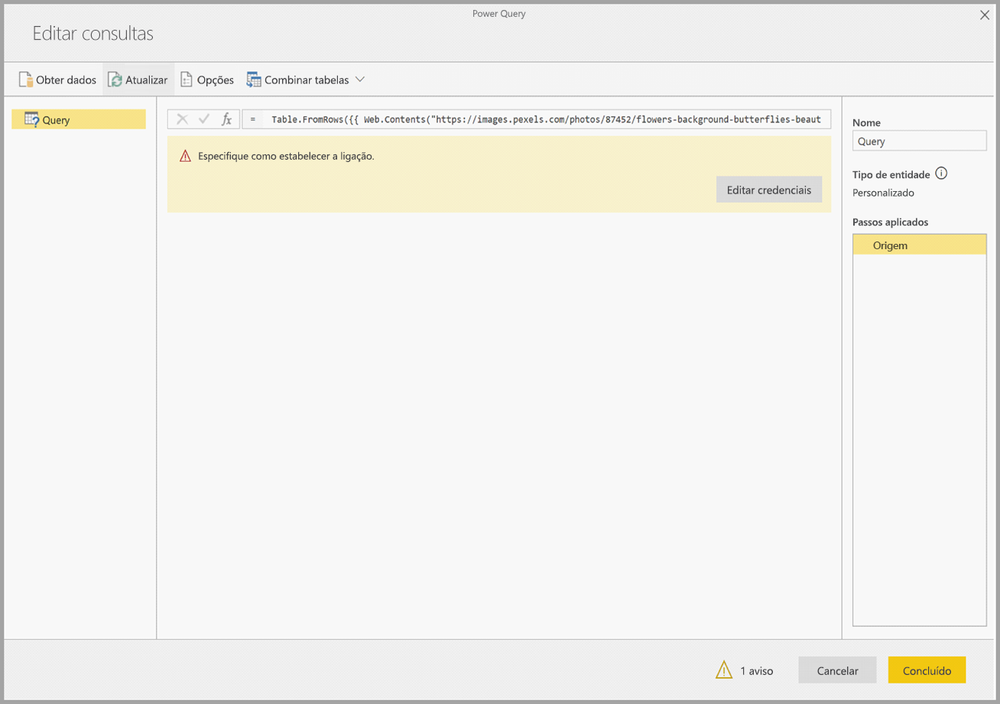

É-lhe apresentada a seguinte imagem.

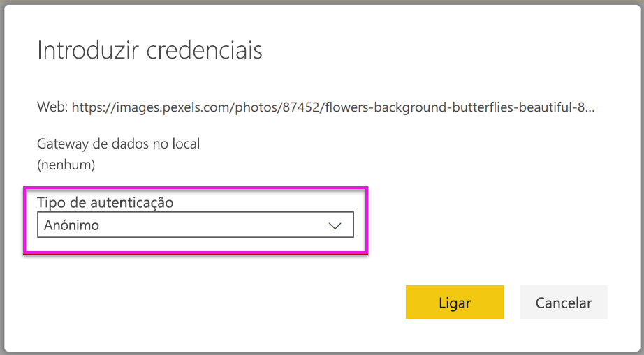

Ser-lhe-ão pedidas credenciais para cada página Web individual.

Selecione **Informações de IA** no editor de consultas.

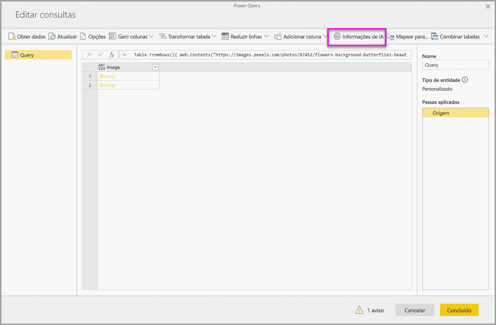

Em seguida, inicie sessão com a sua **conta da organização**.


Selecione a função Etiquetar Imagens, introduza _[Binário]_ no campo de coluna e _en_ no campo de informações de cultura. 

> [!NOTE]
> Atualmente, não é possível escolher uma coluna com base numa lista pendente, uma situação que será resolvida o mais rápido possível durante a pré-visualização privada.


No editor de funções, remova as aspas à volta do nome da coluna. 

> [!NOTE]
> A remoção das aspas é uma solução alternativa temporária, que será resolvida o mais rápido possível durante a pré-visualização.


A função devolve um registo com ambas as etiquetas separadas por vírgulas e como um registo json. Selecione o botão de expansão para adicionar uma ou ambas as colunas à tabela.

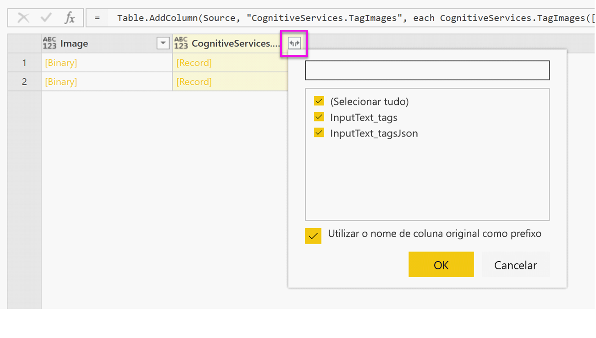

Selecione **Concluído** e guarde o fluxo de dados. Após ter atualizado o fluxo de dados, pode ligar ao mesmo a partir do Power BI Desktop com os conectores de Fluxos de Dados. (Veja os passos na página 5 deste documento.)

## <a name="clean-up-resources"></a>Limpar recursos

Quando já não for necessária, elimine a consulta ao clicar com o botão direito do rato no nome da consulta no editor do Power Query e selecionar **Eliminar**.

## <a name="next-steps"></a>Próximos passos

Neste tutorial, aplicou as funções de classificação de sentimento e etiquetagem de imagens num fluxo de dados do Power BI. Para saber mais sobre os Serviços Cognitivos no Power BI, leia os artigos seguintes.

* [Serviços Cognitivos no Azure](/azure/cognitive-services/)
* Introdução à [preparação personalizada de dados em fluxos de dados](../transform-model/service-dataflows-overview.md)
* Saiba mais sobre o [Power BI Premium](https://powerbi.microsoft.com/power-bi-premium/)

Poderá também estar interessado nos seguintes artigos.

* [Tutorial: Invocar um modelo do Machine Learning Studio (clássico) no Power BI (Pré-visualização)](service-tutorial-invoke-machine-learning-model.md)
* [Integração do Azure Machine Learning no Power BI (Pré-visualização)](../transform-model/service-machine-learning-integration.md)
* [Serviços Cognitivos no Power BI (Pré-visualização)](../transform-model/service-cognitive-services.md)