# Tutorial: Definir alertas de dados no serviço Power BI
Defina alertas para receber notificações quando os dados nos seus dashboards forem alterados para além dos limites que definiu. 

Pode definir alertas em mosaicos se tiver uma licença do Power BI Pro ou se um dashboard tiver sido partilhado consigo a partir de uma [capacidade Premium](../service-premium.md). Os alertas só podem ser definidos nos mosaicos afixados a partir de elementos visuais de relatório e apenas em medidores, KPIs e cartões. Os alertas podem ser definidos em elementos visuais criados a partir de conjuntos de dados de transmissão em fluxo que foram afixados a partir de um relatório a um dashboard, mas não podem ser definidos em mosaicos de transmissão em fluxo criados diretamente no dashboard com a opção **Adicionar mosaico** > **Dados de transmissão em fluxo personalizados**. 

Só o utilizador pode ver os alertas que definir, mesmo que partilhe o dashboard. Os alertas de dados são totalmente sincronizados entre plataformas; defina e veja alertas de dados [nas aplicações móveis do Power BI](mobile/mobile-set-data-alerts-in-the-mobile-apps.md) e no serviço Power BI. 

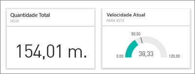

> [!WARNING]
> As notificações de alertas com base em dados dão-lhe informações sobre os seus dados. Se vir os dados do Power BI num dispositivo móvel e esse dispositivo for roubado, recomendamos que utilize o serviço Power BI para desativar todas as regras de alerta com base em dados.
> 

Este tutorial abrange o seguinte.
> [!div class="checklist"]
> * Quem pode definir alertas
> * Quais os elementos visuais que suportam alertas
> * Quem pode ver os meus alertas
> * Os alertas funcionam no Power BI Desktop e no Mobile
> * Como posso criar um alerta
> * Onde vou receber os meus alertas

Se não estiver inscrito no Power BI, [inscreva-se para uma avaliação gratuita](https://app.powerbi.com/signupredirect?pbi_source=web) antes de começar.

## Definir alertas de dados no serviço Power BI
Veja a Amanda a adicionar alguns alertas a mosaicos no seu dashboard. Em seguida, siga as instruções passo-a-passo abaixo do vídeo para experimentar.

<iframe width="560" height="315" src="https://www.youtube.com/embed/JbL2-HJ8clE" frameborder="0" allowfullscreen></iframe>

Este exemplo utiliza um mosaico de cartão do dashboard de [exemplo de Análise de Revenda](http://go.microsoft.com/fwlink/?LinkId=529778).

1. A partir do medidor do dashboard, KPI ou mosaico do cartão, selecione as reticências.
   
   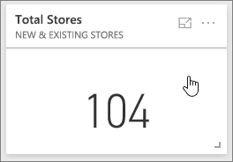
2. Selecione o ícone de campainha  ou **Gerir alertas** para adicionar um ou mais alertas a **Total stores**.
   
1. No painel **Gerir alertas**, selecione **+ Adicionar regra de alerta**.  Certifique-se de que o controlo de deslize está definido como **Ativo**e atribua um título ao alerta. Os títulos ajudam a reconhecer facilmente os alertas.
   
   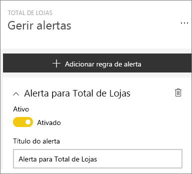
4. Desloque o ecrã para baixo e introduza os detalhes do alerta.  Neste exemplo, vamos criar um alerta que nos notifica uma vez por dia se o número total de lojas ficar acima de 100. Os alertas serão apresentados no nosso Centro de notificações. E o Power BI também nos envia uma mensagem de e-mail.
   
   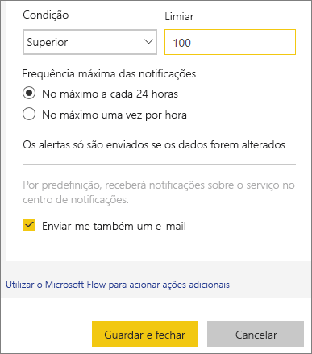
5. Selecione **Guardar e fechar**.

## Receber alertas
Quando os dados que estão a ser monitorizados atingirem um dos limiares que definiu, acontecem várias coisas. Em primeiro lugar, o Power BI verifica se passou mais de uma hora ou mais de 24 horas (consoante a opção que selecionou) desde o último alerta enviado. Desde que os dados tenham passado o limiar, receberá um alerta.

Em seguida, o Power BI envia um alerta para o Centro de notificação e, opcionalmente, por e-mail. Cada alerta contém uma ligação direta para os seus dados. Selecione a ligação para ver o mosaico relevante.  

1. Se tiver definido o alerta para lhe enviar uma mensagem de e-mail, irá encontrar algo deste género na sua Caixa de entrada.
   
   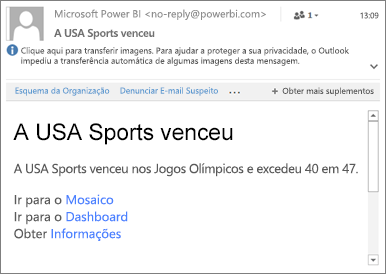
2. O Power BI adiciona uma mensagem ao seu **Centro de notificações** e adiciona um ícone de novo alerta ao mosaico aplicável.
   
   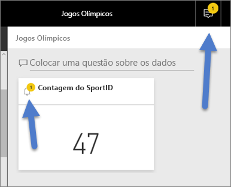
3. Abra o Centro de notificações para ver os detalhes do alerta.
   
    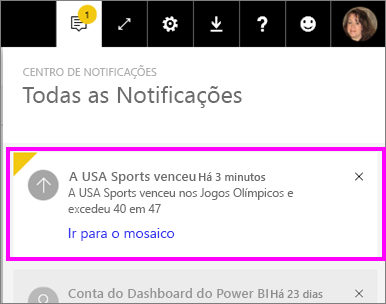
   
   > [!NOTE]
   > Os alertas só funcionam em dados que são atualizados. Quando os dados forem atualizados, o Power BI procura alertas definidos para esses dados. Se os dados tiverem atingido um limiar de alerta, será acionado um alerta.
   > 
   > 

## Gerir alertas
Existem várias formas de gerir os alteras: No próprio mosaico do dashboard, no menu de Definições do Power BI, num mosaico individual na [aplicação móvel do Power BI no iPhone](mobile/mobile-set-data-alerts-in-the-mobile-apps.md) ou na [aplicação móvel do Power BI para Windows 10](mobile/mobile-set-data-alerts-in-the-mobile-apps.md).

### No próprio mosaico
1. Se precisar de alterar ou remover um alerta de um mosaico, volte a abrir a janela **Gerir alertas**, ao selecionar o ícone de campainha . São apresentados todos os alertas que definiu para esse mosaico.
   
    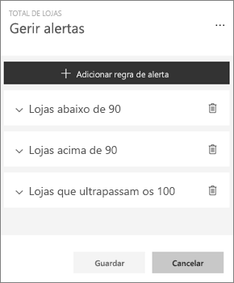.
2. Para modificar um alerta, selecione a seta para a esquerda do nome do alerta.
   
    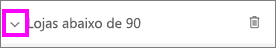.
3. Para eliminar um alerta, selecione o recipiente do lixo à direita do nome do alerta.
   
      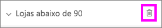

### No menu de definições do Power BI
1. Selecione o ícone de engrenagem na barra de menus do Power BI.
   
    .
2. Em **Definições**, selecione **Alertas**.
   
    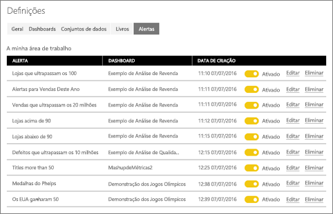
3. A partir daqui, pode ativar e desativar alertas, abrir a janela **Gerir alertas** para fazer alterações ou eliminar o alerta.

## Sugestões e resolução de problemas
* Atualmente, os alertas não são suportados para mosaicos do Bing ou mosaicos de cartões com medidas de data/hora.
* Os alertas só funcionam com tipos de dados numéricos.
* Os alertas só funcionam em dados que são atualizados. Não funcionam em dados estáticos.
* Os alertas só funcionam em conjuntos de dados de transmissão em fluxo se criar um elemento visual de relatório de KPI/cartão/medidor e, em seguida, afixar esse elemento visual ao dashboard.

## Limpar recursos
As instruções para eliminar alertas são explicadas acima. Em suma, selecione o ícone de engrenagem na barra de menus do Power BI. Em **Configurações** selecione **Alertas** e elimine o alerta.

> [!div class="nextstepaction"]
> [Definir alertas de dados num dispositivo móvel](mobile/mobile-set-data-alerts-in-the-mobile-apps.md)

