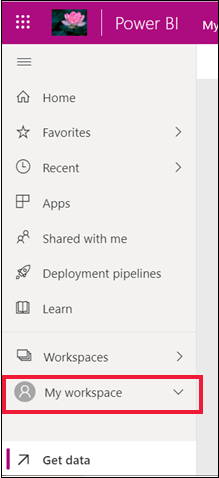
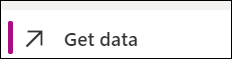
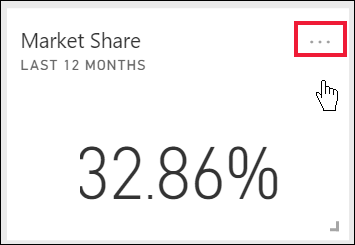

# Tutorial: Definir os alertas nos dashboards do Power BI

[!INCLUDE[consumer-appliesto-yynn](../includes/consumer-appliesto-yynn.md)]

[!INCLUDE [power-bi-service-new-look-include](../includes/power-bi-service-new-look-include.md)]

Defina alertas no serviço Power BI para receber notificações quando os dados num dashboard forem alterados para cima ou para abaixo dos limites que definiu. Os alertas só podem ser definidos nos mosaicos afixados a partir de elementos visuais de relatório e apenas em medidores, KPIs e cartões. 

Pode criar alertas nos dashboards:
- que criou e guardou em **A minha área de trabalho**;
- que foram partilhados consigo numa [capacidade Premium](end-user-license.md); 
- em qualquer área de trabalho a que possa aceder, se tiver uma licença do Power BI Pro.    

Os alertas só funcionam em dados que são atualizados. Quando os dados forem atualizados, o Power BI procura alertas definidos para esses dados. Se os dados tiverem atingido um limiar de alerta, será acionado um alerta. 

Esta funcionalidade ainda está em desenvolvimento, por isso veja [abaixo a secção Sugestões e resolução de problemas](#tips-and-troubleshooting).

Só o utilizador pode ver os alertas que definir, mesmo que partilhe o dashboard. Os alertas de dados são totalmente sincronizados entre plataformas; defina e veja alertas de dados [nas aplicações móveis do Power BI](mobile/mobile-set-data-alerts-in-the-mobile-apps.md) e no serviço Power BI. 

> [!WARNING]
> Esses alertas fornecem informações sobre os seus dados. Se vir os dados do Power BI num dispositivo móvel e esse dispositivo for roubado, recomendamos que utilize o serviço Power BI para desativar todos os alertas.
> 

Este tutorial abrange o seguinte.
> [!div class="checklist"]
> * Quem pode definir alertas
> * Quais os elementos visuais que suportam alertas
> * Quem pode ver os meus alertas
> * Os alertas funcionam no Power BI Desktop e no Mobile
> * Como criar um alerta
> * Onde vou receber os meus alertas

## Pré-requisitos

Se não estiver inscrito no Power BI, [inscreva-se para uma avaliação gratuita](https://app.powerbi.com/signupredirect?pbi_source=web) antes de começar.

1. Este exemplo utiliza um mosaico de cartão do dashboard do exemplo Vendas e Marketing. Abra o serviço Power BI (app.powerbi.com), inicie sessão e abra **A Minha Área de Trabalho**.    
    

2. No canto inferior esquerdo, selecione **Obter dados**.

    

3. Na página Obter dados apresentada, selecione **Exemplos**.

4. Selecione o Exemplo de Vendas e Marketing e, em seguida, escolha **Ligar**.

    

5. Depois de o Power BI se ligar ao exemplo, selecione **Ir para o dashboard** na caixa de diálogo apresentada.     
    

## Adicionar um alerta a um mosaico do dashboard

1. A partir do medidor do dashboard, KPI ou mosaico do cartão, selecione as reticências.
   
   

2. Selecione o ícone de alerta  ou **Gerir alertas** para adicionar um ou mais alertas ao cartão **Quota de mercado**.

   

   
1. No painel **Gerir alertas**, selecione **+ Adicionar regra de alerta**.  Certifique-se de que o controlo de deslize está definido como **Ativo**e atribua um título ao alerta. Os títulos ajudam a reconhecer facilmente os alertas.
   
   
4. Desloque o ecrã para baixo e introduza os detalhes do alerta.  Neste exemplo, vamos criar um alerta que nos notifica uma vez por dia se a nossa quota de mercado aumentar para 40 ou mais. Os alertas serão apresentados no nosso [Centro de notificações](end-user-notification-center.md). E o Power BI também nos envia uma mensagem de e-mail.
   
   

5. Selecione **Guardar e fechar**.
 

   > 

## Receber alertas
Quando os dados que estão a ser monitorizados atingirem um dos limiares que definiu, acontecem várias coisas. Em primeiro lugar, o Power BI verifica se passou mais de uma hora ou mais de 24 horas (consoante a opção que selecionou) desde o último alerta enviado. Desde que os dados tenham passado o limiar, receberá um alerta.

Em seguida, o Power BI envia um alerta para o Centro de Notificações e, opcionalmente, por e-mail. Cada alerta contém uma ligação direta para os seus dados. Selecione a ligação para ver o mosaico relevante.  

1. Se tiver definido o alerta para lhe enviar uma mensagem de e-mail, irá encontrar algo deste género na sua Caixa de entrada. Este é um alerta que definimos para o cartão **Sentimento**.
   
   
2. O Power BI também adiciona uma mensagem ao seu **Centro de notificações**.
   
   
3. Abra o Centro de notificações para ver os detalhes do alerta.
   
    
   
  

## Gerir alertas

Existem várias formas de gerir os alertas: no próprio mosaico do dashboard, no menu de Definições do Power BI, num mosaico individual na [aplicação móvel do Power BI no iPhone](mobile/mobile-set-data-alerts-in-the-mobile-apps.md) ou na [aplicação móvel do Power BI para Windows 10](mobile/mobile-set-data-alerts-in-the-mobile-apps.md).

### No próprio mosaico

1. Se precisar de alterar ou remover um alerta de um mosaico, volte a abrir a janela **Gerir alertas** ao selecionar o ícone de alerta . São apresentados todos os alertas que definiu para esse mosaico.
   
    .
2. Para modificar um alerta, selecione a seta para a esquerda do nome do alerta.
   
    .
3. Para eliminar um alerta, selecione o recipiente do lixo à direita do nome do alerta.
   
      

### No menu de definições do Power BI

1. Selecione o ícone de engrenagem na barra de menus do Power BI.
   
    .
2. Em **Definições**, selecione **Alertas**.
   
    
3. A partir daqui, pode ativar e desativar alertas, abrir a janela **Gerir alertas** para fazer alterações ou eliminar o alerta.

## Sugestões e resolução de problemas 

* Se não conseguir definir um alerta para um medidor, um KPI ou um cartão, contacte o administrador do Power BI ou o suporte técnico de TI para obter ajuda. Às vezes, os alertas são desativados ou não estão disponíveis no seu dashboard ou para determinados tipos de mosaicos do dashboard.
* Os alertas só funcionam em dados que são atualizados. Não funcionam em dados estáticos. Os exemplos fornecidos pela Microsoft são, em grande parte, estáticos. 
* A capacidade de receber e ver conteúdos partilhados exige uma licença Power BI Pro ou Premium. Para obter mais informações, leia [Qual é a minha licença?](end-user-license.md).
* Os alertas podem ser definidos em elementos visuais criados a partir de fluxos de conjuntos de dados que são afixados de um relatório a um dashboard. Os alertas não podem ser definidos em fluxos de mosaicos criados diretamente no dashboard com **Adicionar mosaico** > **Dados de transmissão em fluxo personalizados**.

## Limpar recursos
As instruções para eliminar alertas são explicadas acima. Em suma, selecione o ícone de engrenagem na barra de menus do Power BI. Em **Configurações** selecione **Alertas** e elimine o alerta.

> [!div class="nextstepaction"]
> [Definir alertas de dados num dispositivo móvel](mobile/mobile-set-data-alerts-in-the-mobile-apps.md)

