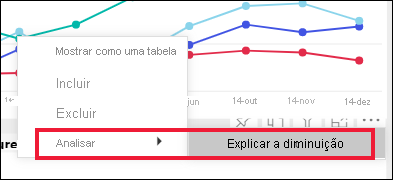
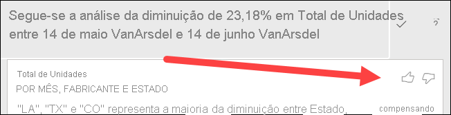
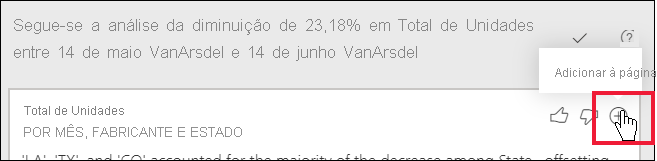

# Utilizar a funcionalidade Analisar para explicar as flutuações nos elementos visuais do relatório

[!INCLUDE[consumer-appliesto-yynn](../includes/consumer-appliesto-yynn.md)]

Nos elementos visuais do relatório, pode ver muitas vezes um grande aumento dos valores e, em seguida, uma queda acentuada dos mesmos e questionar-se acerca dessas flutuações. Com a funcionalidade **Analisar** do **serviço Power BI**, pode descobrir a causa das flutuações com apenas alguns cliques.

Por exemplo, considere o seguinte elemento visual que mostra *Total de unidades* por *Mês* e *Fabricante*. A VanArsdel tem um desempenho superior ao dos seus concorrentes, mas apresenta uma queda acentuada em junho de 2014. Nesses casos, pode explorar os dados para ajudar a explicar a alteração que ocorreu. 

Pode pedir ao serviço Power BI para explicar os aumentos, as diminuições ou a distribuição invulgar nos elementos visuais e, assim, obter análises rápidas, automatizadas e informativas sobre os dados. Clique com o botão direito do rato num ponto de dados e selecione **Analisar > Explicar a diminuição** (ou o aumento, se a barra anterior era mais baixa) ou **Analisar > Localizar onde esta distribuição é diferente**. As informações são apresentadas numa janela fácil de utilizar.

A funcionalidade Analisar é contextual e baseia-se no ponto de dados imediatamente anterior (como a barra ou coluna anterior).

> [!NOTE]
> Esta funcionalidade encontra-se em pré-visualização e encontra-se sujeita a alterações. A funcionalidade de informações está ativada por predefinição (não precisa de marcar nenhuma caixa de Pré-visualização para a ativar).

### Quais os fatores e as categorias escolhidos

Depois de examinar colunas diferentes, o Power BI seleciona e apresenta os fatores que mostram a maior alteração na contribuição relativa. Os valores que tiveram a alteração mais significativa na contribuição são indicados na descrição. Além disso, os valores que tiveram os maiores aumentos e diminuições reais também são indicados.

Para ver todas as informações geradas pelo Power BI, utilize a barra de deslocação. A ordem é classificada com o contribuidor mais significativo a ser apresentado primeiro. 

## Utilizar informações
Para utilizar as informações para explicar as tendências vistas nos elementos visuais, clique com o botão direito do rato em qualquer ponto de dados numa barra ou num gráfico de linhas e selecione **Analisar**. Em seguida, escolha a opção apresentada: **explicar o aumento**, **explicar a diminuição** ou **explicar a diferença**.

Depois, o Power BI Desktop executa algoritmos de aprendizagem automática nos dados e preenche uma janela com um elemento visual e uma descrição que descreve quais as categorias que mais influenciaram o aumento, a diminuição ou a diferença.  Para este exemplo, a primeira informação é um gráfico de cascata.

Ao selecionar os pequenos ícones na parte inferior do visual de cascata, pode optar por ter as informações apresentadas em gráfico de dispersão, gráfico de colunas empilhadas ou gráfico de friso.

Utilize os ícones de *polegar para cima* e *polegar para baixo* na parte inferior da página para dar feedback sobre o elemento visual e a funcionalidade.  

Pode utilizar as informações quando o relatório estiver na Vista de leitura ou na Vista de edição, o que o tornará versátil para permitir analisar dados e para criar elementos visuais que pode facilmente adicionar aos relatórios. Se tiver o relatório aberto na Vista de edição, verá um ícone de adição ao lado dos ícones de polegar. Selecione o ícone de adição para adicionar as informações ao relatório como um novo elemento visual. 

## Detalhes dos resultados devolvidos

Os detalhes devolvidos pelas informações têm o objetivo de realçar as diferenças entre os dois períodos de tempo, para ajudar a compreender a alteração entre eles.  

O algoritmo utiliza as outras colunas no modelo e calcula a divisão por essa coluna nos períodos de tempo *antes* e *depois*. Em seguida, determina a quantidade de alterações que ocorreram nessa divisão e devolve essas colunas com a maior alteração. Por exemplo, *Estado* foi selecionado nas informações em cascata acima, uma vez que a contribuição feita por Louisiana, Texas e Colorado caiu de 13% para 19% de junho para julho e contribuiu mais para a diminuição no *Total de unidades*.  

Para cada informação devolvida, existem quatro elementos visuais que podem ser apresentados. O objetivo de três desses elementos visuais é realçar a alteração na contribuição entre os dois períodos. Por exemplo, para a explicação do aumento do *Trimestre 2* para o *Trimestre 3*. O gráfico do friso mostra a alteração antes e depois do ponto de dados selecionado.

### Dispersão

O elemento visual do gráfico de dispersão mostra o valor da medida no primeiro período (no eixo x) em comparação com o valor da medida no segundo período (no eixo y), para cada valor da coluna (*Estado* neste caso). Os pontos de dados estarão na região verde se o valor aumentar e na região vermelha se diminuir. 

A linha pontilhada mostra a melhor opção. Os pontos de dados acima desta linha aumentaram mais do que a tendência geral e o contrário ocorreu com os pontos de dados abaixo da mesma.  

Os itens de dados cujos valores estavam em branco em qualquer um dos períodos não serão apresentados no gráfico de dispersão.

### Gráfico de colunas 100% empilhadas

O elemento visual do gráfico de colunas 100% empilhadas mostra o valor da contribuição para o total (100%), para o ponto de dados selecionado e o anterior, o que permite uma comparação lado a lado da contribuição para cada ponto de dados. Neste exemplo, as descrições mostram a contribuição real do valor selecionado do Texas. Como a lista de estados é longa, as descrições ajudam-no a ver os detalhes. Ao utilizar as descrições, vemos que o Texas contribuiu com cerca da mesma percentagem para o total de unidades (31% e 32%), mas o número real de total de unidades diminuiu de 89 para 71. Nota: o eixo Y é uma percentagem, não um total, e cada banda de coluna é uma percentagem, não um valor. 

### Gráfico do friso

O elemento visual do gráfico do friso mostra o valor da medida antes e depois. É particularmente útil para mostrar as alterações nas contribuições quando a *ordenação* dos contribuidores mudou (por exemplo, *LA* cai do lugar de contribuidor número dois para o número onze).  Embora *TX* seja representado por um friso amplo na parte superior, o que significa que é o contribuidor mais significativo antes e depois, a queda mostra que o valor da contribuição caiu tanto durante o período selecionado como depois.

### Gráfico de cascata

O quarto elemento visual é um gráfico de cascata que mostra os aumentos ou as diminuições reais entre os períodos. Este elemento visual mostra claramente um contribuidor significativo para a diminuição de junho de 2014 – neste caso, **Estado**. O aspeto particular da influência de **Estado** no total de unidades é que os declínios no Louisiana, Texas e Colorado desempenharam o papel mais significativo.      

 

## Considerações e limitações
Uma vez que estas informações se baseiam na alteração face ao ponto de dados anterior, não estão disponíveis quando selecionar o primeiro ponto de dados num elemento visual. 

**Analisar** não está disponível para todos os tipos de elementos visuais. 

A lista seguinte é o conjunto de cenários atualmente não suportados para **Analisar –explicar o aumento/diminuição/diferença**:

* Filtros de Primeiros N
* Filtros de inclusão/exclusão
* Filtros de medição
* Medidas não numéricas
* Utilização de "Mostrar valor como"
* Medidas filtradas: são cálculos ao nível dos elementos visuais com um filtro específico aplicado (por exemplo, *Total de Vendas de França*) e são utilizadas em alguns dos elementos visuais criados pela funcionalidade de informações
* Colunas categóricas no eixo X, a menos que defina uma ordenação por coluna escalar. Se utilizar uma hierarquia, todas as colunas na hierarquia ativa terão de cumprir esta condição

## Próximos passos
[Gráficos de cascata](../visuals/power-bi-visualization-waterfall-charts.md)    
[Gráficos de dispersão](../visuals/power-bi-visualization-scatter.md)    
[Gráficos de colunas](../visuals/power-bi-report-visualizations.md)    
[Ribbon charts (Gráficos de friso)](../visuals/desktop-ribbon-charts.md)
