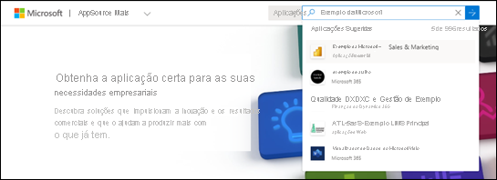
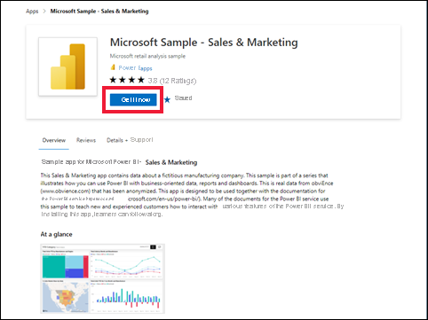

# Instalar e utilizar a aplicação de exemplo Sales and Marketing no serviço Power BI

[!INCLUDE[consumer-appliesto-yyny](../includes/consumer-appliesto-yyny.md)]

Agora que já tem as [noções básicas sobre como obter conteúdos do Power BI](end-user-app-view.md), vamos utilizar o Microsoft AppSource para obter a aplicação de modelo Marketing e Vendas. A aplicação de modelo Marketing e Vendas contém dados de exemplo que pode utilizar para explorar o serviço Power BI. Esta aplicação específica tem um dashboard e várias páginas de relatório. 

> [!IMPORTANT]
> A instalação desta aplicação a partir do Microsoft AppSource requer uma licença **Power BI Pro**.  Para obter mais informações, veja [Licenças](end-user-license.md).

## Obter a aplicação a partir do Microsoft AppSource

1. Abra [https://appsource.microsoft.com](https://appsource.microsoft.com).

   

1. Na caixa de pesquisa, introduza **Exemplo Microsoft** e selecione **Exemplo Microsoft – Vendas e Marketing**. 

    

1. Se pretender, leia a visão geral e as críticas e veja as imagens.  Em seguida, selecione **Obter agora**.

   

1. Confirme que pretende instalar esta aplicação.

   

5. Assim que a aplicação for instalada, o serviço Power BI apresentará uma mensagem de êxito. Selecione **Ir para a aplicação**. Em alternativa, selecione a aplicação na tela **Aplicações**. Será apresentado o dashboard da aplicação ou o relatório da aplicação, em função da forma como o estruturador criou a aplicação.

    

7.  Esta aplicação de modelo está definida para ser aberta no dashboard. No entanto, o *designer* da aplicação poderia tê-la configurado para abrir uma das páginas do relatório.  

    

## Interagir com os dashboards e relatórios na aplicação
Explore com calma os dados nos dashboards e nos relatórios que compõem a aplicação. Tem acesso a todas as interações padrão do Power BI, como a filtragem, o realce, a ordenação e a desagregação.  Ainda se sente um pouco confuso com a diferença entre dashboards e relatórios?  Leia o [artigo sobre dashboards](end-user-dashboards.md) e o [artigo sobre relatórios](end-user-reports.md).  

## Próximos passos
* [Voltar para a descrição geral das aplicações](end-user-apps.md)    
* [Ver um relatório do Power BI](end-user-report-open.md)    
* [Outras formas de partilhar conteúdos consigo](end-user-shared-with-me.md)
