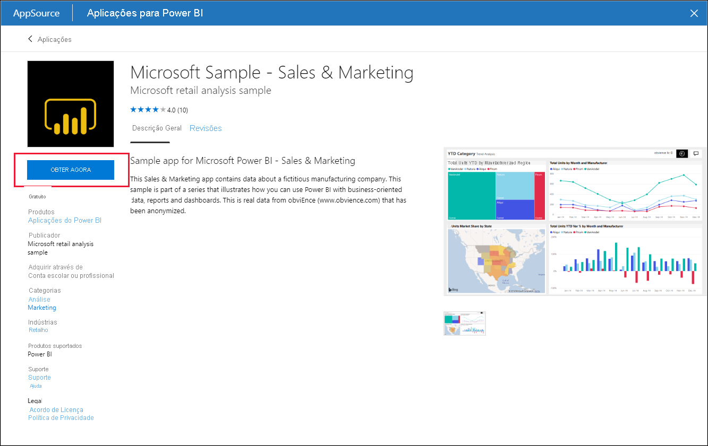
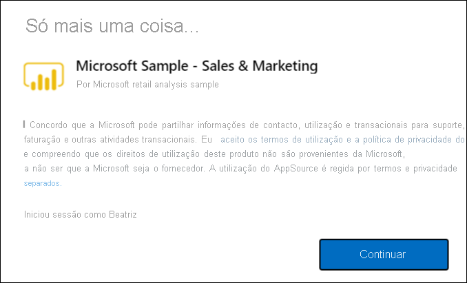
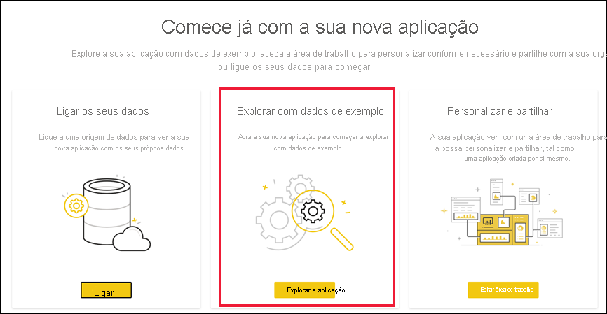

# Instalar e utilizar a aplicação de exemplo Sales and Marketing no serviço Power BI

[!INCLUDE[consumer-appliesto-yyny](../includes/consumer-appliesto-yyny.md)]

Agora que já possui [noções básicas sobre como obter conteúdos do Power BI](end-user-app-view.md), vamos utilizar o Microsoft AppSource para obter a aplicação Marketing and Sales. 

## Obter a aplicação a partir do Microsoft AppSource

1. Abra [https://appsource.microsoft.com](https://appsource.microsoft.com).

   

1. Na caixa de pesquisa, introduza **Marketing** e coloque uma marca de verificação junto a **Refinar por produto > Aplicações do Power BI**. 

    

1. Selecione o mosaico da aplicação **Microsoft sample - Sales & Marketing**. Se pretender, leia a visão geral e as críticas e veja as imagens.  Em seguida, selecione **Obter agora**.

   

1. Confirme que pretende instalar esta aplicação.

   

5. Assim que a aplicação for instalada, o serviço Power BI apresentará uma mensagem de êxito. Selecione **Ir para a aplicação** para abrir a aplicação. Será apresentado o dashboard da aplicação ou o relatório da aplicação, em função da forma como o estruturador criou a aplicação.

    

    Também pode abrir a aplicação diretamente a partir da lista de conteúdos de aplicação ao selecionar **Aplicações** e escolher o mosaico da aplicação **Sales & Marketing**.

    

6. Escolha se pretende ligar os seus próprios dados, explorar com dados de exemplo ou personalizar e partilhar a sua nova aplicação. Uma vez que selecionámos uma aplicação de exemplo da Microsoft, vamos começar por explorar. 

    

7.  A sua nova aplicação é aberta com um dashboard. No entanto, o *designer* da aplicação poderia tê-la configurado para abrir um relatório.  

    

## Interagir com os dashboards e relatórios na aplicação
Explore com calma os dados nos dashboards e nos relatórios que compõem a aplicação. Tem acesso a todas as interações padrão do Power BI, como a filtragem, o realce, a ordenação e a desagregação.  Ainda se sente um pouco confuso com a diferença entre dashboards e relatórios?  Leia o [artigo sobre dashboards](end-user-dashboards.md) e o [artigo sobre relatórios](end-user-reports.md).  

## Próximos passos
* [Voltar para a descrição geral das aplicações](end-user-apps.md)    
* [Ver um relatório do Power BI](end-user-report-open.md)    
* [Outras formas de partilhar conteúdos consigo](end-user-shared-with-me.md)
