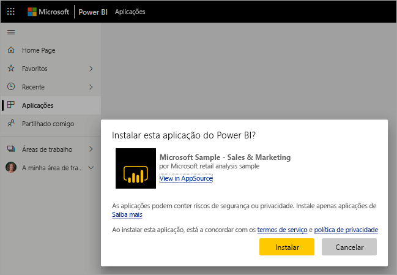
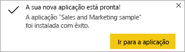

# Instalar e utilizar a aplicação de exemplo Sales and Marketing no serviço Power BI
Agora que já possui [noções básicas sobre como obter conteúdos do Power BI](end-user-app-view.md), vamos obter a aplicação Sales and Marketing a partir do Microsoft AppSource (appsource.com). 

## Microsoft AppSource (appsource.com)
Eis a ligação para a aplicação: [aplicação Sales and Marketing](https://appsource.microsoft.com/product/power-bi/microsoft-retail-analysis-sample.salesandmarketingsample?tab=Overview). Selecionar esta ligação abrirá a página de transferência desta aplicação no Microsoft AppSource. 

1. Poderá ser-lhe pedido para iniciar sessão antes de poder transferir a aplicação. Inicie sessão com o mesmo endereço de e-mail que utiliza para o Power BI. 

    

2. Selecione **Obter agora**. 

    

3. Se for a primeira vez que inicia sessão no AppSource, terá de aceitar os termos de utilização. 

    

4. O serviço Power BI será aberto. Confirme que pretende instalar esta aplicação.

    

5. Ser-lhe-á apresentada uma mensagem de êxito pelo serviço Power BI assim que a aplicação for instalada. Selecione **Ir para a aplicação** para abrir a aplicação. Será apresentado o dashboard da aplicação ou o relatório da aplicação, em função da forma como o estruturador criou a aplicação.

    

    Também pode abrir a aplicação diretamente a partir da lista de conteúdos da aplicação ao selecionar **Aplicações** e **Vendas e Marketing**.

    

6. Escolha se quer explorar ou personalizar e partilhar a sua nova aplicação. Uma vez que selecionámos uma aplicação de exemplo da Microsoft, vamos começar por explorar. 

    

7.  A sua nova aplicação é aberta com um dashboard. No entanto, o *designer* da aplicação poderia tê-la configurado para abrir um relatório.  

    

## Interagir com os dashboards e relatórios na aplicação
Explore com calma os dados nos dashboards e nos relatórios que compõem a aplicação. Tem acesso a todas as interações padrão do Power BI, como a filtragem, o realce, a ordenação e a desagregação.  Ainda se sente um pouco confuso com a diferença entre dashboards e relatórios?  Leia o [artigo sobre dashboards](end-user-dashboards.md) e o [artigo sobre relatórios](end-user-reports.md).  

## Próximos passos
* [Voltar para a descrição geral das aplicações](end-user-apps.md)
* [Ver um relatório do Power BI](end-user-report-open.md)
* [Outras formas de partilhar conteúdos consigo](end-user-shared-with-me.md)
