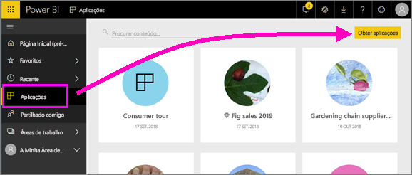
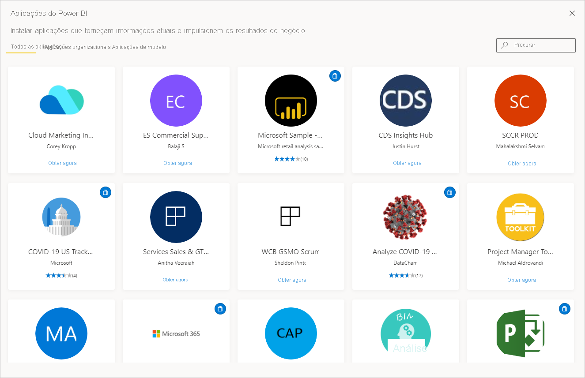
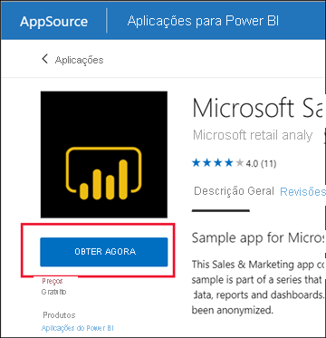
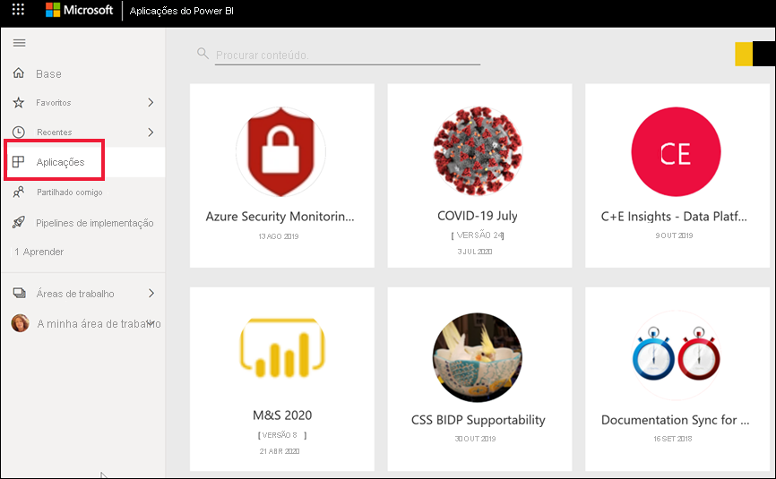
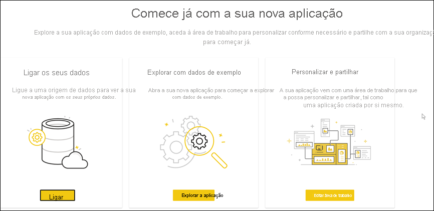
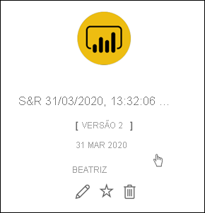
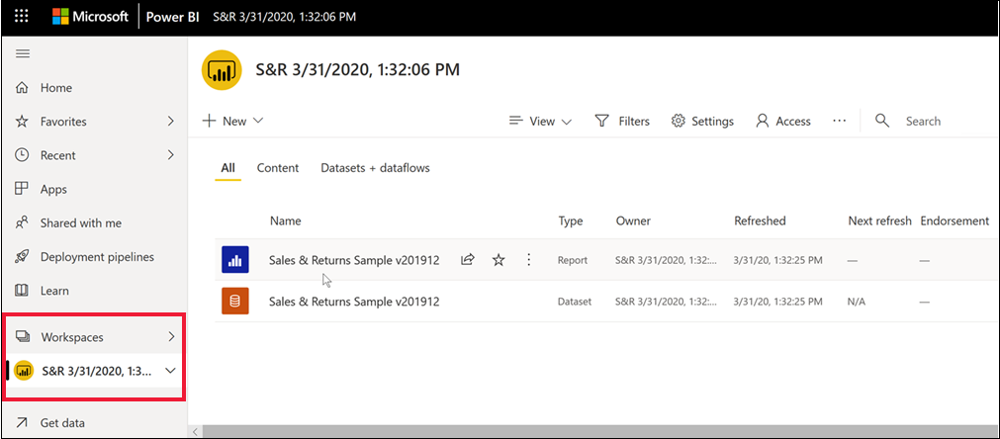
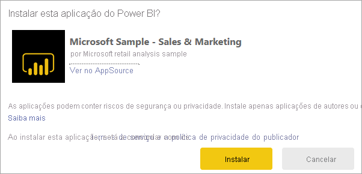
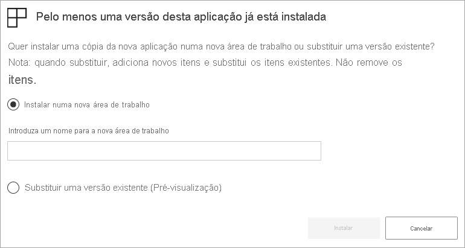

# Instalar e utilizar aplicações com dashboards e relatórios no Power BI

[!INCLUDE[consumer-appliesto-ynny](../includes/consumer-appliesto-ynny.md)]

[!INCLUDE [power-bi-service-new-look-include](../includes/power-bi-service-new-look-include.md)]

Agora que tem uma [noção básica sobre as aplicações](end-user-apps.md), vamos aprender a abrir e interagir com aplicações. 

## Formas de obter uma nova aplicação
Existem várias formas de obter uma nova aplicação:
* Pode obtê-la no marketplace de aplicações do Power BI no Power BI.
* Pode utilizar uma ligação direta para uma aplicação que tenha recebido do estruturador da aplicação. 
* Um estruturador de aplicações na sua organização pode instalar a aplicação automaticamente na sua conta do Power BI.

Com o Power BI Mobile, só pode instalar uma aplicação através de uma ligação direta. Se o criador da aplicação instalar a aplicação automaticamente, irá vê-la na sua lista de aplicações.

## Aplicações e licenças
Nem todos os utilizadores do Power BI podem ver e interagir com aplicações. 
- Se tiver uma licença gratuita, pode abrir aplicações que estão armazenadas na capacidade Premium e que tenham sido partilhadas consigo.  
- Se tiver uma licença Pro, pode abrir aplicações que tenham sido partilhadas consigo.

## Obter a aplicação a partir do marketplace de aplicações do Power BI

Pode encontrar e instalar aplicações a partir do marketplace de aplicações do Power BI. No marketplace de aplicações, pode obter aplicações organizacionais e de modelo.

- Está disponível uma *aplicação organizacional* para os utilizadores do Power BI na sua organização. Estas aplicações também incluem dashboards e relatórios pré-criados que pode utilizar tal como estão ou personalizar e partilhá-los. A sua organização pode ter aplicações de monitorização de vendas, medição do desempenho ou análise das contratações.
- Uma *aplicação de modelo* inclui dashboards e relatórios pré-criados que pode utilizar para estabelecer ligação a muitos dos serviços que utiliza para gerir a sua empresa, como o SalesForce, o Microsoft Dynamics e o Google Analytics.

1. [Inicie sessão no serviço Power BI](./end-user-sign-in.md), se ainda não o fez. 

1. Quando o serviço Power BI estiver aberto, selecione **Aplicações > Obter aplicações**. 

    

1. O marketplace de aplicações do Power BI é apresentado.

   

   Estão disponíveis três separadores para utilização:
   * **Todas as aplicações** – procure aplicações de modelo e todas as aplicações organizacionais disponíveis para si. As aplicações de modelo distinguem-se pelo ícone de saco de compras no canto superior direito dos mosaicos.
   * **Aplicações organizacionais** – procure aplicações organizacionais que tenham sido partilhadas consigo. 
   * **Aplicações de modelo** – procure aplicações de modelo que estão alojadas no AppSource.

   Em alternativa, pode utilizar a caixa de pesquisa para obter uma seleção filtrada de aplicações. Escrever parte do nome de uma aplicação ou de uma categoria, como finanças, análise, marketing, etc., facilitará a procura do item. 

   A caixa de pesquisa é sensível ao separador que tem aberto; apenas serão devolvidas as aplicações do tipo selecionado. Se o separador **Todas as aplicações** estiver aberto, serão devolvidas as aplicações organizacionais e de modelo. Esta situação pode ser confusa quando uma aplicação organizacional e uma aplicação de modelo têm o mesmo nome. Lembre-se de que os mosaicos da aplicação de modelo têm um ícone de saco de compras no canto superior direito.

Quando encontrar a aplicação que pretende, selecione **Obter agora** para instalar a mesma.

   

* Se estiver a instalar uma aplicação organizacional, esta será imediatamente adicionada à lista de aplicações.
* Se estiver a instalar uma aplicação de modelo, será direcionado para a oferta de aplicações de modelo no AppSource. Veja [um exemplo](end-user-app-marketing.md) de como transferir e instalar uma aplicação de modelo de exemplo do marketplace de aplicações do Power BI. A aplicação foi instalada juntamente com uma área de trabalho com o mesmo nome.

   > [!NOTE]
   > Se estiver a utilizar uma licença de utilizador gratuita, poderá transferir aplicações, mas não poderá vê-las a menos que faça a atualização para uma conta do Power BI Pro ou que a aplicação esteja armazenada numa capacidade Premium partilhada. Para obter mais informações, veja [licenças para utilizadores empresariais](end-user-license.md).

## Instalar uma aplicação de uma ligação direta
Também pode instalar uma aplicação organizacional a partir de uma ligação direta no e-mail do designer da aplicação.  

**No computador** 

Ao selecionar a ligação no e-mail, o serviço Power BI ([https://app.powerbi.com](https://app.powerbi.com)) abre a aplicação no browser. 

**No dispositivo móvel iOS ou Android** 

Quando selecionar a ligação no e-mail no seu dispositivo móvel, a aplicação será instalada automaticamente e a ligação será aberta na aplicação móvel. Poderá ter de iniciar sessão primeiro. 

## Interagir com os dashboards e relatórios na aplicação
Explore com calma os dados nos dashboards e nos relatórios que compõem a aplicação. Tem acesso a todas as interações padrão do Power BI, como a filtragem, o realce, a ordenação e a desagregação.  Ainda se sente um pouco confuso com a diferença entre dashboards e relatórios?  Leia o [artigo sobre dashboards](end-user-dashboards.md) e o [artigo sobre relatórios](end-user-reports.md).  

### Abrir uma aplicação

Instalou ou recebeu uma aplicação de um colega. Para ver essa aplicação, abra a lista de conteúdos Aplicações ao selecionar **Aplicações** no painel de navegação.

Paire com o cursor sobre a aplicação e selecione-a para abri-la. Consoante a aplicação, poderá receber um pedido semelhante ao seguinte:

Para obter orientações sobre a opção a selecionar, veja [Install template apps](../connect-data/service-template-apps-install-distribute.md) (Instalar aplicações de modelo).

Paire com o cursor sobre a aplicação para ver detalhes e selecione o cartão da aplicação para abrir a mesma.

A aplicação é aberta. Todas as aplicações têm esquemas, elementos visuais, cores e opções diferentes. Contudo, todas as aplicações têm funcionalidades em comum.

1. Nome da aplicação e data da última atualização. Selecione a seta pendente para procurar o proprietário e o contacto de Ajuda.
1. Selecione **Power BI** para voltar à [Página Principal](end-user-home.md).
1. A barra de ação. 
1. A tela de página de relatório.
1. O painel de navegação da aplicação.  Abaixo do nome da aplicação, está apresentada a lista de páginas de relatório. Selecione o nome de uma página de relatório para abri-la. De momento, temos a página *Taxa de devolução* aberta. 
1. Selecione a seta para expandir o painel **Filtros**.

Também pode explorar a área de trabalho associada. [Saiba mais sobre as áreas de trabalho](end-user-workspaces.md) Selecione **Power BI** (número 2) para voltar ao **Início** e escolha **Áreas de trabalho**. 

## Atualizar uma aplicação 

De tempos a tempos, os estruturadores das aplicações podem lançar novas versões das respetivas aplicações. A forma como obtém a nova versão depende da forma como recebeu a original. 

* Se obteve a aplicação a partir da sua organização, a atualização para a nova versão é totalmente transparente e não tem de fazer nada. 

* Se obteve a aplicação a partir do AppSource, da próxima vez que abrir a aplicação, verá uma barra de notificações. A notificação informa-o de que está disponível uma nova versão. 

    1. Selecione **Obter** para atualizar.  

        <!-- -->

    2. Quando lhe for pedido para instalar a aplicação atualizada, selecione **Instalar**. 

         

    3. Uma vez que já tem uma versão desta aplicação, decida se quer substituir a versão existente ou instalar a aplicação atualizada numa nova área de trabalho.   

         

     > [!NOTE] 
     > Se instalar uma nova versão, todas as alterações feitas aos relatórios e dashboards serão substituídas. Para manter os seus relatórios e dashboards atualizados, pode guardá-los com um nome ou localização diferente antes da instalação. 

    4. Depois de instalar a versão atualizada, selecione **Atualizar aplicação** para concluir o processo de atualização. 

## Considerações e resolução de problemas

- Um administrador do Power BI pode ativar ou desativar a instalação de aplicações. Contacte o departamento de TI ou o suporte técnico caso precise de ativar esta funcionalidade.    
- Para utilizar aplicações, tem de ter uma licença Pro ou armazenar a aplicação numa capacidade Premium partilhada. [Saiba mais sobre as licenças](end-user-license.md).

## Próximos passos
* [Voltar para a descrição geral das aplicações](end-user-apps.md)
* [Ver um relatório do Power BI](end-user-report-open.md)
* [Outras formas de partilhar conteúdos consigo](end-user-shared-with-me.md)

