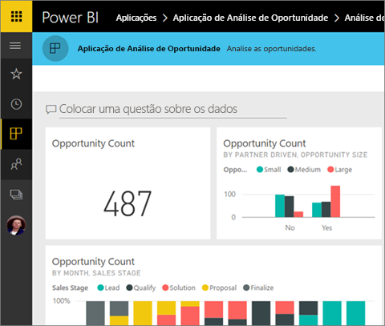
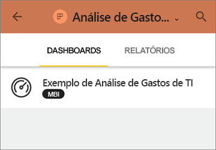
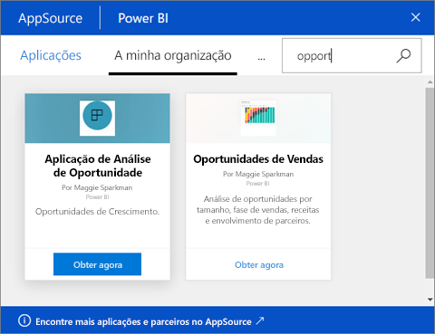
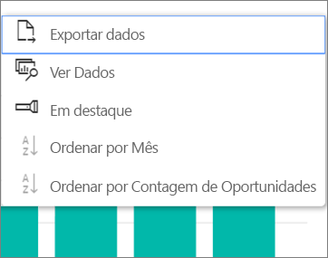

# Instalar e utilizar aplicações com dashboards e relatórios no Power BI
Agora que tem uma [noção básica sobre as aplicações](end-user-apps.md), vamos aprender a abrir e interagir com aplicações. 

## Formas de obter uma nova aplicação
Não se esqueça de que existem várias formas de obter uma nova aplicação. Um colega designer de relatórios pode instalar a aplicação automaticamente na sua conta do Power BI ou enviar-lhe uma ligação direta para uma aplicação. Além disso, pode aceder ao AppSource e procurar aplicações disponíveis para si dentro e fora da empresa. 

Quanto ao Power BI no seu dispositivo móvel, só pode instalar uma aplicação a partir de uma ligação direta. Não pode fazê-lo a partir do AppSource. Se o autor instalar a aplicação automaticamente, irá vê-la na sua lista de aplicações.

## Instalar uma aplicação de uma ligação direta
A forma mais fácil de instalar uma nova aplicação de forma autónoma é ao receber uma ligação direta, através do e-mail, por parte do autor da aplicação.  

**No computador** 

Ao selecionar a ligação no e-mail, o serviço Power BI ([https://powerbi.com](https://powerbi.com)) é aberto num browser. Confirme que pretende instalar a aplicação e o Power BI será aberto na página de destino da aplicação.

**No dispositivo móvel iOS ou Android** 

Quando selecionar a ligação no e-mail no seu dispositivo móvel, a aplicação é instalada automaticamente e é aberta a lista de conteúdos da mesma na aplicação móvel. 

## Obter a aplicação a partir do Microsoft AppSource
Também pode encontrar e instalar aplicações a partir do Microsoft AppSource. Só são apresentadas as aplicações às quais tenha acesso (ou seja, que o autor da aplicação lhe deu permissão a si ou a todas as pessoas para aceder).

1. Selecione **Aplicações**  > **Obter aplicações**. 
   
     
2. No AppSource, em **A minha organização**, pode procurar para filtrar os resultados e encontrar a aplicação que procura.
   
     
3. Selecione **Obter agora** para adicionar a aplicação à sua lista de conteúdos Aplicações. 

## Interagir com os dashboards e relatórios na aplicação
Agora, pode explorar os dados nos dashboards e relatórios na aplicação. Tem acesso a todas as interações padrão do Power BI, como a filtragem, o realce, a ordenação e a desagregação. Também pode [exportar os dados para o Excel ](end-user-export-data.md) a partir de uma tabela ou de outro elemento visual num relatório. Saiba mais sobre [interagir com relatórios no Power BI](end-user-reading-view.md). 

## Próximos passos
* [Aplicações do Power BI para serviços externos](end-user-connect-to-services.md)
* Perguntas? [Experimente perguntar à Comunidade do Power BI](http://community.powerbi.com/)

