# Instalar e utilizar aplicações com dashboards e relatórios no Power BI

[!INCLUDE[consumer-appliesto-ynny](../includes/consumer-appliesto-ynny.md)]

[!INCLUDE [power-bi-service-new-look-include](../includes/power-bi-service-new-look-include.md)]

Agora que tem uma [noção básica sobre as aplicações](end-user-apps.md), vamos aprender a abrir e interagir com aplicações. 

## Formas de obter uma nova aplicação
Existem várias formas de obter uma nova aplicação. Um colega designer de relatórios pode instalar a aplicação automaticamente na sua conta do Power BI ou enviar-lhe uma ligação direta para uma aplicação. Além disso, pode aceder ao AppSource e procurar aplicações disponíveis para si dos designers de aplicações dentro e fora da empresa. 

Quanto ao Power BI no seu dispositivo móvel, só pode instalar uma aplicação a partir de uma ligação direta. Não pode fazê-lo a partir do AppSource. Se o criador da aplicação instalar a aplicação automaticamente, irá vê-la na sua lista de aplicações.

## Instalar uma aplicação de uma ligação direta
A maneira mais fácil de instalar uma nova aplicação de forma autónoma é ao receber uma ligação direta, através do e-mail, por parte do estruturador de aplicações.  

**No computador** 

Ao selecionar a ligação no e-mail, o serviço Power BI ([https://powerbi.com](https://powerbi.com)) abre a aplicação no browser. 

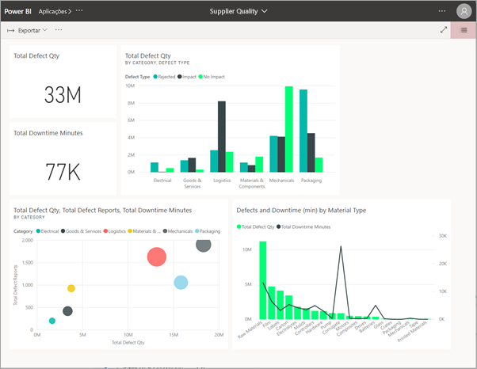

**No dispositivo móvel iOS ou Android** 

Quando selecionar a ligação no e-mail no seu dispositivo móvel, a aplicação será instalada automaticamente e a ligação será aberta na aplicação móvel. Poderá ter de iniciar sessão primeiro. 

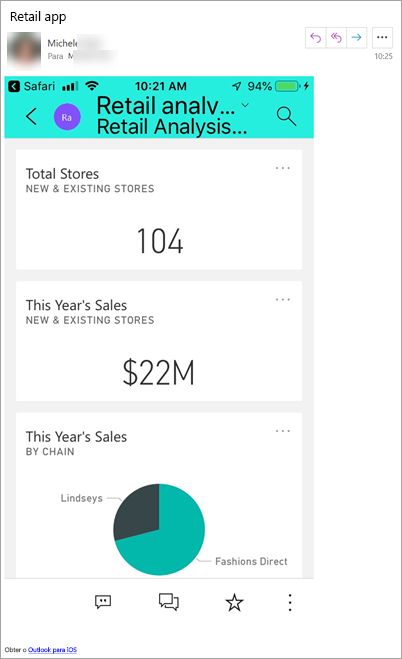

## Obter a aplicação a partir do Microsoft AppSource
Também pode encontrar e instalar aplicações a partir do Microsoft AppSource. Só são apresentadas as aplicações às quais tenha acesso (ou seja, que o autor da aplicação lhe deu permissão a si ou a todas as pessoas para aceder).

1. Selecione **Aplicações**  > **Obter aplicações**. 
   
    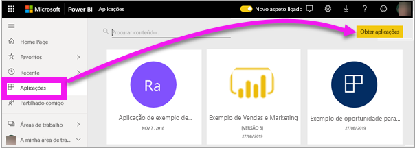    
2. No AppSource, em **A minha organização**, procure para filtrar os resultados e encontrar a aplicação que procura.
   
    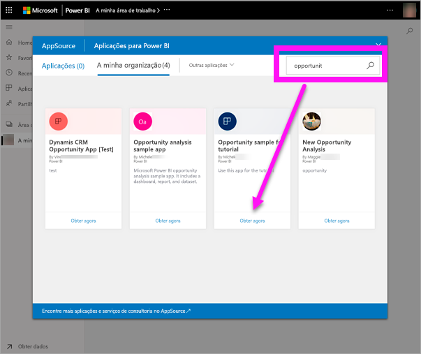
3. Selecione **Obter agora** para adicionar a aplicação à sua lista de conteúdos Aplicações. 

## Obter uma aplicação a partir do site do Microsoft AppSource 

Neste exemplo, vamos abrir uma das aplicações de exemplo da Microsoft. No AppSource, irá encontrar aplicações para muitos dos serviços que utiliza para gerir o seu negócio.  Por exemplo: Salesforce, Microsoft Dynamics, Google Analytics, GitHub, Zendesk, Marketo e muitos mais. Para saber mais, veja [Aplicações para serviços que utiliza com o Power BI](../service-connect-to-services.md). 

1. Num browser, abra [https://appsource.microsoft.com](https://appsource.microsoft.com) e selecione **Aplicações do Power BI**.

    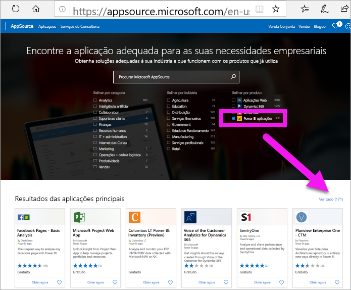

2. Selecione **Ver tudo** para apresentar a lista de todas as aplicações do Power BI atualmente disponíveis no AppSource. Navegue ou faça uma pesquisa para procurar a aplicação chamada **Exemplo Microsoft – Vendas e Marketing**.

    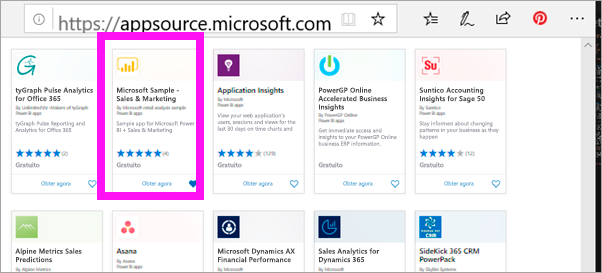

3. Selecione **Obter agora** e concorde com os termos de utilização.

    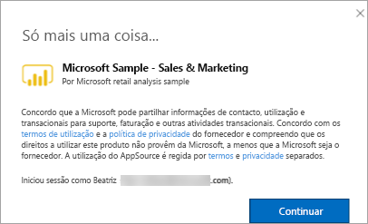

4. Confirme que pretende instalar esta aplicação.

    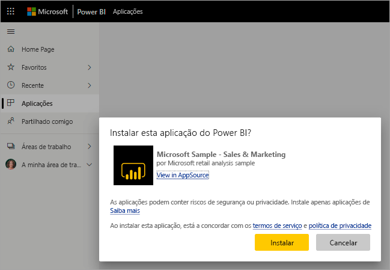

5. Ser-lhe-á apresentada uma mensagem de êxito pelo serviço Power BI assim que a aplicação for instalada. Selecione **Ir para a aplicação** para abrir a aplicação. Será apresentado o dashboard da aplicação ou o relatório da aplicação, em função da forma como o estruturador criou a aplicação.

    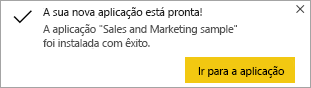

    Também pode abrir a aplicação diretamente a partir da lista de conteúdos da aplicação ao selecionar **Aplicações** e **Vendas e Marketing**.

    

6. Escolha se quer explorar ou personalizar e partilhar a sua nova aplicação. Uma vez que selecionámos uma aplicação de exemplo da Microsoft, vamos começar por explorar. 

    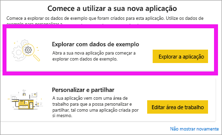

7.  A sua nova aplicação é aberta com um dashboard. No entanto, o *estruturador* da aplicação poderia ter configurado a aplicação para abrir um relatório.  

    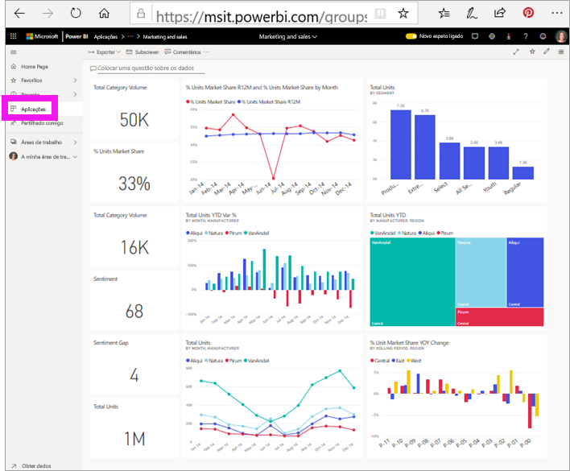

## Interagir com os dashboards e relatórios na aplicação
Explore com calma os dados nos dashboards e nos relatórios que compõem a aplicação. Tem acesso a todas as interações padrão do Power BI, como a filtragem, o realce, a ordenação e a desagregação.  Ainda se sente um pouco confuso com a diferença entre dashboards e relatórios?  Leia o [artigo sobre dashboards](end-user-dashboards.md) e o [artigo sobre relatórios](end-user-reports.md).  

## Atualizar uma aplicação 

De tempos a tempos, os criadores das aplicações podem lançar novas versões das suas aplicações. A forma como obtém a nova versão depende da forma como recebeu a original. 

* Se obteve a aplicação a partir da sua organização, a atualização para a nova versão é totalmente transparente e não tem de fazer nada. 

* Se obteve a aplicação a partir do AppSource, da próxima vez que abrir a aplicação, verá uma barra de notificações. A notificação informa-o de que está disponível uma nova versão. 

    1. Selecione **Obter** para atualizar.  

        <!-- -->

    2. Quando lhe for pedido para instalar a aplicação atualizada, selecione **Instalar**. 

         

    3. Uma vez que já tem uma versão desta aplicação, decida se quer substituir a versão existente ou instalar a aplicação atualizada numa nova área de trabalho.   

         

    > [!NOTE] 
    > Se instalar uma nova versão, todas as alterações feitas aos relatórios e dashboards serão substituídas. Para manter os seus relatórios e dashboards atualizados, pode guardá-los com um nome ou localização diferente antes da instalação. 

    4. Depois de instalar a versão atualizada, selecione **Atualizar aplicação** para concluir o processo de atualização. 

    <!-- -->

## Próximos passos
* [Voltar para a descrição geral das aplicações](end-user-apps.md)
* [Ver um relatório do Power BI](end-user-report-open.md)
* [Outras formas de partilhar conteúdos consigo](end-user-shared-with-me.md)
