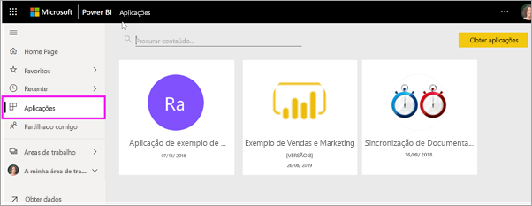

# Aplicações no Power BI

[!INCLUDE [power-bi-service-new-look-include](../includes/power-bi-service-new-look-include.md)]

## O que é uma aplicação do Power BI?
Uma *aplicação* é um tipo de conteúdo do Power BI que combina dashboards e relatórios relacionados num único local. Uma aplicação pode ter um ou mais dashboards ou relatórios em conjunto. As aplicações são criadas por *designers* do Power BI que distribuem e partilham as mesmas com *consumidores* como você. 

As suas aplicações estão organizadas na lista de conteúdos **Aplicações**. Basta selecionar **Aplicações** para que as suas aplicações sejam apresentadas. Paire o rato sobre uma aplicação para ver a data da última atualização e o proprietário. 

> [!NOTE]
> A utilização da funcionalidade de aplicações requer uma licença do Power BI Pro. <!-- add link to how to figure out your license -->

## ***Designers*** e ***consumidores*** de aplicações
Consoante o seu cargo, pode ser uma pessoa que cria aplicações (*designer*) para sua utilização ou para partilhar com colegas. Também pode ser uma pessoa que recebe e transfere aplicações (*consumidor*) criadas por outras pessoas. Este artigo é direcionado para *consumidores* de aplicações.

## Vantagens das aplicações
As aplicações são uma forma fácil de partilhar diferentes tipos de conteúdos de uma só vez. Os *designers* de aplicações criam os dashboards e os relatórios, e agrupam-nos numa aplicação. Em seguida, os *designers* partilham ou publicam a aplicação numa localização onde o *consumidor* pode ter acesso à mesma. Uma vez que os dashboards e os relatórios relacionados são agrupados, é mais fácil encontrar e instalar tanto no serviço de Power BI ([https://powerbi.com](https://powerbi.com)) como no seu dispositivo móvel. Depois de instalar uma aplicação, não terá de memorizar os nomes de vários dashboards ou de relatórios, uma vez que estes estão juntos numa aplicação, tanto no seu browser como no seu dispositivo móvel.

Com as aplicações, sempre que o autor da aplicação lançar atualizações, o utilizador pode vê-las automaticamente. O autor também controla quantas vezes os dados são agendados para atualização, para que não se tenha de preocupar em atualizá-los. 

<!-- add conceptual art -->
## Obter uma nova aplicação
Pode obter aplicações de várias formas diferentes. Algumas dessas formas estão listadas abaixo.  No entanto, para receber instruções detalhadas de forma a obter e explorar uma aplicação, veja [Abrir e interagir com uma aplicação](end-user-app-view.md).

- O estruturador de aplicações pode instalar a aplicação automaticamente na sua conta do Power BI e, na próxima vez que abrir o Power BI, verá a nova aplicação na sua lista de conteúdos **Aplicações**. 
- O estruturador de aplicações pode enviar-lhe uma ligação direta para uma aplicação. Ao selecionar a ligação abre a aplicação no Power BI.
- Quanto ao Power BI no seu dispositivo móvel, só pode instalar uma aplicação a partir de uma ligação direta. Não pode fazê-lo a partir do AppSource. Se o autor instalar a aplicação automaticamente, irá vê-la na sua lista de aplicações.
- Pode procurar aplicações no [AppSource](https://appsource.microsoft.com). O AppSource contém aplicações publicadas por designers de relatórios dentro e fora da sua empresa. Por exemplo, pode encontrar uma aplicação no AppSource para um serviço que já utiliza, como o Google Analytics, o GitHub ou o Microsoft Dynamics. Também irá encontrar exemplos de aplicações que pode utilizar para saber mais sobre o Power BI.  

## Passo seguinte
* [Abrir e interagir com uma aplicação](end-user-app-view.md)
* [Outras formas de partilhar conteúdos](end-user-shared-with-me.md)

