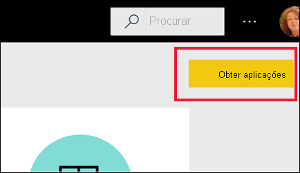
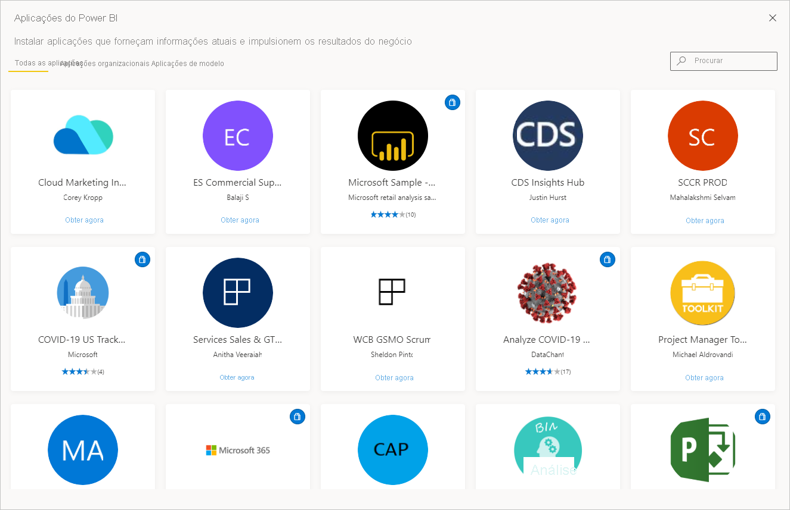
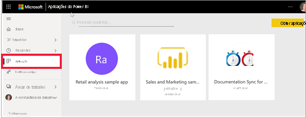

# Aplicações no Power BI

[!INCLUDE[consumer-appliesto-ynny](../includes/consumer-appliesto-ynny.md)]

[!INCLUDE [power-bi-service-new-look-include](../includes/power-bi-service-new-look-include.md)]

## O que é uma aplicação do Power BI?
Uma *aplicação* é um tipo de conteúdo do Power BI que combina dashboards e relatórios relacionados num único local. Uma aplicação pode ter um ou mais dashboards ou relatórios em conjunto. As aplicações são criadas por *designers* do Power BI que distribuem e partilham as aplicações com os colegas. Existem diferentes formas de os *designers* partilharem uma aplicação. Para saber mais, veja a secção **Obter uma nova aplicação** abaixo. 

## *Designers* de aplicações e *utilizadores* de aplicações
Consoante o seu cargo, pode ser uma pessoa que cria aplicações (*designer*) para sua utilização ou para partilhar com colegas. Também pode ser uma pessoa que recebe e transfere aplicações (*utilizador empresarial*) criadas por outras pessoas. Este artigo destina-se a *utilizadores empresariais*.

Ver e abrir uma aplicação requer determinadas permissões. O destinatário tem de ter uma licença do Power BI Pro ou a aplicação tem de ser partilhada com o destinatário num tipo especial de armazenamento na cloud chamado **capacidade Premium**. Para saber mais sobre licenças e capacidade Premium, veja [Licenças para o serviço Power BI](end-user-license.md).

## Vantagens das aplicações
As aplicações são uma forma fácil de os *designers* partilharem diferentes tipos de conteúdos de uma só vez. Os *designers* de aplicações criam os dashboards e os relatórios, e agrupam-nos numa aplicação. Em seguida, os *designers* partilham ou publicam a aplicação numa localização onde o *utilizador empresarial* pode ter acesso à mesma. Uma vez que os dashboards e os relatórios relacionados são agrupados, é mais fácil encontrar e instalar tanto no serviço de Power BI ([https://powerbi.com](https://powerbi.com)) como no seu dispositivo móvel. Depois de instalar uma aplicação, não terá de memorizar os nomes de vários dashboards ou de relatórios, uma vez que estes estão juntos numa aplicação, tanto no seu browser como no seu dispositivo móvel.

Com as aplicações, sempre que o autor da aplicação lançar atualizações, o utilizador pode vê-las automaticamente. O autor também controla quantas vezes os dados são agendados para atualização, para que não se tenha de preocupar em atualizá-los. 

<!-- add conceptual art -->
## Obter uma nova aplicação
Existem várias formas diferentes de obter uma nova aplicação. Pode procurar, localizar e instalar aplicações, e os designers de aplicações podem partilhar aplicações consigo. 

### Encontrar e instalar aplicações a partir do marketplace de aplicações do Power BI
Uma forma de encontrar aplicações consiste em selecionar **Obter aplicação** a partir do ecrã **Aplicações** do Power BI. 

Navegue na lista de aplicações no marketplace de aplicações do Power BI até encontrar uma para instalar. Escolha a partir de **Aplicações organizacionais**, que estão disponíveis apenas para pessoas na sua empresa, ou **Aplicações de modelo**, que são publicadas pela Microsoft e pela comunidade para qualquer utilizador do Power BI instalar. 

Existem outras formas de obter aplicações. Algumas destas formas estão listadas abaixo. No entanto, para receber instruções detalhadas de forma a obter e explorar uma aplicação, veja [Abrir e interagir com uma aplicação](end-user-app-view.md).

* O estruturador de aplicações pode instalar a aplicação automaticamente na sua conta do Power BI e, na próxima vez que abrir o serviço Power BI, verá a nova aplicação na sua lista de conteúdos **Aplicações**. 
* O estruturador de aplicações pode enviar-lhe uma ligação direta para uma aplicação. Ao selecionar a ligação, abre a aplicação no serviço Power BI.
* No Power BI no seu dispositivo móvel, só pode instalar uma aplicação a partir de uma ligação direta e não a partir do marketplace de aplicações. Se o autor instalar a aplicação automaticamente, irá vê-la na sua lista de aplicações. 

As suas aplicações estão organizadas na lista de conteúdos **Aplicações**. Basta selecionar **Aplicações** para que as suas aplicações sejam apresentadas. Paire o rato sobre uma aplicação para ver a data da última atualização e o proprietário. 

## Próximos passos
* [Abrir e interagir com uma aplicação](end-user-app-view.md)
* [Outras formas de partilhar conteúdos](end-user-shared-with-me.md)

