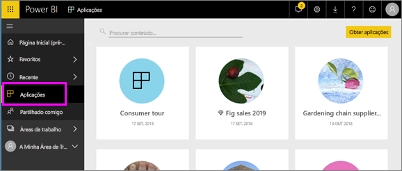

# Aplicações no Power BI
## O que é uma aplicação do Power BI?
Uma *aplicação* é um tipo de conteúdo do Power BI que combina dashboards e relatórios relacionados num único local. Uma aplicação pode ter um ou mais dashboards ou relatórios em conjunto. As aplicações são criadas por *designers* do Power BI que distribuem e partilham as mesmas com *consumidores* como você. 

As suas aplicações estão organizadas na lista de conteúdos **Aplicações**.

## ***Designers*** e ***consumidores*** de aplicações
Consoante o seu cargo, pode ser uma pessoa que cria aplicações (designer) para sua utilização ou para partilhar com colegas. Também pode ser uma pessoa que recebe e transfere aplicações (consumidor) criadas por outras pessoas. Este artigo é direcionado para *consumidores* de aplicações.

## Vantagens das aplicações
As aplicações são fáceis de encontrar e instalar no serviço Power BI ([https://powerbi.com](https://powerbi.com)) e no seu dispositivo móvel. Depois de instalar uma aplicação, não terá de memorizar os nomes de vários dashboards, uma vez que estes estão juntos numa aplicação, tanto no seu browser como no seu dispositivo móvel.

Com as aplicações, sempre que o autor da aplicação lançar atualizações, o utilizador pode vê-las automaticamente. O autor também controla quantas vezes os dados são agendados para atualização, para que não se tenha de preocupar em atualizá-los. 

<!-- add conceptual art -->
## Obter uma nova aplicação
Pode obter aplicações de várias formas diferentes. 
- O autor da aplicação pode instalar a aplicação automaticamente na sua conta do Power BI e, da próxima vez que abrir o Power BI, verá a nova aplicação na lista de conteúdos **Aplicações**. 
- O autor da aplicação pode enviar-lhe uma ligação direta para a aplicação através do e-mail. Ao selecionar a ligação abre a aplicação no Power BI.
- Pode procurar aplicações no AppSource, onde pode ver todas as aplicações às quais pode aceder. O AppSource contém aplicações publicadas por designers de relatórios dentro e fora da sua empresa. Por exemplo, pode encontrar uma aplicação no AppSource para um serviço que já utiliza, como o Google Analytics, o GitHub ou o Microsoft Dynamics. 
- Quanto ao Power BI no seu dispositivo móvel, só pode instalar uma aplicação a partir de uma ligação direta. Não pode fazê-lo a partir do AppSource. Se o autor instalar a aplicação automaticamente, irá vê-la na sua lista de aplicações.

## Passo seguinte
* [Abrir e interagir com uma aplicação](end-user-app-view.md)

