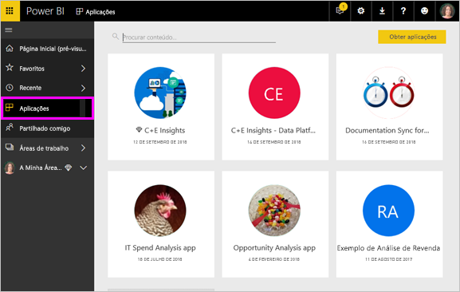

# Conceitos básicos para os ***consumidores*** do serviço Power BI

## *Consumidores* e *criadores* do Power BI
Este artigo pressupõe que já leu a [Descrição geral do Power BI](../power-bi-overview.md) e se identificou como um ***consumidor*** do Power BI. Os consumidores recebem conteúdos do Power BI, como dashboards e relatórios, dos colegas. Os consumidores utilizam o serviço Power BI, que é uma versão do Power BI em site. 

Irá certamente deparar-se com o termo "Power BI Desktop" ou apenas "Desktop", que é uma ferramenta autónoma utilizada pelos *criadores* que criam e partilham dashboards e relatórios consigo. É importante saber que existem outras ferramentas do Power BI. No entanto, enquanto consumidor, só irá trabalhar com o serviço Power BI. Este artigo aplica-se apenas ao serviço Power BI. 

## Terminologia e conceitos
Este artigo não é um tutorial prático nem uma apresentação visual do Power BI. Trata-se de um artigo de descrição geral através do qual pretendemos dar-lhe a conhecer os conceitos e a terminologia do Power BI. Queremos apresentar-lhe os conceitos e explicar-lhe como funcionam. Para ver uma apresentação do serviço Power BI e da respetiva navegação, visite [Ver uma apresentação](end-user-experience.md).

## Abrir o serviço Power BI pela primeira vez
A maioria dos consumidores do Power BI obtém o serviço Power BI porque 1) a respetiva empresa compra licenças e 2) um administrador atribui essas licenças a colaboradores como você. 

Para começar, abra um browser e escreva **app.powerbi.com**. Na primeira vez que abrir o serviço Power BI, verá uma página como esta.

À medida que utilizar o Power BI, poderá personalizar o que lhe será apresentado sempre que abrir o site.  Por exemplo, ao abrir o site, algumas pessoas preferem que seja apresentada a Página Inicial do Power BI, enquanto outras pessoas preferem ver um dashboard favorito. Não se preocupe, iremos mostrar-lhe como fazer isto. 
- [Página Inicial (Pré-visualização)](https://powerbi.microsoft.com/blog/introducing-power-bi-home-and-global-search)    
- [Definir conteúdos como **em destaque**](end-user-featured.md) 

Antes de avançar mais, vamos falar sobre os elementos base que constituem o serviço Power BI.

## ***Conteúdos*** do Power BI
### Introdução aos elementos base
Para um consumidor do Power BI, os cinco elementos base são: ***visualizações***, ***dashboards***, ***relatórios***, ***aplicações*** e ***conjuntos de dados***. Por vezes, estes elementos são denominados ***conteúdos*** do *Power BI*. Os *conteúdos* existem em ***áreas de trabalho***. Um fluxo de trabalho típico envolve todos estes blocos de compilação:  Um *criador* do Power BI (a amarelo no diagrama abaixo) recolhe dados de *conjuntos de dados*, incorpora-os no Power BI para análise, cria *relatórios* com *visualizações* que destacam informações e factos interessantes, afixa as visualizações dos relatórios num dashboard e partilha os relatórios e dashboards com *consumidores* como você (a preto no diagrama abaixo) sob a forma de *aplicações* ou outros tipos de conteúdos partilhados. 

Fundamentalmente: 
*  Uma ***visualização*** (ou *elemento visual*) é um tipo de gráfico utilizado pelos *criadores* do Power BI com os dados de *relatórios* e *conjuntos de dados*. Geralmente, os *criadores* criam os elementos visuais no Power BI Desktop. 

    Para obter mais informações, veja [Visualizations for Power BI *consumers*](end-user-visualizations.md) (Visualizações para consumidores do Power BI)

*  Um *conjunto de dados* é um contentor de dados. Por exemplo, pode ser um ficheiro do Excel da Organização Mundial de Saúde, uma base de dados dos clientes de uma empresa ou um ficheiro do Salesforce.  

*  Um *dashboard* é um único ecrã com gráficos, texto e elementos visuais interativos. Um dashboard recolhe as suas métricas mais importantes, num único ecrã, para contar uma história ou responder a uma pergunta. Os conteúdos do dashboard são provenientes de um ou mais relatórios ou conjuntos de dados.

    Para obter mais informações, veja [Dashboards for Power BI *consumers*](end-user-dashboards.md) (Dashboards para consumidores do Power BI)

*  Um *relatório* é composto por uma ou mais páginas de gráficos, texto e elementos visuais interativos que, em conjunto, constituem um só relatório. Um relatório é baseado num único conjunto de dados. Muitas vezes, as páginas dos relatórios são organizadas de forma a abordar uma área de interesse central ou responder a uma única pergunta.

    Para obter mais informações, veja [Reports for Power BI *consumers*](end-user-reports.md) (Relatórios para consumidores do Power BI)

*  Uma *aplicação* é uma forma de os *criadores* agruparem e partilharem dashboards e relatórios relacionados em conjunto. Os *consumidores* recebem algumas aplicações automaticamente, mas podem procurar outras aplicações criadas por colegas ou pela comunidade. Por exemplo, os serviços externos que já pode utilizar, como o Google Analytics e o Microsoft Dynamics CRM, disponibilizam aplicações do Power BI.

Ou seja, se for um novo utilizador e iniciar sessão no Power BI pela primeira vez, não verá desde logo nenhum dashboard, aplicação ou relatório. 
_______________________________________________________

## Conjuntos de Dados
Um *conjunto de dados* é uma coleção de dados importada ou à qual os *criadores* se ligam e depois utilizam para criar relatórios e dashboards. Como um consumidor, não irá interagir diretamente com conjuntos de dados, mas pode ser útil compreender o papel dos mesmos no panorama geral.  

Cada conjunto de dados representa uma origem de dados única, por exemplo, um livro do Excel no OneDrive, um conjunto de dados tabular SSAS local ou um conjunto de dados do Salesforce. São suportadas várias origens de dados diferentes.

Quando um criador partilha uma aplicação consigo, pode ver os conjuntos de dados incluídos com a aplicação. 

**UM** conjunto de dados...

* Pode ser utilizado várias vezes, indefinidamente
* Pode ser utilizado em vários relatórios diferentes
* As visualizações desse conjunto de dados podem ser apresentadas em vários dashboards diferentes
  
  

Vamos avançar para o elemento seguinte: as visualizações
__________________________________________________________

## Visualizações
As visualizações (também conhecidas como elementos visuais) apresentam informações que foram descobertas nos dados. As visualizações facilitam a interpretação das informações, pois o cérebro consegue compreender mais rapidamente uma imagem do que uma folha de cálculo com números, por exemplo.

Eis algumas das visualizações que poderá encontrar no Power BI: cascata, friso, mapa de árvore, circular, funil, cartão, dispersão e medidor. Veja a [lista completa de visualizações incluídas no Power BI](../power-bi-visualization-types-for-reports-and-q-and-a.md).

   

A comunidade também disponibiliza visualizações, que são denominadas *elementos visuais personalizados*. Se receber um relatório com um elemento visual que não reconhece, é provável que se trate de um elemento visual personalizado. Se precisar de ajuda para interpretar o elemento visual personalizado, <!--[look up the name of the report or dashboard *designer*](end-user-owner.md)-->procure o nome do *criador* do relatório ou dashboard e contacte-o.

**UMA** visualização num relatório…

* Pode ser utilizada várias vezes, indefinidamente, no mesmo relatório através do comando copiar/colar
* Pode ser utilizada em vários dashboards diferentes
__________________________________________________
## Relatórios
Um relatório do Power BI é composto por uma ou mais páginas de visualizações, gráficos e texto. Todas as visualizações num relatório vêm de um único conjunto de dados. Os *criadores* partilham relatórios com os *consumidores*, que [interagem com os relatórios na *Vista de leitura*](end-user-reading-view.md).

**UM** relatório...

* pode ser associado a vários dashboards (os mosaicos afixados desse relatório único podem aparecer em vários dashboards).
* É criado através dos dados de um único conjunto de dados  
* Pode fazer parte de múltiplas aplicações.
  
  

________________________________________________

## Dashboards
Um dashboard representa uma vista personalizada de um subconjunto de um ou vários conjuntos de dados subjacentes. Os *criadores* criam dashboards e partilham-nos com os *consumidores*, de forma individual ou como parte de uma aplicação. Um dashboard é uma única tela que contém *mosaicos*, gráficos e texto. 

  

Um mosaico é uma representação de um elemento visual que um *criador* *afixa*, por exemplo, a um dashboard a partir de um relatório.  Cada mosaico afixado apresenta uma [visualização](end-user-visualizations.md) que foi criada a partir de um conjunto de dados e afixada a esse dashboard. Um mosaico também pode conter uma página de relatório inteira, bem como um vídeo ou dados de transmissão em direto. Os *criadores* podem adicionar mosaicos a dashboards de muitas formas, pelo que não é possível abordá-las todas neste tópico geral. Para saber mais, consulte [Mosaicos de dashboard no Power BI](end-user-tiles.md). 

Os consumidores não podem editar dashboards. No entanto, podem adicionar comentários, ver dados relacionados, definir o dashboard como favorito, subscrevê-lo e mais. 

Quais são as finalidades dos dashboards?  Eis algumas delas:

* para ver rapidamente todas as informações necessárias para tomar decisões
* para monitorizar as informações mais importantes sobre o seu negócio
* para garantir que todos os colegas estão em sintonia, visualizando e usando a mesma informação
* para monitorizar a solidez de uma empresa, produto, unidade de negócio, campanha de marketing, etc.
* para criar uma vista personalizada de um dashboard maior – todas as métricas importantes para si

**UM** dashboard...

* pode exibir visualizações de vários conjuntos de dados diferentes
* pode exibir visualizações de vários relatórios diferentes
* pode mostrar visualizações afixadas de outras ferramentas (por exemplo, Excel)
  
  

________________________________________________

## Aplicações
Estas coleções de dashboards e relatórios organizam e agrupam os conteúdos num único pacote. Os *criadores* do Power BI criam e partilham aplicações com utilizadores individuais, grupos, uma organização inteira ou com o público. Como consumidor, pode ter a certeza de que você e os seus colegas estão a trabalhar nos mesmos dados: uma única versão das informações. 

É fácil encontrar e instalar aplicações no serviço Power BI (https://powerbi.com)) e no seu dispositivo móvel. Depois de instalar uma aplicação, não terá de memorizar os nomes de vários dashboards, uma vez que estes estão juntos numa aplicação, tanto no seu browser como no seu dispositivo móvel. 

Esta aplicação tem três dashboards e três relatórios relacionados que constituem uma única aplicação.

Com as aplicações, sempre que o autor da aplicação lançar atualizações, o utilizador pode vê-las automaticamente. O autor também controla quantas vezes os dados são agendados para atualização, para que não se tenha de preocupar em atualizá-los.

Pode obter aplicações de várias formas diferentes. O criador da aplicação pode instalar a aplicação automaticamente na sua conta do Power BI ou enviar-lhe uma ligação direta para uma aplicação. Em alternativa, pode procurar a aplicação no Microsoft AppSource, onde se encontram todas as aplicações às quais pode aceder. No Power BI no seu dispositivo móvel, só pode instalar aplicações a partir de uma ligação direta e não a partir do AppSource. Se o criador da aplicação instalar a aplicação automaticamente, irá vê-la na sua lista de aplicações.

Quando a aplicação estiver instalada, selecione-a na sua lista Aplicações e, em seguida, selecione o dashboard ou relatório que pretende abrir e explorar primeiro.   

Esperamos que este artigo tenha sido útil para compreender as noções básicas dos elementos base que constituem o serviço Power BI para consumidores. 

## Próximos passos
- Rever e marcar o [Glossário](end-user-glossary.md)    
- Ver uma [apresentação do serviço Power BI](end-user-experience.md)
- Ler a [descrição geral do Power BI destinada a consumidores](end-user-consumer.md)    
- Ver um vídeo em que o Will explica os conceitos básicos e faz uma apresentação do serviço Power BI. <iframe width="560" height="315" src="https://www.youtube.com/embed/B2vd4MQrz4M" frameborder="0" allowfullscreen></iframe>