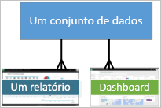

# Conceitos básicos para os consumidores do serviço Power BI

[!INCLUDE[consumer-appliesto-ynnm](../includes/consumer-appliesto-ynnm.md)]

[!INCLUDE [power-bi-service-new-look-include](../includes/power-bi-service-new-look-include.md)]

Este artigo pressupõe que já leu a [Descrição geral do Power BI](../fundamentals/power-bi-overview.md) e que se identificou como um [**consumidor _do Power BI_** ](end-user-consumer.md). Os consumidores recebem conteúdos do Power BI, como dashboards e relatórios, dos colegas. Os consumidores utilizam o serviço Power BI, que é uma versão do Power  BI em site.

Para receber conteúdos de terceiros, é necessário obter uma licença de utilizador do Power BI Pro ou uma licença de capacidade Premium do Power BI. [Procurar o seu tipo de licença](end-user-license.md)

Vai, sem dúvida, ouvir o termo “Power BI Desktop” ou apenas “Desktop”. É a ferramenta autónoma utilizada pelos *criadores* que criam e partilham dashboards e relatórios consigo. É importante saber que existem outras ferramentas do Power BI. Desde que seja um consumidor, vai trabalhar apenas com o serviço Power BI. Este artigo aplica-se apenas ao serviço Power BI.

## Terminologia e conceitos

Este artigo não é um tutorial prático nem uma apresentação visual do Power BI. Trata-se de um artigo de descrição geral para lhe dar a conhecer os conceitos e a terminologia do Power BI. Vai apresentar-lhe os conceitos e explicar-lhe como funcionam. Para uma apresentação do serviço Power BI e da navegação, aceda a [Início Rápido – Introdução ao serviço Power BI](end-user-experience.md).

## Abrir o serviço Power BI pela primeira vez

A maioria dos consumidores do Power BI obtém o serviço Power BI porque 1) a empresa compra licenças e 2) um administrador atribui essas licenças aos colaboradores, como é o seu caso.

Para começar, abra um browser e escreva **app.powerbi.com**. Na primeira vez que abrir o serviço Power BI, verá algo como o seguinte:

À medida que utilizar o Power BI, poderá personalizar o que lhe será apresentado sempre que abrir o site. Por exemplo, algumas pessoas preferem que seja apresentada a **Home Page** do Power BI, enquanto outras pessoas preferem ver um dashboard favorito. Não se preocupe, este artigo vai ensiná-lo a personalizar a sua experiência.

- [Apresentação da Home Page do Power BI e da Pesquisa Global](https://powerbi.microsoft.com/blog/introducing-power-bi-home-and-global-search)

- [Dashboards em destaque no serviço Power BI](end-user-featured.md)

Antes de avançar mais, vamos falar sobre os elementos base que constituem o serviço Power BI.

_______________________________________________________

## Conteúdos do Power BI

### Introdução aos elementos base

Para um consumidor do Power BI, os cinco blocos modulares são: **_visualizações_** , **_dashboards_** , **_relatórios_** , **_aplicações_** e **_conjuntos de dados_** . Por vezes, estes elementos são denominados *conteúdos* **_do Power BI_** . Os *conteúdos* existem em **_áreas de trabalho_** . Um fluxo de trabalho típico envolve todos os blocos modulares: Um *criador* do Power BI (a amarelo no diagrama abaixo) recolhe dados de *conjuntos de dados*, incorpora-os no Power BI para análise, cria *relatórios* com *visualizações* que destacam informações e factos interessantes, afixa as visualizações dos relatórios num dashboard e partilha os relatórios e dashboards com *consumidores*, como é o seu caso (a preto no diagrama abaixo). O *criador* partilha-os sob a forma de *aplicações* ou outros tipos de conteúdos partilhados.

Fundamentalmente:

-  uma **_visualização_** (ou *elemento visual*), é um tipo de gráfico criado pelos *criadores* do Power BI. Os elementos visuais apresentam os dados a partir de *relatórios* e de *conjuntos de dados*. Geralmente, os *criadores* criam os elementos visuais no Power BI Desktop.

    Para obter mais informações, veja [Interagir com elementos visuais em relatórios, dashboards e aplicações](end-user-visualizations.md).

-  Um *conjunto de dados* é um contentor de dados. Por exemplo, pode ser um ficheiro do Excel da Organização Mundial de Saúde. Também pode ser uma base de dados dos clientes de uma empresa ou um ficheiro do Salesforce.  

-  Um *ícone de dashboard* é um único ecrã com gráficos, texto e elementos visuais interativos. Um dashboard recolhe as suas métricas mais importantes, num único ecrã, para contar uma história ou responder a uma pergunta. Os conteúdos do dashboard são provenientes de um ou mais relatórios ou conjuntos de dados.

    Para obter mais informações, veja [Dashboards para os consumidores do Power BI](end-user-dashboards.md).

-  Um *relatório* é composto por uma ou mais páginas de gráficos, texto e elementos visuais interativos que, em conjunto, constituem um só relatório. O Power BI baseia um relatório num único conjunto de dados. Muitas vezes, o serviço organiza páginas dos relatórios para abordar uma área de interesse central ou responder a uma única pergunta.

    Para obter mais informações, veja [Relatórios no Power BI](end-user-reports.md).

-  Uma *aplicação* é uma forma de os *criadores* agruparem e partilharem dashboards e relatórios relacionados em conjunto. Os *consumidores* recebem algumas aplicações automaticamente, mas podem procurar outras aplicações criadas por colegas ou pela comunidade. Por exemplo, os serviços externos que já pode utilizar, como o Google Analytics e o Microsoft Dynamics CRM, disponibilizam aplicações do Power BI.

Ou seja, se for um novo utilizador e iniciar sessão no Power BI pela primeira vez, não verá desde logo nenhum dashboard, aplicação ou relatório.

_______________________________________________________

## Conjuntos de Dados

Um *conjunto de dados* é uma coleção de dados importada ou à qual os *criadores* se ligam e depois utilizam para criar relatórios e dashboards. Como consumidor, não vai interagir diretamente com conjuntos de dados, mas pode ser útil compreender o papel dos mesmos no panorama geral.  

Cada conjunto de dados representa uma única origem de dados. Por exemplo, a origem pode ser um livro do Excel no OneDrive, um conjunto de dados tabular no local do SQL Server Analysis Services ou um conjunto de dados do Salesforce. O Power BI suporta várias origens de dados diferentes.

Quando um criador partilha uma aplicação consigo, pode ver os conjuntos de dados que o criador incluiu com a aplicação.

Um conjunto de dados...

- Pode ser utilizado várias vezes por um criador de relatórios para criar dashboards e relatórios

- Pode servir para criar vários relatórios diferentes

- Os elementos visuais desse conjunto de dados podem ser apresentados em vários dashboards diferentes

  

Vamos avançar para o elemento seguinte: as visualizações

_______________________________________________________

## Visualizações

As visualizações (também conhecidas como elementos visuais) apresentam informações que o Power BI descobriu nos dados. As visualizações facilitam a interpretação das informações, pois o cérebro consegue compreender mais rapidamente uma imagem do que uma folha de cálculo com números.

Eis algumas das visualizações que poderá encontrar no Power BI: cascata, friso, mapa de árvore, circular, funil, cartão, dispersão e medidor:

   

Veja a [lista completa de visualizações incluídas no Power BI](../power-bi-visualization-types-for-reports-and-q-and-a.md).

A comunidade também disponibiliza visualizações, que são denominadas *elementos visuais personalizados*. Se receber um relatório com um elemento visual que não reconhece, é provável que se trate de um elemento visual personalizado. Se precisar de ajuda para interpretar o elemento visual personalizado, procure o nome do *criador* do relatório ou dashboard e contacte-o.

Uma visualização num relatório…

- Pode aparecer várias vezes no mesmo relatório

- Pode aparecer em vários dashboards diferentes

_______________________________________________________

## Relatórios

Um relatório do Power BI é composto por uma ou mais páginas de visualizações, gráficos e texto. Todas as visualizações num relatório vêm de um único conjunto de dados. Os *criadores* partilham relatórios com os *consumidores*, que [interagem com os relatórios na *Vista de leitura*](end-user-reading-view.md).

Um relatório…

- Pode ser associado a vários dashboards (os mosaicos afixados desse relatório único podem aparecer em vários dashboards).

- Pode ser criado através dos dados de um único conjunto de dados.  

- Pode fazer parte de múltiplas aplicações.

  

_______________________________________________________

## Dashboards

Um dashboard representa uma vista personalizada de um subconjunto de um ou vários conjuntos de dados subjacentes. Os *criadores* criam dashboards e partilham-nos com os *consumidores*, de forma individual ou como parte de uma aplicação. Um dashboard é uma única tela que contém *mosaicos*, gráficos e texto.

  

Um mosaico é uma representação de um elemento visual que um *criador* *afixa* (por exemplo, de um relatório para um dashboard). Cada mosaico afixado apresenta uma [visualização](end-user-visualizations.md) que o estruturador criou a partir de um conjunto de dados e afixou a esse dashboard. Um mosaico também pode conter uma página de relatório inteira, bem como um vídeo ou dados de transmissão em direto. Existem várias formas através das quais os *criadores* adicionam mosaicos aos dashboards. Existem demasiadas para serem abordadas neste artigo de descrição geral. Para saber mais, consulte [Mosaicos de dashboard no Power BI](end-user-tiles.md).

Os consumidores não podem editar dashboards. No entanto, podem adicionar comentários, ver dados relacionados, definir o dashboard como favorito, subscrevê-lo e mais.

Quais são as finalidades dos dashboards?  Eis algumas delas:

- para ver rapidamente todas as informações necessárias para tomar decisões

- para monitorizar as informações mais importantes sobre o seu negócio

- para garantir que todos os colegas estão em sintonia e conseguem ver e utilizar as mesmas informações

- para monitorizar a solidez de uma empresa, produto, unidade de negócio, campanha de marketing, etc.

- para criar uma vista personalizada de um dashboard maior – todas as métricas importantes para si

**UM** dashboard...

- pode exibir visualizações de vários conjuntos de dados diferentes

- pode exibir visualizações de vários relatórios diferentes

- pode mostrar visualizações afixadas de outras ferramentas (por exemplo, Excel)

  

_______________________________________________________

## Aplicações

Estas coleções de dashboards e relatórios organizam e agrupam os conteúdos num único pacote. Os *criadores* do Power BI criam e partilham aplicações com utilizadores individuais, grupos, uma organização inteira ou com o público. Como consumidor, garantimos que os mesmos dados estão a ser trabalhados por si e pelos seus colegas: uma única versão fidedigna das informações.

> [!NOTE]
> Para utilizar aplicações, é necessário obter uma licença do Power BI Pro ou Premium. 

É fácil encontrar e instalar aplicações no [serviço Power BI](https://powerbi.com) e no dispositivo móvel. Depois de instalar uma aplicação, não precisa de memorizar os nomes de vários dashboards diferentes. Estes estão todos juntos numa aplicação, no browser ou no dispositivo móvel.

Esta aplicação tem três dashboards e três relatórios relacionados que constituem uma única aplicação.

Com as aplicações, sempre que o autor da aplicação lançar atualizações, o utilizador pode vê-las automaticamente. O autor também controla o agendamento para a frequência com que o Power BI atualiza os dados. Não precisa de se preocupar com a atualização dos dados.

Pode obter aplicações de várias formas diferentes:

- O estruturador de aplicações pode instalar a aplicação automaticamente na sua conta do Power BI.

- O estruturador de aplicações pode enviar-lhe uma ligação direta para uma aplicação.

- Pode pesquisá-la no [Microsoft AppSource](https://appsource.microsoft.com/marketplace/apps?product=power-bi), onde pode ver todas as aplicações às quais pode aceder.

No Power BI no seu dispositivo móvel, só pode instalar aplicações a partir de uma ligação direta e não a partir do AppSource. Se o criador da aplicação instalar a aplicação automaticamente, irá vê-la na sua lista de aplicações.

Quando a aplicação estiver instalada, selecione-a na sua lista Aplicações e, em seguida, selecione o dashboard ou o relatório que pretende abrir e explorar primeiro.

Esperamos que este artigo tenha sido útil para compreender os blocos modulares que constituem o serviço Power BI para consumidores.

## Próximos passos

- Rever e marcar o [Glossário](end-user-glossary.md)

- Ver [uma apresentação do serviço Power BI](end-user-experience.md)

- Ler a [descrição geral do Power BI destinada a consumidores](end-user-consumer.md)

- Ver um vídeo em que o Will explica os conceitos básicos e faz uma apresentação do serviço Power BI.

    <iframe width="560" height="315" src="https://www.youtube.com/embed/B2vd4MQrz4M" frameborder="0" allowfullscreen></iframe>
