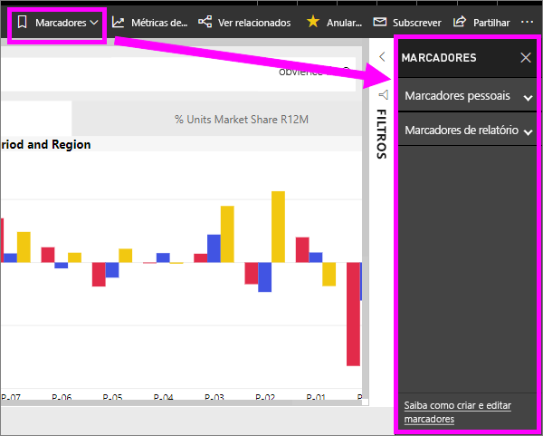
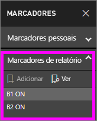
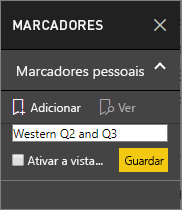
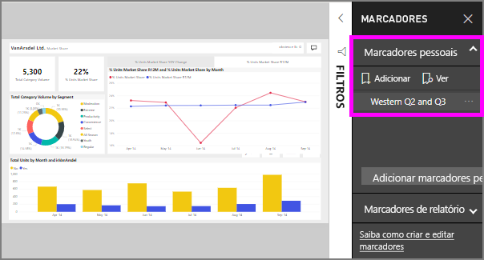

# Quais são indicadores?
Indicadores capturam a vista atualmente configurada de uma página de relatório, incluindo filtros, segmentações de dados e o estado dos elementos visuais. Quando seleciona um marcador, Power BI leva-o novamente para essa exibição. Existem dois tipos de marcadores - aqueles que cria por conta própria e foram criadas pelo relatório *designers*.

## Utilizar marcadores para partilhar informações e criar histórias no Power BI 
Existem muitas utilizações de marcadores. Digamos que descubra uma informação interessante e deseja preservar---criar um marcador, para que possa voltar mais tarde. Tem de deixar e querem preservar o trabalho atual, crie um indicador. Pode até mesmo criando um marcador a vista predefinida do relatório, para que cada vez que voltar, que o modo de exibição da página do relatório é aberto pela primeira vez. 

Também pode criar uma coleção de marcadores, dispô-las na ordem em que pretende e, em seguida, percorra cada marcador numa apresentação para realçar uma série de informações que contam uma história.  

## Utilizar marcadores
Para abrir o painel de marcadores, selecione **marcadores** na barra de menus. Para voltar para o modo de exibição publicado original do relatório, selecione **repor para predefinição**.

### Indicadores de relatório
Se o relatório *designer* incluído indicadores de relatório, pode encontrá-las no **indicadores de relatório** cabeçalho. 

Selecione um indicador para alterar para essa exibição de relatório. 

### Indicadores de pessoas

Quando criar um marcador, os elementos seguintes são guardados com o marcador:

* Página atual
* Filtros
* Segmentação de Dados, incluindo o tipo de segmentação de dados (por exemplo, lista pendente ou lista) e o estado da segmentação de dados
* Estado da seleção do elemento visual (por exemplo, os filtros de realce cruzado)
* Sequência de ordenação
* Localização de agregação
* Visibilidade (de um objeto, através do painel **Seleção**)
* Os modos de detalhe ou **Em Destaque** de qualquer objeto visível

Configure uma página de relatório conforme quiser que apareça no marcador. Depois da página de relatório e dos elementos visuais serem dispostos como pretende, selecione **Adicionar** no painel **Marcadores** para adicionar um marcador. Neste exemplo, adicionamos alguns filtros de data e região. 

**Power BI** cria um marcador e atribui-lhe um nome genérico ou um nome que introduzir. Pode *mudar o nome*, *eliminar*, ou *atualizar* um marcador ao selecionar as reticências junto ao nome do marcador, em seguida, selecionar uma ação no menu apresentado.

Depois de ter um marcador, pode apresentá-lo ao selecionar o marcador no **marcadores** painel. 

<!--
## Arranging bookmarks
As you create bookmarks, you might find that the order in which you create them isn't necessarily the same order you'd like to present them to your audience. No problem, you can easily rearrange the order of bookmarks.

In the **Bookmarks** pane, simply drag-and-drop bookmarks to change their order, as shown in the following image. The yellow bar between bookmarks designates where the dragged bookmark will be placed.

The order of your bookmarks can become important when you use the **View** feature of bookmarks, as described in the next section. 

-->

## Marcadores como uma apresentação de diapositivos
Para apresentar ou exibir indicadores, por ordem, selecione **View** partir a **indicadores** painel para começar uma apresentação de diapositivos.

Quando estiver no modo **Visualização**, existem alguns aspetos a ter em consideração:

1. O nome do marcador é apresentado na barra de título, que aparece na parte inferior da tela.
2. A barra de título do marcador tem setas que lhe permitem mover para o marcador anterior ou seguinte.
3. Pode sair do modo **Visualização** ao selecionar **Sair** no painel **Marcadores** ou ao selecionar o **X** localizado na barra de título do marcador. 

Quando estiver no **Visualização**, pode fechar o painel **Marcadores** (ao clicar no X nesse painel) para dar mais espaço à sua apresentação. No modo **Visualização**, todos os elementos visuais são interativos e estão disponíveis para realce cruzado, tal como acontece quando interage com eles. 

<!--
## Visibility - using the Selection pane
With the release of bookmarks, the new **Selection** pane is also introduced. The **Selection** pane provides a list of all objects on the current page and allows you to select the object and specify whether a given object is visible. 

You can select an object using the **Selection** pane. Also, you can toggle whether the object is currently visible by clicking the eye icon to the right of the visual. 

When a bookmark is added, the visible status of each object is also saved based on its setting in the **Selection** pane. 

It's important to note that **slicers** continue to filter a report page, regardless of whether they are visible. As such, you can create many different bookmarks, with different slicer settings, and make a single report page appear very different (and highlight different insights) in various bookmarks.

## Bookmarks for shapes and images
You can also link shapes and images to bookmarks. With this feature, when you click on an object, it will show the bookmark associated with that object. This can be especially useful when working with buttons; you can learn more by reading the article about [using buttons in Power BI](desktop-buttons.md). 

To assign a bookmark to an object, select the object, then expand the **Action** section from the **Format Shape** pane, as shown in the following image.

Once you turn the **Action** slider to **On** you can select whether the object is a back button, a bookmark, or a Q&A command. If you select bookmark, you can then select which of your bookmarks the object is linked to.

There are all sorts of interesting things you can do with object-linked bookmarking. You can create a visual table of contents on your report page, or you can provide different views (such as visual types) of the same information, just by clicking on an object.

When you are in editing mode you can use ctrl+click to follow the link, and when not in edit mode, simply click the object to follow the link. 

## Bookmark groups

Beginning with the August 2018 release of **Power BI Desktop**, you can create and use bookmark groups. A bookmark group is a collection of bookmarks that you specify, which can be shown and organized as a group. 

To create a bookmark group, hold down the CTRL key and select the bookmarks you want to include in the group, then click the ellipses beside any of the selected bookmarks, and select **Group** from the menu that appears.

**Power BI Desktop** automatically names the group *Group 1*. Fortunately, you can just double-click on the name and rename it to whatever you want.

With any bookmark group, clicking on the bookmark group's name only expands or collapses the group of bookmarks, and does not represent a bookmark by itself. 

When using the **View** feature of bookmarks, the following applies:

* If the selected bookmark is in a group when you select **View** from bookmarks, only the bookmarks *in that group* are shown in the viewing session. 

* If the selected bookmark is not in a group, or is on the top level (such as the name of a bookmark group), then all bookmarks for the entire report are played, including bookmarks in any group. 

To ungroup bookmarks, just select any bookmark in a group, click the ellipses, and then select **Ungroup** from the menu that appears. 

Note that selecting **Ungroup** for any bookmark from a group takes all bookmarks out of the group (it deletes the group, but not the bookmarks themselves). So to remove a single bookmark from a group, you need to **Ungroup** any member from that group, which deletes the grouping, then select the members you want in the new group (using CTRL and clicking each bookmark), and select **Group** again. 
-->

## Limitações e considerações
Nesta versão dos **marcadores**, existem algumas limitações e considerações a não esquecer.

* A maioria dos elementos visuais personalizados deve funcionar devidamente com a marcação. Caso se depare com problemas com um marcador e um elemento visual personalizado, contacte o criador desse elemento visual personalizado e peça-lhe para adicionar suporte para marcadores ao elemento visual. 
* Se adicionar um elemento visual numa página de relatório depois de criar um marcador, este será apresentado no estado predefinido. Isto também significa que se apresentar uma segmentação de dados numa página onde criou anteriormente marcadores, esta irá estar no estado predefinido.
* O movimento entre os elementos visuais depois de ser criado um marcador será refletido no marcador. 
* Em geral, seus indicadores não serão afetados se o relatório *designer* atualiza ou republishes o relatório. No entanto, se o designer torna grandes alterações para o relatório, como remover os campos utilizados por um marcador, em seguida, receberá uma mensagem de erro da próxima vez que está tentando abrir esse indicador. 

<!--
## Next steps
spotlight?
-->
