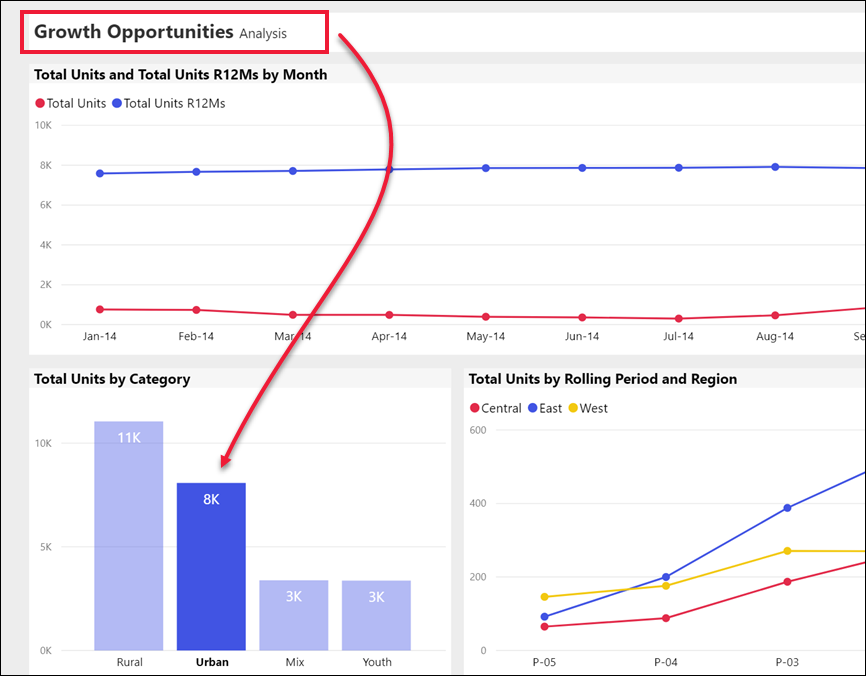

# Botões no serviço Power BI
Pode ter reparado em botões nos relatórios que recebe de colegas e questionado como utilizá-los. Alguns têm palavras, outros têm setas, outros têm gráficos e outros até têm menus pendentes. Este artigo irá ensinar-lhe a reconhecer os botões e como descobrir o que fazer com eles.

## Como reconhecer um botão
Os botões numa página de relatório podem parecer-se muito com formas, imagens ou ícones. No entanto, se ocorrer uma ação quando seleciona (clica em) algum, então provavelmente é um botão.

## Tipos de botões
Os criadores de relatórios adicionam botões aos relatórios para ajudar na navegação e exploração. Os tipos de botões são: **Anterior**, **Marcador**, **Pormenorizar**, **Navegação entre páginas**, **Perguntas e Respostas** e **URL da Web**. 

### Botões de retrocesso 
Um botão de retrocesso pode ter uma seta como ícone e, quando o seleciona, o Power BI leva-o de volta à página anterior.  Os botões de retrocesso são utilizados frequentemente com a pormenorização. Aqui está um exemplo de um botão de retrocesso utilizado com a pormenorização.

1. Selecione **Word** no gráfico de barras.
1. Selecione **Pormenorizar** e **Market basket analysis**.

    

    Ao selecionar **Market basket analysis**, o Power BI abre a página de relatório de *Market basket analysis* e utiliza as seleções feitas na página de origem para filtrar o que é mostrado na página de destino.

    

    Está agora na página de relatório de **Market basket analysis**, que é filtrada para o Word. Selecione o botão Anterior para voltar à página anterior do relatório. 

## Botões de Marcador
Os criadores de relatórios geralmente incluem marcadores nos seus relatórios. Pode ver a lista de marcadores de relatório ao selecionar **Ver** > **Marcadores** no canto superior direito. Quando um criador de relatórios adiciona um *botão* de marcador, é apenas para proporcionar uma forma alternativa de navegar para a página do relatório que está associada a esse marcador. A página terá as definições e filtros aplicados que são capturados pelo marcador. [Saiba mais sobre os marcadores no Power BI](end-user-bookmarks.md). 

Neste exemplo, o botão tem um ícone e o nome do marcador, *Urban*. 

Ao selecionar o botão Marcador, o Power BI leva-o à localização e às definições estabelecidas para esse marcador.  Neste caso, o marcador está na página de relatório *Growth opportunities* e essa página é alvo de filtragem cruzada para **Urban**.

## Botões de Pormenorização
Há duas maneiras de pormenorizar no serviço Power BI. A Pormenorização leva-o a uma página de relatório diferente e os dados dessa página de destino são apresentados de acordo com os filtros e seleções que fez na página de origem.

Uma maneira de pormenorizar num relatório é clicar com o botão direito do rato num ponto de dados num elemento visual, selecionar **Pormenorizar** e escolher o destino. Este método é descrito acima, na secção intitulada **Botões de retrocesso**. No entanto, por vezes os criadores de relatórios utilizam um *botão* de pormenorização, para tornar a ação mais óbvia e chamar a atenção para informações importantes.  

Os botões de pormenorização podem ter mais do que um pré‑requisito. A não ser que cumpra todos os pré‑requisitos, o botão não irá funcionar. Vejamos um exemplo.

Aqui está um botão de pormenorização que nos irá levar à página *Store details*. Pairar o cursor sobre o botão revela uma descrição que nos informa de que precisamos de selecionar tanto uma loja como um produto. Até selecionarmos um de cada, o botão permanece inativo.

Agora que selecionámos um produto (**Word**), e uma loja (**Leo**), o botão muda de cor para nos informar que agora está ativo.

A seleção do botão de pormenorização leva-nos à página de relatório *Store*. A página *Store* é filtrada para as nossas seleções de **Word** e **Leo**.

Os botões de pormenorização também podem ter menus pendentes que lhe oferecem uma seleção de destinos. Depois de ter feito as seleções na página do relatório de origem, selecione a página de relatório de destino para a pormenorização. No exemplo abaixo, estamos a mudar a nossa seleção para pormenorizar até chegar à página de relatório *Market details*. 

## Navegação entre páginas

Os botões de navegação entre páginas levam‑no a uma página diferente no mesmo relatório. Muitas vezes, os criadores de relatórios criam botões de navegação para contar uma história ou para o guiar através das informações do relatório. No exemplo abaixo, o criador de relatórios adicionou em cada página um botão que o leva à primeira página do relatório, a página de resumo de nível superior. Este botão de navegação entre páginas é útil porque há muitas páginas neste relatório.

## Botões de Perguntas e Respostas 
A seleção de um botão de Perguntas e Respostas abre a janela do Explorador de Perguntas e Respostas do Power BI. A janela de Perguntas e Respostas aparece acima da página do relatório e pode ser fechada ao selecionar o X. [Saiba mais sobre Perguntas e Respostas](end-user-q-and-a.md)

## URL da Web
Os botões de URL da Web abrem uma nova janela do browser. Os criadores de relatórios podem adicionar este tipo de botão como uma origem de referência, para ligar ao site corporativo, ou mesmo como uma ligação a um relatório ou dashboard diferente. No exemplo abaixo, o botão URL da Web permite transferir o ficheiro de origem do relatório. 

Uma vez que a página é aberta numa janela separada, feche a janela ou selecione o separador Power BI para voltar ao relatório do Power BI.

## Próximos passos
[Marcadores](end-user-bookmarks.md)    
[Agregar, desagregar](end-user-drill.md)
