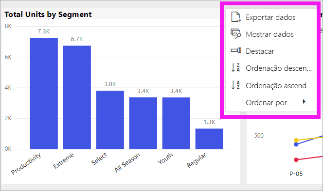
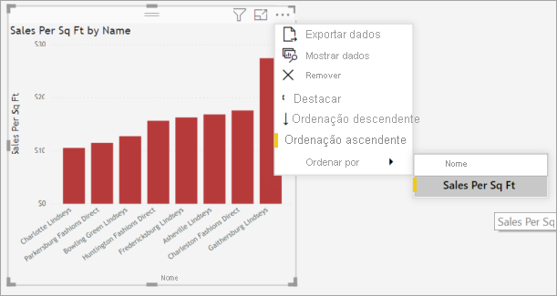
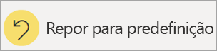
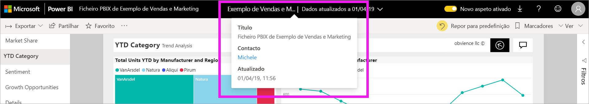

# Alterar a forma como um gráfico é ordenado num relatório do Power BI

[!INCLUDE[consumer-appliesto-ynny](../includes/consumer-appliesto-ynny.md)]

> [!IMPORTANT]
> **Este artigo destina-se aos utilizadores do Power BI que não tenham permissões de edição no relatório ou no conjunto de dados e que apenas trabalhem na versão online do Power BI (o serviço Power BI). Se for um *designer*, *administrador* ou *proprietário* de relatórios, este artigo poderá não ter toda a informação de que necessita. Em alternativa, leia [Ordenação por coluna no Power BI Desktop](../desktop-sort-by-column.md)** .

No serviço Power BI, pode alterar o aspeto de um elemento visual ao ordená-lo por campos de dados diferentes. Ao alterar a forma como ordena um elemento visual, pode destacar as informações que pretende transmitir. Se estiver a utilizar dados numéricos (como o volume de vendas) ou dados de texto (como nomes de estado), pode ordenar as visualizações conforme quiser. O Power BI oferece bastante flexibilidade para ordenação e menus rápidos para utilização. 

Os elementos visuais num dashboard não podem ser ordenados. No entanto, pode ordenar a maioria das visualizações num relatório do Power BI 

## Introdução

Para começar, abra um relatório que tenha sido partilhado consigo. Selecione um elemento visual (que pode ser ordenado) e selecione **Mais ações** (...).  Existem três opções de ordenação: **Ordenação descendente**, **Ordenação ascendente** e **Ordenar por**. 
    

### Ordenar alfabética ou numericamente

Os elementos visuais podem ser ordenados alfabeticamente pelos nomes textuais das categorias ou pelos valores numéricos de cada categoria. Por exemplo, este gráfico está ordenado alfabeticamente pela categoria de eixo X **Store name**.

É fácil alterar a ordenação de uma categoria (nome de arquivo) para um valor (vendas por metro quadrado). Selecione **Mais ações** (...) e selecione **Ordenar por**. Selecione um valor numérico utilizado no elemento visual.  Neste exemplo, selecionámos **Sales Per Sq Ft**.

Se for necessário, alterne entre uma sequência de ordenação ascendente e descendente.  Selecione **Mais ações** (...) novamente e selecione **Ordenação descendente** ou **Ordenação ascendente**. O campo que está a ser utilizado na ordenação está a negrito e tem uma barra amarela.

   

> [!NOTE]
> Nem todos os elementos visuais podem ser ordenados. Por exemplo, os seguintes elementos visuais não podem ser ordenados: treemap, mapa, mapa de manchas, dispersão, medidor, cartão, cascata.

## Guardar as alterações feitas à sequência de ordenação
Os relatórios do Power BI mantêm os filtros, as segmentações, a ordenação e outras alterações que fizer, mesmo que esteja a trabalhar na [Vista de leitura](end-user-reading-view.md). Por isso, se sair de um relatório e regressar mais tarde, as alterações de ordenação serão guardadas.  Se quiser reverter as alterações para as definições do *designer* de relatórios, selecione **Repor para predefinição** na barra de menus superior. 

No entanto, se o botão **Repor para predefinição** for apresentado a cinzento, isso significa que o *designer* do relatório desativou a capacidade de guardar (fazer persistir) as suas alterações.

## Considerações e resolução de problemas

### Ordenar através de outros critérios
Por vezes, quer ordenar o elemento visual através de um campo diferente (que não esteja incluído no elemento visual) ou outros critérios.  Por exemplo, talvez queira ordenar de forma sequencial por mês (e não por ordem alfabética) ou por números inteiros em vez de por dígitos (por exemplo, 0, 1, 9, 20 e não 0, 1, 20, 9).  

Apenas a pessoa que criou o relatório pode fazer estas alterações por si. As informações de contacto do *designer* podem ser encontradas ao selecionar o nome do relatório na barra de cabeçalho.

Se for um *designer* e tiver permissões de edição no conteúdo, leia [Ordenação por coluna no Power BI Desktop](../desktop-sort-by-column.md) para saber como atualizar o conjunto de dados e ativar este tipo de ordenação.

## Próximos passos
Mais sobre [Visualizações em relatórios do Power BI](end-user-visualizations.md).

[Power BI - Conceitos Básicos](end-user-basic-concepts.md)
