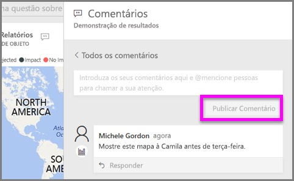
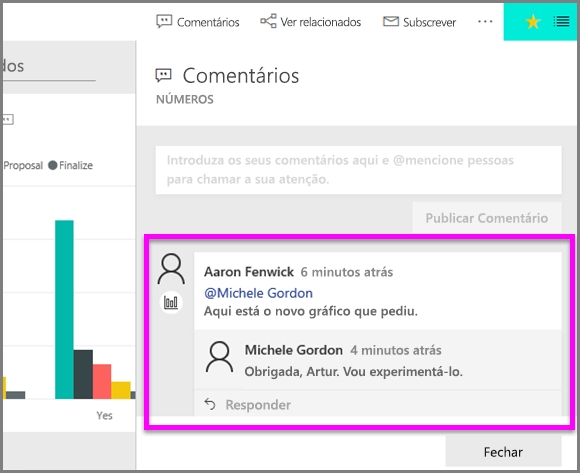

# Adicionar comentários a uma visualização
Adicione um comentário pessoal ou inicie uma conversação sobre uma visualização com os seus colegas. A funcionalidade de **comentário** é apenas uma das formas de como um *consumidor* pode interagir com uma visualização. 

## Como utilizar a funcionalidade de comentário

1. Passe o cursor sobre a visualização e selecione as reticências (...).    
2. No menu pendente, selecione **Adicionar um comentário**.

      

3.  Escreva o seu comentário e selecione **Publicar comentário**. Este é um comentário para mim, com erros ortográficos.

      

4. Aqui está uma conversação que estou a ter com o *designer* da visualização. Ele utiliza o símbolo @ para garantir que vejo o comentário. Eu sei que este comentário é para mim. Quando abro o dashboard desta aplicação no Power BI, seleciono **Comentários** no cabeçalho. O painel **Comentários** apresenta a nossa conversação. 

      

5. Clique em **Fechar** para voltar ao dashboard ou relatório.

## Passos seguintes
Voltar às [visualizações para os consumidores](end-user-visualizations.md)    
<!--[Select a visualization to open a report](end-user-open-report.md)-->