# Adicionar comentários a um dashboard ou relatório
Adicione um comentário pessoal ou inicie uma conversa sobre um dashboard ou relatório com os seus colegas. A funcionalidade de **comentário** é apenas uma das formas de como um *consumidor* pode colaborar com outros. 

## Como utilizar a funcionalidade Comentários
Os comentários podem ser adicionados a um dashboard completo, a elementos visuais individuais num dashboard, a uma página de relatório e a elementos visuais individuais numa página de relatório. Adicione um comentário geral ou um comentário direcionado a colegas específicos.  

Quando adiciona um comentário a um relatório, o Power BI captura os valores atuais do filtro e da segmentação de dados. Isto significa que, quando seleciona ou responde a um comentário, a página de relatório ou o elemento visual de relatório pode mudar para mostrar as seleções de filtro e segmentação de dados que estavam ativas quando o comentário foi criado.  

Porque é que isto é importante? Imagine que um colega aplicou um filtro que revelou uma informação interessante que pretende partilhar com a equipa. Sem esse filtro selecionado, o comentário pode não fazer sentido. 

### Adicionar um comentário geral a um dashboard ou relatório
Os processos para adicionar comentários a um dashboard ou relatório são semelhantes. Neste exemplo, estamos a utilizar um dashboard. 

1. Abra o dashboard ou relatório do Power BI e selecione o ícone de **Comentários**. Esta ação abre a caixa de diálogo Comentários.

    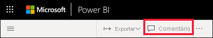

    Aqui podemos ver que o criador do dashboard já adicionou um comentário geral.  Qualquer pessoa com acesso a este dashboard pode ver este comentário.

    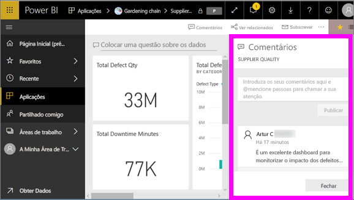

2. Para responder, selecione **Responder**, introduza a sua resposta e selecione **Publicar**.  

    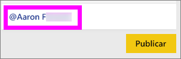

    Por predefinição, o Power BI encaminha a sua resposta para o colega que iniciou o tópico do comentário, neste caso o Samuel F. 

    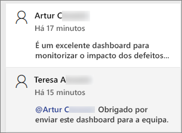

 3. Se quiser adicionar um comentário que não faça parte do tópico existente, escreva o seu comentário no campo de texto superior.

    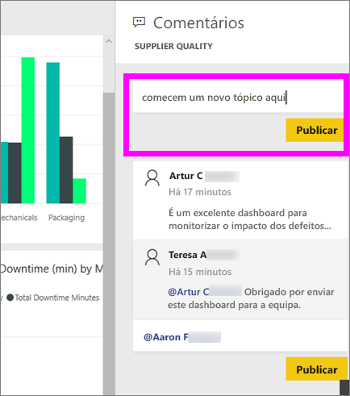

    Os comentários deste dashboard terão o seguinte aspeto.

    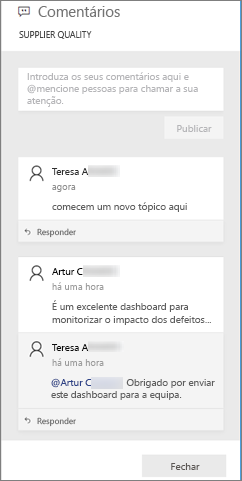

### Adicionar um comentário a um elemento visual específico do dashboard ou relatório
Além de adicionar comentários a um dashboard completo ou a uma página de relatório completa, pode adicionar comentários a mosaicos do dashboard individuais e a elementos visuais de relatório individuais. Os processos são semelhantes e, neste exemplo, estamos a utilizar um relatório.

1. Paire o cursor do rato sobre do elemento visual e selecione as reticências (...).    
2. No menu pendente, selecione **Adicionar um comentário**.

    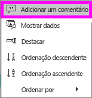  

3.  A caixa de diálogo **Comentários** é aberta e os outros elementos visuais na página ficam a cinzento. Este elemento visual ainda não tem comentários. 

    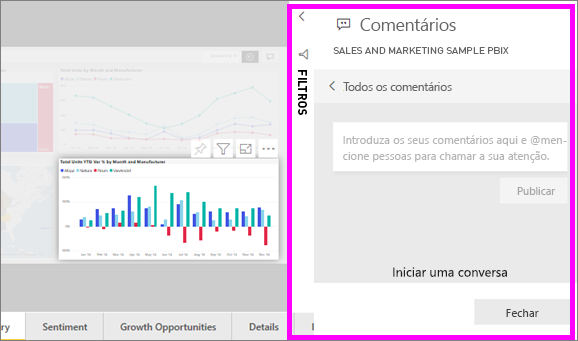  

4. Escreva o seu comentário e selecione **Publicar**.

    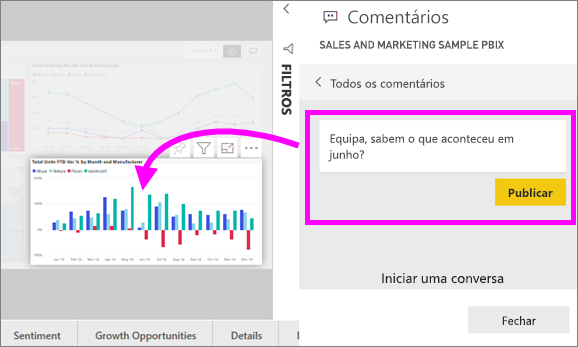  

    - Numa página de relatório, selecionar um comentário feito num elemento visual realça esse elemento visual (ver acima).

    - Num dashboard, o ícone de gráfico  permite-nos saber que o comentário está ligado a um elemento visual específico. Os comentários que se aplicam a todo o dashboard não têm um ícone especial. A seleção do ícone de gráfico realça o elemento visual relacionado no dashboard.

        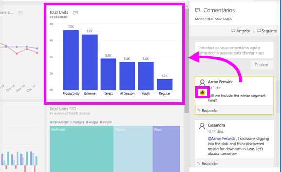

5. Selecione **Fechar** para voltar ao dashboard ou relatório.

### Chame a atenção dos seus colegas ao utilizar o símbolo @
Quer esteja a criar um comentário num dashboard, relatório, mosaico ou elemento visual, chame a atenção dos seus colegas ao utilizar o símbolo "\@".  Quando escreve o símbolo "\@", o Power BI abre uma lista pendente onde pode procurar e selecionar pessoas da sua organização. Qualquer nome verificado que tenha o símbolo "\@" no início é apresentado a azul. 

Aqui está uma conversa que estou a ter com o *designer* da visualização. O símbolo @ é utilizado para garantir que vejo o comentário. Eu sei que este comentário é para mim. Quando abro o dashboard desta aplicação no Power BI, seleciono **Comentários** no cabeçalho. O painel **Comentários** apresenta a nossa conversa.

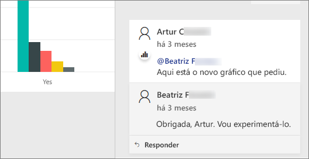  

## Próximos passos
Voltar às [visualizações para os consumidores](end-user-visualizations.md)    
<!--[Select a visualization to open a report](end-user-open-report.md)-->
