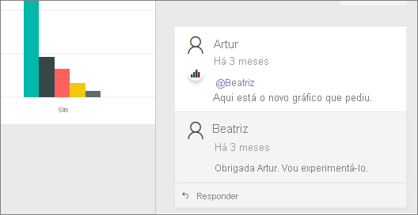
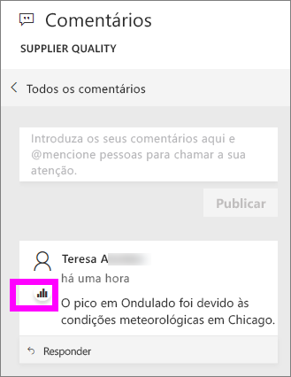

# Adicionar comentários a um dashboard
Adicione um comentário pessoal ou inicie uma conversa sobre um dashboard com os seus colegas. A funcionalidade de **comentário** é apenas uma das formas de como um *consumidor* pode colaborar com outros. 

## Como utilizar a funcionalidade Comentários
Os comentários podem ser adicionados a todo o dashboard ou a elementos visuais individuais num dashboard. Adicione um comentário geral ou um comentário direcionado a colegas específicos.  

### Adicionar um comentário geral ao dashboard
1. Abra o dashboard do Power BI e selecione o ícone de **Comentários**. Esta ação abre a caixa de diálogo Comentários.

    

    Aqui podemos ver que o criador do dashboard já adicionou um comentário geral.  Qualquer pessoa com acesso a este dashboard pode ver este comentário.

    

2. Para responder, selecione **Responder**, introduza a sua resposta e selecione **Publicar**.  

    

    Por predefinição, o Power BI encaminha a sua resposta para o colega que iniciou o tópico do comentário, neste caso o Samuel F. 

    

 3. Se quiser adicionar um comentário ao dashboard que não faça parte do tópico existente, escreva o seu comentário no campo de texto superior.

    

    Os comentários deste dashboard terão o seguinte aspeto.

    

### Adicionar um comentário a um elemento visual específico do dashboard
1. Paire o cursor do rato sobre do elemento visual e selecione as reticências (...).    
2. No menu pendente, selecione **Adicionar um comentário**.

      

3.  A caixa de diálogo **Comentários** é aberta. Este elemento visual ainda não tem comentários. 

      

4. Escreva o seu comentário e selecione **Publicar**.

      

    O ícone de gráfico  permite-nos saber que este comentário está ligado a um elemento visual específico. Selecione o ícone para realçar o respetivo elemento visual no dashboard.

    

5. Selecione **Fechar** para voltar ao dashboard ou relatório.

### Chame a atenção dos seus colegas ao utilizar o símbolo @
Quer esteja a criar comentários no dashboard ou a comentar um elemento visual específico, chame a atenção dos seus colegas ao utilizar o símbolo "\@".  Quando escreve o símbolo "\@", o Power BI abre uma lista pendente onde pode procurar e selecionar pessoas da sua organização. Qualquer nome verificado que tenha o símbolo "\@" no início é apresentado a azul. 

Aqui está uma conversa que estou a ter com o *designer* da visualização. Ele utiliza o símbolo @ para garantir que vejo o comentário. Eu sei que este comentário é para mim. Quando abro o dashboard desta aplicação no Power BI, seleciono **Comentários** no cabeçalho. O painel **Comentários** apresenta a nossa conversa.

  

## Passos seguintes
Voltar às [visualizações para os consumidores](end-user-visualizations.md)    
<!--[Select a visualization to open a report](end-user-open-report.md)-->
