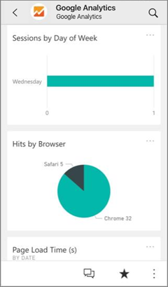
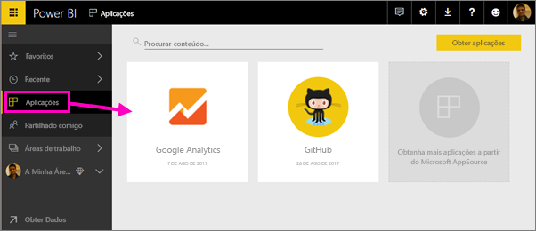
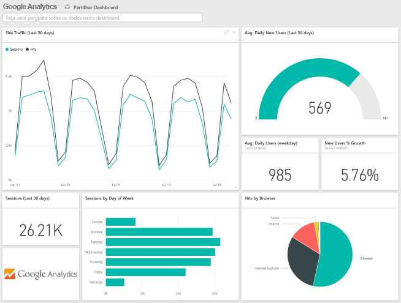
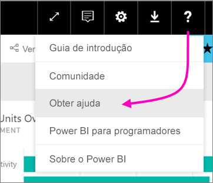

# Ligar aos serviços que utiliza com o Power BI

Após instalar a aplicação, pode ver o dashboard e os relatórios no serviço Power BI ([https://powerbi.com](https://powerbi.com)) e nas aplicações móveis do Power BI. 

## Introdução
[!INCLUDE [powerbi-service-apps-get-more-apps](.././includes/powerbi-service-apps-get-more-apps.md)]

## Ver o dashboard e relatórios
Quando a importação estiver concluída, a nova aplicação aparecerá na página Aplicações.

1. Selecione **Aplicações** no painel de navegação à esquerda > selecione a aplicação.
   
     
2. Pode fazer uma pergunta ao escrever na caixa de Perguntas e Respostas ou clicar num mosaico para abrir o relatório subjacente. 
   
    
   
    Pode filtrar e realçar os dados no relatório, mas não pode guardar as suas alterações.

## O que está incluído
Depois de se ligar a um serviço, irá ver uma aplicação recém-criada com um dashboard, relatórios e conjunto de dados. Os dados do serviço focam-se num cenário específico e podem não abranger todas as informações do serviço. Os dados são agendados para atualização automática uma vez por dia. Pode controlar a agenda ao selecionar o conjunto de dados.

Para obter mais detalhes sobre ligar-se a serviços específicos, consulte as páginas de ajuda individuais.

## Resolução de problemas
**Mosaicos vazios**  
Apesar de o Power BI começar por se ligar ao serviço, poderá ver um conjunto vazio de mosaicos no seu dashboard. Se ainda vir um dashboard vazio após 2 horas, é provável que tenha havido uma falha de ligação. Se não vir uma mensagem de erro com informações sobre como corrigir o problema, envie um ticket de suporte.

* Selecione o ícone de ponto de interrogação (**?**) no canto superior direito >  **Obter ajuda**.
  
    

**Informações em falta**  
O dashboard e os relatórios incluem o conteúdo do serviço voltado para um cenário específico e não abrangem todas as informações do serviço. Se houver uma métrica específica que não esteja a ver no pacote de conteúdos, adicione uma ideia na página [Suporte do Power BI](https://support.powerbi.com/forums/265200-power-bi).

## Sugestão de serviços
Utiliza um serviço que pretende sugerir para uma aplicação do Power BI? Vá para a página [Suporte do Power BI](https://support.powerbi.com/forums/265200-power-bi) e envie os seus comentários.

Tem um serviço para o qual pretende criar uma aplicação? [Envie a sua nomeação](https://azure.microsoft.com/marketplace/programs/certified/apply/) e selecione "Publicar um Pacote de Conteúdos do Power BI" para começar.

## Próximos passos
* [O que são aplicações no Power BI?](../service-install-use-apps.md)
* [Obter dados no Power BI](../service-get-data.md)
* Mais perguntas? [Experimente perguntar à Comunidade do Power BI](http://community.powerbi.com/)

