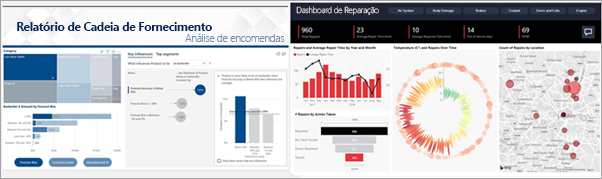

# O serviço Power BI para consumidores

[!INCLUDE[consumer-appliesto-ynny](../includes/consumer-appliesto-ynny.md)]

Vive numa cultura orientada para os dados, onde as decisões empresariais se baseiam em factos e não em opiniões. Necessita de dados para tomar estas decisões e os seus colegas não o irão desiludir.     
 
Estes enviam-lhe todos os tipos de relatórios, folhas de cálculo, e-mails com gráficos e materiais impressos. À medida que os dados se acumulam, torna-se cada vez mais difícil encontrar rapidamente aquilo de que precisa e tem receio de que possa não estar a utilizar as informações mais recentes.  
 

## O serviço Power BI para *consumidores*

O Power BI faz com que o seu trabalho seja mais fácil e tenha maior impacto ao mesmo tempo. Todos esses dados são transformados em gráficos que lhe permitem visualizá-los de forma mais clara. Em vez de ter listas ou tabelas longas de números e palavras, as informações dos seus dados são apresentadas de uma forma ***apelativa***, através de cores e elementos visuais cativantes que contam histórias sobre as mesmas. 

 
Abra o serviço Power BI num browser ou num dispositivo móvel. Você e os seus colegas trabalham a partir dos mesmos dashboards e relatórios fidedignos, os quais são atualizados automaticamente para que esteja sempre a trabalhar com os conteúdos mais recentes.   

Uma vez que os conteúdos não são estáticos, pode aprofundar mais o assunto e procurar tendências, informações e outros dados de business intelligence. Divida e segmente os conteúdos e faça-lhes perguntas com as suas próprias palavras. Em alternativa, descontraia e deixe que os seus dados descubram informações interessantes por si ao receber alertas quando ocorrerem alterações aos dados e relatórios por e-mail com base na agenda que definir. Todos os seus dados em qualquer altura, na cloud ou no local, a partir de qualquer dispositivo. Isto é só o princípio do que o Power BI pode fazer. 

## Sou um *consumidor* do Power BI?

A forma como interage com o Power BI irá depender da sua função. Um utilizador final ou *consumidor* é a pessoa que recebe conteúdos (dashboards, relatórios e aplicações) de colegas. Um consumidor trabalha na versão online ou móvel do Power BI, denominado serviço Power BI, onde pode rever e interagir com esses conteúdos para tomar decisões empresariais. 
   
Enquanto consumidor, não terá acesso a todas as funcionalidades do Power BI, o que não é problema, porque a sua tarefa não se baseia em criar dashboards e relatórios. Irá utilizar o Power BI para análise, monitorização, exploração e tomada de decisões. 

Irá certamente deparar-se com o termo "Power BI Desktop" ou apenas "Desktop", que é uma ferramenta autónoma utilizada pelos *criadores* que criam e partilham dashboards e relatórios consigo.  É importante saber que existem outras ferramentas do Power BI. No entanto, se for um consumidor, só irá trabalhar com o serviço Power BI. 

Dado que está a trabalhar com conteúdos *partilhados*, tudo o que irá precisar é de uma licença **gratuita** porque está a trabalhar numa organização que está a utilizar uma capacidade **Premium**. [Qual é a minha licença?](end-user-license.md)

## Interagir com conteúdos de forma segura 
Não tem de se preocupar ao filtrar, segmentar, subscrever e exportar conteúdos, dado que o seu trabalho não afeta o conjunto de dados subjacente ou os conteúdos partilhados originalmente (dashboards, relatórios e aplicações).  

Não é possível danificar os seus dados.  O Power BI é um excelente local para explorar e experimentar sem se preocupar com a possibilidade de danificar os dados.  
 
Isso não significa que não possa guardar as suas alterações, pois pode faz\ê-lo. Contudo, essas alterações afetam apenas a sua vista dos conteúdos. Além disso, pode reverter facilmente para a vista predefinida com um simples clique no botão.  

## Próximos passos

[Ver uma apresentação do serviço Power BI para consumidores](end-user-reading-view.md)    
[Formação sobre o serviço Power BI para consumidores](/learn/paths/consume-data-with-power-bi/)    
[Terminologia e conceitos para os *consumidores* do Power BI ](end-user-basic-concepts.md)