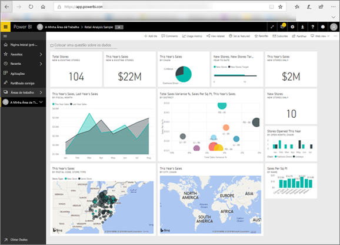

# Power BI para consumidores
A forma como interage com o Power BI irá depender da sua função. Um *utilizador final*, ou *consumidor*, é a pessoa que recebe dashboards, relatórios e aplicações de colegas. Trabalha no ***serviço Power BI*** para rever e interagir com estes conteúdos para tomar decisões de negócios.

Se estiver a utilizar o Power BI pela primeira vez, recomendamos que leia primeiro a [descrição geral do Power BI](../power-bi-overview.md). Aqui aprenderá sobre o conjunto de ferramentas que constituem o Power BI.

Enquanto consumidor, não terá acesso a todas as funcionalidades do Power BI, o que não é problema, porque a sua tarefa não se baseia em criar dashboards e relatórios. A sua tarefa consiste em utilizar o Power BI para análise, monitorização, exploração e tomada de decisões.

Ao ler os artigos para os consumidores, irá aprender a terminologia, obter uma apresentação do serviço Power BI, descobrir como navegar para os conteúdos e, em seguida, aprender a interagir com esses conteúdos.  Vamos então começar!

