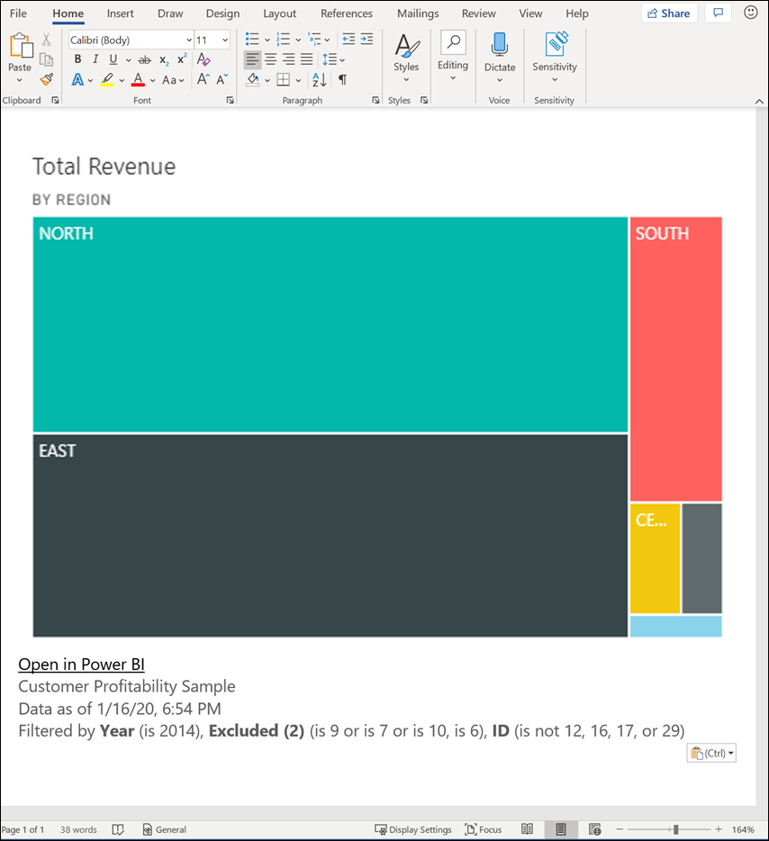

# Copiar um elemento visual como uma imagem na área de transferência

[!INCLUDE[consumer-appliesto-yyyn](../includes/consumer-appliesto-yyyn.md)]

Já alguma vez quis partilhar uma imagem de um dashboard ou relatório do Power BI? Agora, pode copiar o elemento visual e colá-lo em qualquer outra aplicação que suporte essa ação. 

Quando copiar uma imagem estática de um elemento visual, obterá uma cópia do elemento visual juntamente com os metadados. O que está incluído:
* ligar de volta ao dashboard ou relatório do Power BI
* título do dashboard ou relatório
* aviso se a imagem tiver informações confidenciais
* carimbo de data/hora da última atualização
* filtros aplicados ao elemento visual

### Copiar de um mosaico do dashboard

1. Navegue até ao dashboard a partir do qual quer copiar.

2. No canto superior direito do elemento visual, selecione **Mais ações (...)** e escolha **Copiar elemento visual como imagem**. 

    

3. Quando a caixa de diálogo **O elemento visual está pronto para a cópia**, selecione **Copiar para a área de transferência**.

    

4. Depois de o elemento visual ter sido copiado, cole-o noutra aplicação com **Ctrl + V** ou clique com o botão direito do rato > Colar. Na captura de ecrã abaixo, colamos o elemento visual no Microsoft Word. 

    

### Copiar a partir de um elemento visual de relatório 

1. Navegue até ao relatório a partir do qual quer copiar.

2. No canto superior direito do elemento visual, selecione o ícone **Copiar elemento visual como imagem**. 

    

3. Quando a caixa de diálogo **O elemento visual está pronto para a cópia**, selecione **Copiar para a área de transferência**.

    

4. Depois de o elemento visual ter sido copiado, cole-o noutra aplicação com **Ctrl + V** ou clique com o botão direito do rato > Colar. Na captura de ecrã abaixo, colamos o elemento visual num e-mail.

    

5. Se existir uma etiqueta de confidencialidade de dados aplicada ao relatório, receberá um aviso quando selecionar o ícone de cópia.  

    

    Além disso, será adicionada uma etiqueta de confidencialidade aos metadados abaixo do elemento visual colado. 

    

## Considerações e resolução de problemas

   

P: Porque é que o ícone Copiar está desativado num elemento visual?    
R: Atualmente, suportamos elementos visuais nativos do Power BI e elementos visuais personalizados certificados. Existe um suporte limitado para certos elementos visuais, incluindo: 
- Elementos visuais ESRI e outros elementos visuais de Mapa 
- Elementos visuais do Python 
- Visuais R 
- PowerApps    

R: A capacidade de copiar um elemento visual pode ser desligada pelo departamento de TI ou pelo administrador do Power BI.

P: Porque é que o meu elemento visual não está a ser colado corretamente?    
R: Existem limitações para elementos visuais personalizados e elementos visuais animados. 

## Próximos passos
Mais sobre [Visualizações nos relatórios do Power BI](end-user-visual-type.md)

Mais perguntas? [Pergunte à Comunidade do Power BI](https://community.powerbi.com/)

