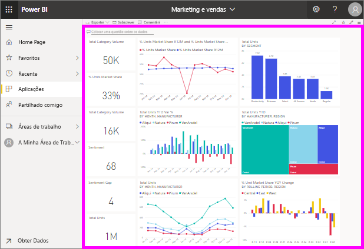

# Visualizar um dashboard

[!INCLUDE [power-bi-service-new-look-include](../includes/power-bi-service-new-look-include.md)]

Os *consumidores* do Power BI passam muito tempo a visualizar dashboards. Os dashboards foram criados para realçar as informações específicas de relatórios e conjuntos de dados subjacentes. E os consumidores do Power BI utilizam essas informações para controlar, monitorizar, responder a perguntas, testar e muito mais – para tomar decisões condicionadas pelos dados empresariais.

O Power BI Pro é necessário tanto para partilhar um dashboard como para visualizar um dashboard partilhado.

## Abrir um dashboard

|              |         |
|------------|--------------------------------|
|      |Os dashboards podem ser abertos em várias localizações do serviço Power BI.   Basta procurar este ícone do dashboard. Depois de identificar um  dashboard, é simples abri-lo: basta selecioná-lo e este preenche  a sua tela do Power BI. |
|                    |          |

Poderá encontrar dashboards em todos os contentores na barra de navegação esquerda. 

- **Home Page** 
- **Favoritos** – se definiu [um dashboard como favorito](end-user-favorite.md)
- **Recente** – se visitou recentemente um dashboard
- **Aplicações** – a maioria das aplicações contêm dashboards e relatórios
- **Partilhado comigo** – se um colega [partilhou um dashboard consigo](end-user-shared-with-me.md)
- **Minha área de trabalho** – se transferiu qualquer um do [exemplos do Power BI](../sample-datasets.md)

## Próximos passos
* Conheça melhor os dashboards ao ver uma apresentação de um dos nossos [dashboards de exemplo](../sample-tutorial-connect-to-the-samples.md).
* Saiba mais sobre [mosaicos do dashboard](end-user-tiles.md) e o que acontece quando seleciona um.