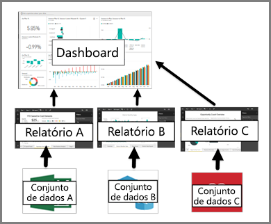

# Dashboards para consumidores do serviço Power BI

[!INCLUDE [power-bi-service-new-look-include](../includes/power-bi-service-new-look-include.md)]

Um ***dashboard*** do Power BI é uma única página, frequentemente denominada tela, que utiliza visualizações para contar uma história. Como está limitada a uma página, um dashboard bem concebido contém apenas os elementos mais importantes da história.

As visualizações apresentadas no dashboard são denominadas *mosaicos* e são *afixadas* ao dashboard por *designers* de relatórios. Na maioria dos casos, ao selecionar um mosaico, é direcionado para a página de relatório onde foi criada a visualização. Se for um novo utilizador do Power BI, pode obter uma boa base de aprendizagem ao ler os [conceitos básicos do Power BI](end-user-basic-concepts.md).

> [!NOTE]
> Os dashboards podem ser [visualizados e partilhados em dispositivos móveis](mobile/mobile-apps-view-dashboard.md).
>
> É necessário o Power BI Pro para visualizar um dashboard que tenha sido partilhado consigo.
> 

As visualizações num dashboard são provenientes de relatórios e cada relatório baseia-se num conjunto de dados. Na verdade, uma forma de pensar num dashboard é como uma entrada para os relatórios e conjuntos de dados subjacentes. Selecionar uma visualização leva-o ao relatório (e ao conjunto de dados) que utilizou para a criar.

## Vantagens dos dashboards
Os dashboards são uma forma fantástica de monitorizar a sua empresa, procurar respostas e ver rapidamente todas as métricas mais importantes. As visualizações num dashboard podem ser provenientes de um ou vários conjuntos de dados subjacentes ou de um ou vários relatórios subjacentes. Um dashboard pode combinar dados no local e na cloud ao fornecer uma vista consolidada, independentemente de onde os dados residem.

Um dashboard não é apenas uma imagem apelativa, é interativo e os mosaicos são atualizados à medida que os dados subjacentes são alterados.

## Dashboards versus relatórios para ***consumidores*** do Power BI
Os relatórios costumam ser confundidos com os dashboards, pois também são telas preenchidas com visualizações. No entanto, existem algumas diferenças significativas do ponto de vista dos *consumidores* do Power BI.

| **Capacidade** | **Dashboards** | **Relatórios** |
| --- | --- | --- |
| Páginas |Uma página |Uma ou mais páginas |
| Origens de dados |Um ou mais relatórios e um ou mais conjuntos de dados por dashboard |Um único conjunto de dados por relatório |
| Filtragem |Não pode filtrar nem segmentar |Várias formas diferentes de filtrar, realçar e segmentar |
| Definir alertas |Pode criar alertas para que lhe seja enviado um e-mail quando são cumpridas determinadas condições |Não |
| Destaques |Pode definir um dashboard como o seu dashboard "em destaque" |Não pode criar um relatório em destaque |
| Pode ver as tabelas e os campos de conjuntos de dados subjacentes |Não. Pode exportar dados mas não pode ver tabelas e campos no próprio dashboard. |Sim. Pode ver tabelas, campos e valores de conjuntos de dados. |

## designers e consumidores de dashboards
Enquanto ***consumidor*** do Power BI, recebe dashboards de *designers*. Continue a aprender sobre dashboards com estes tópicos:

* [Visualizar um dashboard](end-user-dashboard-open.md)
* Saiba mais sobre [mosaicos do dashboard](end-user-tiles.md) e o que acontece quando seleciona um.
* Quer controlar um mosaico do dashboard individual e receber um e-mail quando atingir um determinado limiar? [Crie alertas nos mosaicos](end-user-alerts.md).
* Divirta-se a fazer perguntas ao dashboard. Saiba como utilizar as [Perguntas e Respostas do Power BI](end-user-q-and-a.md) para fazer uma pergunta sobre os dados e receber uma resposta na forma de uma visualização.

> [!TIP]
> Se não encontrou aqui o que procurava, utilize o Índice à esquerda.
> 

## Próximos passos
[Visualizar um dashboard](end-user-dashboard-open.md) 