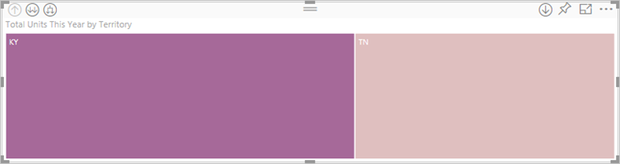

# Modo de desagregação numa visualização no Power BI

## A desagregação requer uma hierarquia
Quando um visual tem uma hierarquia, pode desagregar para revelar detalhes adicionais. Por exemplo, pode ter uma visualização que observa a contagem de medalhas olímpicas por uma hierarquia constituída por desporto, disciplina e evento. Por predefinição, a visualização mostra a contagem de medalhas por desporto: ginástica, esqui, desportos aquáticos, etc. Mas, uma vez que tem uma hierarquia, selecionar um dos elementos visuais (como uma barra, linha ou bolha) mostraria uma imagem cada vez mais detalhada. Selecione o elemento **desportos aquáticos** para ver os dados sobre natação, mergulho e polo aquático.  Selecione o elemento **mergulho** para ver detalhes sobre eventos de prancha, plataforma e mergulho sincronizado.

Pode adicionar hierarquias a relatórios que lhe pertencem, mas não àqueles que foram partilhados consigo.
Não sabe que visualizações do Power BI contêm uma hierarquia?  Passe o cursor por uma visualização e, se vir estes controlos de desagregação nos cantos superiores, a sua visualização tem uma hierarquia.

    
   

As datas são um tipo único de hierarquia. Quando adicionar um campo de data a uma visualização, o Power BI adiciona automaticamente uma hierarquia de tempo que contém ano, trimestre, mês e dia. Para obter mais informações, consulte [Hierarquias visuais e comportamento de desagregação](../guided-learning/visualizations.yml?tutorial-step=18) ou veja o vídeo abaixo.

  <iframe width="560" height="315" src="https://www.youtube.com/embed/MNAaHw4PxzE?list=PL1N57mwBHtN0JFoKSR0n-tBkUJHeMP2cP" frameborder="0" allowfullscreen></iframe>

> [!NOTE]
> Para saber como criar hierarquias através do Power BI Desktop, veja o vídeo [Como criar e adicionar hierarquias](https://youtu.be/q8WDUAiTGeU)
> 

## Pré-requisitos

1. No serviço Power BI ou no Power BI Desktop, a desagregação requer uma visualização com uma hierarquia. 
   
2. Para continuar, [abra o exemplo Análise de Retalho](../sample-datasets.md) e crie um treemap que utilize as **Unidades Totais Este Ano** (Valores) por **Território**, **Cidade**, **Código Postal**, e **Nome** (Grupo).  O treemap tem uma hierarquia constituída por território, cidade, código postal e nome de cidade. Cada território tem uma ou mais cidades, cada cidade tem um ou mais códigos postais, etc. Por predefinição, a visualização mostra apenas os dados de território, uma vez que *Território* aparece em primeiro lugar na lista.
   
   

2. Compreender a forma como os vários ícones de desagregação funcionam em conjunto pode ser confuso, por isso iremos filtrar o treemap para apresentar apenas dois dos territórios mais pequenos: **KY** e **TN**. Selecione o treemap e, em **Filtros de nível visual**, expanda **Território** e selecione **KY** e **TN**.

        

   Agora, apenas dois territórios são apresentados no treemap.

   

## Três formas de aceder às funcionalidades de desagregação
Existem várias opções para aceder às funcionalidades de agregação, desagregação e expansão para visualizações com hierarquias. Este artigo mostra como utilizar a primeira opção abaixo. Após compreender as noções básicas de agregação, desagregação e expansão (estes três métodos realizam as mesmas ações), experimente-os e escolha o que preferir.

- Coloque o cursor sobre uma visualização para ver e utilizar os ícones.  

    

- Faça clique com o botão direito do rato numa visualização para ver e utilizar o menu.
    
    

- Na barra de menus do Power BI, selecione o botão **Explorar**.

   

## Caminhos de desagregação
### Desagregar
Existem várias formas de explorar a visualização. ***Desagregar*** conduz ao nível seguinte da hierarquia, pelo que, se estiver no nível **Território**, pode desagregar até ao nível Cidade e, em seguida, até ao nível Código Postal e, finalmente, até ao nível Nome. Cada passo do caminho apresenta novas informações.

### Expandir

***Expandir*** adiciona outro nível de hierarquia à vista atual. Por isso, se estiver no nível **Território**, pode expandir e adicionar detalhes de cidade, código postal e nome ao treemap. Cada passo no caminho apresenta as mesmas informações e adiciona um nível de informações novas.

Também pode escolher se quer desagregar ou expandir um campo de cada vez ou todos os campos de uma vez. 

## Desagregar todos os campos de uma vez

1. Comece pelo nível superior do treemap que apresenta dados para KY e TN. Alargue o treemap ao selecionar uma das alças e ao arrastar para a direita. 

     .

2. Para desagregar ***todos os campos de uma vez***, selecione a seta dupla no canto superior esquerdo da visualização . O treemap mostra agora dados de cidade para Kentucky e Tennessee. 

    
   
5. Desagregue mais uma vez até ao nível Código Postal da hierarquia.

    

3. Para voltar a agregar, selecione a seta para cima no canto superior esquerdo da visualização .

## Desagregar um campo de cada vez
Este método utiliza o ícone de desagregação apresentado no canto superior direito da própria visualização. 

1. Selecione o ícone de desagregação para o ativar . Agora tem a opção de desagregar ***um campo de cada vez***. 
   
   

   Se não ativar a desagregação, selecionar um elemento visual (como uma barra, bolha ou folha) não irá efetuar a desagregação, mas sim uma filtragem cruzada dos outros gráficos na página de relatórios.

2. Selecione a *folha* para **TN**. O treemap apresenta agora todas as cidades no Tennessee que têm uma loja. 

    

2. A partir deste ponto, pode continuar a desagregação para Tennessee, desagregar para uma determinada cidade do Tennessee ou expandir (veja **Expandir todos os campos de uma vez** abaixo). Continuemos a desagregar um campo de cada vez.  Selecione **Knoxville, TN**. O treemap mostra agora o código postal para a sua loja em Knoxville. 

   

    Repare que o título muda à medida que desagrega e regressa.  

## Expandir tudo e expandir um campo de cada vez
Ter um treemap que apresenta apenas um código postal não é muito informativo.  Por isso, vamos expandir para baixo um nível na hierarquia.  

1. Com o treemap ativo, selecione o ícone *Expandir para baixo* . O treemap mostra agora dois níveis da hierarquia: Código Postal e Nome da loja. 

    

2. Para ver os quatro níveis de dados da hierarquia para Tennessee, selecione a seta de agregação até chegar ao segundo nível do treemap, **Unidades totais este ano por território e cidade**. 

    

3. Certifique-se de que a desagregação continua ativada  e selecione o ícone *Expandir para baixo* . O treemap apresenta agora alguns detalhes adicionais. Em vez de apresentar apenas a cidade e o estado, apresenta agora também o código postal. 

    

4. Selecione novamente o ícone *Expandir para baixo* para apresentar os quatro níveis de detalhe da hierarquia para Tennessee no treemap. Coloque o cursor sobre uma folha para ver ainda mais detalhes.

   

## Desagregar filtra outros elementos visuais
Ao trabalhar no Modo de desagregação, pode decidir de que forma é que a desagregação e a expansão afetam outras visualizações na página. 

Por predefinição, a desagregação não irá filtrar outros elementos visuais num relatório. No entanto, esta funcionalidade pode ser ativada no Power BI Desktop e no serviço Power BI. 

1. No Power BI Desktop, selecione o separador **Formato** e a caixa de verificação **Desagregar filtra outros elementos visuais**.

    

2. Agora, quando desagregar (ou agregar ou expandir) um elemento visual com uma hierarquia, esta ação filtrará os outros elementos visuais na página. 

    

    

> [!NOTE]
> Para ativar esta opção no serviço Power BI, selecione **Interações visuais > Desagregar filtra outros elementos visuais** na barra de menus superior.
>
> 

## Compreender o eixo de hierarquia e o grupo de hierarquia
Pode pensar no eixo de hierarquia e no grupo de hierarquia como os mecanismos que pode utilizar para aumentar e diminuir a granularidade dos dados que pretende ver. Considera-se que têm uma hierarquia todos os dados que possam ser organizados em categorias e subcategorias. Isto, obviamente, inclui datas e horas.

Pode criar uma visualização no Power BI para ter uma hierarquia, ao selecionar um ou mais campos de dados para adicionar ao conjunto de dados **Eixo** ou ao conjunto de dados **Grupo**, com os dados que pretende examinar como campos de dados no conjunto de campos **Valores**. Saberá se os seus dados são hierárquicos se os ícones do *Modo de desagregação* aparecerem nos cantos superiores esquerdo e direito da sua visualização. 

Essencialmente, é conveniente pensar em dois tipos de dados hierárquicos:
- Dados de data e hora: se tiver um campo com um tipo de dados DateTime, já tem dados hierárquicos. O Power BI cria automaticamente uma hierarquia para todos os campos de dados cujos valores podem ser analisados numa estrutura [DateTime](https://msdn.microsoft.com/library/system.datetime.aspx). Apenas precisa de adicionar um campo DateTime ao conjunto de dados **Eixo** ou **Grupo**.
- Dados categóricos: se os seus dados tiverem origem em coleções que contêm subcoleções ou tiverem linhas de dados que partilham valores comuns, tem dados hierárquicos.

O Power BI permite-lhe expandir por um ou por todos os subconjuntos. Pode desagregar os seus dados para ver um único subconjunto em cada nível ou para ver todos os subconjuntos simultaneamente em cada nível. Por exemplo, pode desagregar para um ano específico ou ver todos os resultados para cada ano à medida que se desce na hierarquia. Por outro lado, pode agregar da mesma forma.

As seguintes secções descrevem a desagregação da vista mais elevada, da vista central e da vista mais baixa.

### Dados hierárquicos e dados de hora
Para este exemplo, acompanhe o [exemplo de Análise de Revenda](../sample-datasets.md) e crie uma visualização de gráfico de colunas empilhadas que apresente o **Mês** (Eixo) por **TotalSales** (Total de Vendas) (Valores).  

Apesar de o campo de dados Eixo ser **Mês**, este cria uma categoria **Ano** no conjunto de dados **Eixo**. Isto deve-se ao facto de o Power BI fornecer uma estrutura DateTime completa para todos os valores que lê. A parte superior da hierarquia mostra os dados do ano.

Com o modo Desagregar ativado, clique na barra no gráfico para descer um nível na hierarquia. Verá três barras para os dados dos trimestres disponíveis. Em seguida, nos ícones do canto superior esquerdo, selecione **Expandir tudo para um nível na hierarquia**. Em seguida, faça-o novamente para obter o nível mais baixo da hierarquia, que mostra resultados para cada mês.

Além da visualização, podemos ver a hierarquia refletida nos dados compostos para cada relatório. A seguinte tabela mostra os resultados de **Mostrar Dados** num relatório a desagregar de um único mês ou todos os meses. 

Tenha em atenção que os dados são os mesmos para relatórios trimestrais e anuais, mas após desagregar o nível de detalhe especificado para **Valores**, pode ver que o relatório único é mais específico e o relatório "todos os meses" tem mais dados.

|Modo Expandir|Ano|Trimestre|Mês|Dia|
| ---|:---:|:---:|:---:|---|
|Único|||||
|Tudo|||||

### Dados de categoria hierárquica
Os dados modelados a partir de coleções e subcoleções são hierárquicos. Um bom exemplo disto são os dados de localização. Pense numa tabela numa origem de dados cujas colunas são Country (País), State (Estado), City (Cidade) e Zip (Código Postal). Os dados que partilham o mesmo Country (País), State (Estado), City (Cidade) são hierárquicos.

Para este exemplo, acompanhe o [exemplo de Análise de Revenda](../sample-datasets.md). Crie uma visualização de gráfico de coluna empilhada que abranja as **Total Units This Year** (Unidades Totais Este Ano) (Valores) por **Territory** (Território), **City** (Cidade), **PostalCode** (Código Postal) e **Name** (Nome) (Grupo).  

Com o modo Desagregar ativado, nos ícones do canto superior esquerdo, selecione **Expandir tudo para um nível na hierarquia** três vezes.
Deverá estar no nível mais baixo da hierarquia, que mostra resultados para Territory (Território), City (Cidade) e Postal Code (Código Postal).

Além da visualização, podemos ver a hierarquia refletida nos dados compostos para cada relatório. A seguinte tabela mostra os resultados de **Mostrar Dados** num relatório a desagregar para um único território ou todos os territórios. À medida que desagrega, pode ver como o relatório relativo a um território se torna mais específico e o relatório "todos os territórios" tem mais dados.

| Modo Expandir|Territory|City|Postal|Nome|
| ---|:---:|:---:|:---:|---|
|Único|||||
|Tudo|||||

## Considerações e limitações
* Se adicionar um campo de data a uma visualização não criar uma hierarquia, pode ser que o campo "data" não esteja realmente guardado como uma data. Se for o proprietário do conjunto de dados, abra-o na vista de *Dados* no Power BI Desktop, selecione a coluna que contém a data e, no separador Modelação, altere o **Tipo de Dados** para **Data** ou **Data/Hora**. Se o relatório tiver sido partilhado consigo, contacte o proprietário para pedir a alteração.  
  
  

## Passos seguintes
[Visualizações nos relatórios do Power BI](../visuals/power-bi-report-visualizations.md)

[Relatórios do Power BI](end-user-reports.md)

[Power BI - Conceitos Básicos](end-user-basic-concepts.md)

Mais perguntas? [Pergunte à Comunidade do Power BI](http://community.powerbi.com/)

