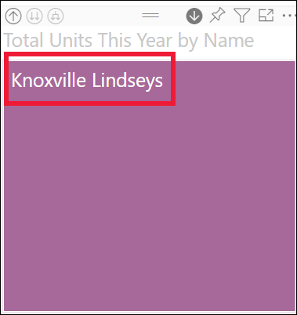

# Modo de exploração num elemento visual no Power BI

[!INCLUDE[consumer-appliesto-yyny](../includes/consumer-appliesto-yyny.md)]

Este artigo mostra como pode desagregar num elemento visual no serviço Microsoft Power BI. Com a desagregação e a agregação nos pontos de dados, pode explorar os detalhes mais aprofundados sobre os seus dados. 

## A desagregação requer uma hierarquia

Quando um visual tem uma hierarquia, pode desagregar para revelar detalhes adicionais. Por exemplo, pode ter um elemento visual que observa a contagem de medalhas olímpicas por uma hierarquia constituída por desporto, disciplina e evento. Por predefinição, o elemento visual mostra a contagem de medalhas por desporto: ginástica, esqui, desportos aquáticos, etc. Porém, dado que tem uma hierarquia, selecionar um dos elementos visuais (como uma barra, linha ou bolha) apresentaria uma imagem cada vez mais detalhada. Selecionar o elemento **desportos aquáticos** iria apresentar dados sobre natação, mergulho e polo aquático.  Selecionar o elemento **mergulho** iria apresentar detalhes sobre eventos de mergulho sincronizado, plataforma e prancha.

As datas são um tipo único de hierarquia.  Os *designers* de relatórios costumam adicionar hierarquias de datas aos elementos visuais. Uma hierarquia de datas comum contém o ano, trimestre, mês e dia. 

## Descubra quais elementos visuais podem ser explorados
Não sabe que elementos visuais do Power BI contêm uma hierarquia? Paire o cursor sobre um elemento visual. Se for apresentada uma combinação dos seguintes controlos de exploração na parte superior, significa que o seu elemento visual contém uma hierarquia.

  

## Saiba como desagregar e agregar

Neste exemplo, utilizamos um gráfico treemap que contém uma hierarquia composta pelo território, cidade, código postal e nome da loja. O gráfico treemap, antes de ser explorado, apresenta o total de unidades vendidas este ano por território. O território é o nível superior da hierarquia.

  

### Duas formas de aceder às funcionalidades de exploração

Tem duas formas de aceder às funcionalidades para desagregar, agregar e expandir os elementos visuais que contêm hierarquias. Experimente-as e utilize a que mais lhe agradar.

- Primeira forma: paire o cursor sobre um elemento visual para ver e utilizar os ícones. Ative primeiro a desagregação ao selecionar a seta para baixo. O fundo cinzento indica que a desagregação está ativada.   

    

- Segunda forma: clique com o botão direito do rato num elemento visual para apresentar e utilizar o menu.

    

## Caminhos de desagregação

### Desagregar todos os campos de uma só vez

Existem várias formas de explorar um elemento visual. Selecionar o ícone de desagregação de duas setas  permite-lhe avançar para o próximo nível na hierarquia. Se estiver a observar o nível **Territory** (Território) para Kentucky e Tennessee, pode desagregar para o nível da cidade em ambos os estados e, em seguida, para o nível do código postal para ambos os estados e, por último, para o nível do nome da loja para ambos os estados. Cada passo do caminho apresenta novas informações.

Selecione o ícone de agregação  até voltar a "Total units this year by territory" (Total de unidades este ano por território).

### Expandir todos os campos em simultâneo

**Expandir** adiciona outro nível de hierarquia à vista atual. Por isso, se estiver no nível **Território**, pode expandir todas as folhas atuais na árvore em simultâneo.  A primeira pormenorização adiciona dados de cidade para **KY** e **TN**. A pormenorização seguinte adiciona dados de código postal para **KY** e **TN** e mantém também os dados de cidade. Cada passo no caminho apresenta as mesmas informações e adiciona um nível de informações novas.

### Desagregar um campo de cada vez

1. Selecione o ícone de desagregação para a ativar .

    Agora tem a opção de desagregar **um campo de cada vez** ao selecionar um elemento visual. Exemplos de elementos visuais são: barra, bolha e folha.

    

    Se não ativar a desagregação, a seleção de um elemento visual (como uma barra, bolha ou folha) não procederá à desagregação. Em vez disso, será efetuada a filtragem cruzada dos outros gráficos na página do relatório.

1. Selecione a folha para **TN**. O gráfico treemap apresenta agora todas as cidades e territórios no Tennessee que têm uma loja.

    

1. Neste momento, pode:

    1. Continuar a desagregação no Tennessee.

    1. Efetuar uma desagregação numa determinada cidade do Tennessee.

    1. Optar por expandir.

    Continuemos a desagregar um campo de cada vez.  Selecione **Knoxville, TN**. O treemap mostra agora o código postal da sua loja em Knoxville.

    

    Repare que o título muda à medida que desagrega e regressa.

    E efetue a desagregação de mais um campo. Selecione o código postal **37919** e efetue a desagregação até ao nome da loja. 

        

    Para estes dados específicos, a desagregação de todos os níveis em simultâneo pode não ser interessante. Em vez disso, vamos experimentar expandir.

### Expandir tudo e expandir um campo de cada vez

Um treemap a mostrar apenas um código postal ou apenas o nome de uma loja não é algo informativo.  Por isso, vamos *expandir* para baixo um nível na hierarquia.  

1. Primeiro, volte a agregar até ao nível do código postal.     
1. Com o treemap ativo, selecione o ícone *expandir para baixo*. O treemap mostra agora dois níveis da hierarquia: código postal e nome da loja.

    

1. Para ver os quatro níveis de dados da hierarquia do Tennessee, selecione a seta de agregação até chegar ao segundo nível, **Total de unidades deste ano por território e por cidade**.

    

1. Confirme que a desagregação ainda está ativada,  e selecione o ícone *expandir para baixo*. O gráfico treemap mostra agora o mesmo número de folhas (caixas), mas cada folha tem detalhes adicionais. Em vez de apresentar apenas a cidade e o estado, agora também apresenta o código postal.

    

1. Selecione novamente o ícone *Expandir para baixo* para apresentar os quatro níveis de detalhe da hierarquia do Tennessee no treemap. Coloque o cursor sobre uma folha para ver ainda mais detalhes.

    

## Mostrar os dados à medida que explora
Utilize a opção **Mostrar como uma tabela** para ver o que acontece em segundo plano. Sempre que explorar ou expandir, a opção **Mostrar como uma tabela** irá apresentar os dados utilizados para criar o elemento visual. Isto pode ajudar a compreender como as hierarquias, a exploração e a expansão funcionam em conjunto para criar elementos visuais. 

No canto superior direito, selecione **Mais ações** (...) e, em seguida, selecione **Mostrar como uma tabela**. 

O Power BI abre o treemap de forma a que este preencha a tela. Os dados que compõem o treemap são apresentados por baixo do elemento visual. 

Apenas com o elemento visual na tela, continue a desagregar. Repare que os dados na tabela mudam para refletir os dados que estão a ser utilizados para criar o treemap. A tabela seguinte mostra os resultados da desagregação de todos os campos em simultâneo, de Territory (Território) a Store Name (Nome da Loja). A primeira tabela representa o nível superior da hierarquia, o treemap a mostrar duas folhas, uma para **KY** e outra para **TN**. As três tabelas seguintes representam os dados do treemap à medida que efetua a desagregação de todos os níveis em simultâneo: do território para a cidade, para o código postal, até ao nome da loja.

Repare que os totais são iguais para **City** (Cidade), **PostalCode** (Código Postal) e **Name** (Nome). Os totais nem sempre serão iguais.  Porém, para estes dados só existe uma loja em cada código postal e em cada cidade.  

## Considerações e limitações
- Por predefinição, a desagregação não filtrará outros elementos visuais num relatório. No entanto, o designer do relatório pode alterar este comportamento predefinido. À medida que explora, observe se os outros elementos visuais na página foram sujeitos à filtragem cruzada ou ao realce cruzado.

- Ver um relatório que foi partilhado consigo requer uma licença do Power BI Pro ou Premium ou que o relatório esteja armazenado na capacidade do Power BI Premium. [Qual é a minha licença?](end-user-license.md)

## Passos seguintes

[Elementos visuais em relatórios do Power BI](../visuals/power-bi-report-visualizations.md)

[Relatórios do Power BI](end-user-reports.md)

[Power BI - Conceitos Básicos](end-user-basic-concepts.md)

Mais perguntas? [Pergunte à Comunidade do Power BI](https://community.powerbi.com/)
