# Guia de Início Rápido: Introdução ao serviço Power BI

[!INCLUDE [power-bi-service-new-look-include](../includes/power-bi-service-new-look-include.md)]

Agora que já conhece as noções básicas do Power BI, vamos ver como funciona o **serviço Power BI**. Conforme já foi mencionado, alguém na sua equipa poderá passar grande parte do seu tempo no **Power BI Desktop**, a combinar dados e a criar relatórios para outras pessoas. Por outro lado, poderá passar grande parte do seu tempo no serviço Power BI, a ver e interagir com conteúdos criados por outras pessoas (experiência de **consumo**). Neste guia de início rápido, irá importar dados de exemplo e utilizar esses dados para aprender a trabalhar com o serviço Power BI. 
 
## Pré-requisitos

- Se não estiver inscrito no Power BI, [inscreva-se para uma avaliação gratuita](https://app.powerbi.com/signupredirect?pbi_source=web) antes de começar.

- Leia [Conceitos básicos do serviço Power BI](end-user-basic-concepts.md)

## Abrir o serviço Power BI

Primeiro, abra o serviço Power BI (app.powerbi.com) e navegue até **Home page**. 
1. Se o painel de navegação à esquerda estiver fechado, selecione o ícone do painel de navegação  para expandi-lo. 

1. Selecione **Home Page**, se ainda não estiver aberta. 

1. Obtenha dados de exemplo. Iremos recolher alguns dados de exemplo para utilizar com o nosso guia do serviço Power BI. Fornecemos todos os tipos de dados de exemplo para que possa explorar. Desta vez, utilizaremos os dados sobre marketing e vendas. 

    Para acompanhar, utilize estas instruções para instalar a [aplicação de exemplo Vendas e marketing](end-user-app-marketing.md).

1. Depois de instalar a aplicação, selecione **Aplicações** no painel de navegação. 

   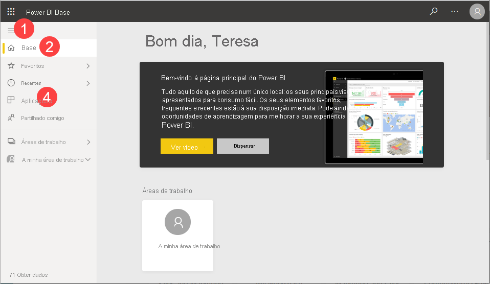

2. No ecrã **Aplicações**, selecione a aplicação de exemplo **Vendas e Marketing**.

    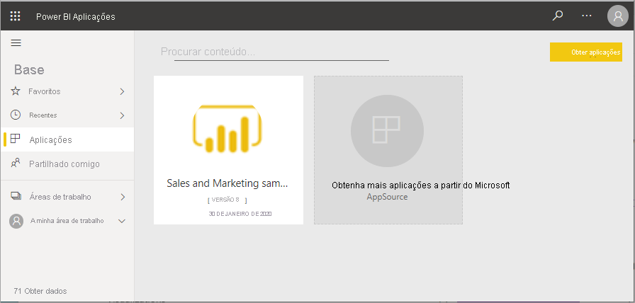

2. Selecione **Explorar a aplicação**.

    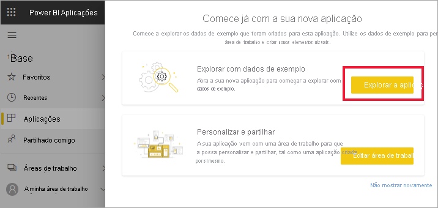

3. O serviço Power BI abre o dashboard da aplicação. Os dashboards são algo que distingue o serviço Power BI do Power BI Desktop. O exemplo também inclui um relatório e um conjunto de dados. 

    

    Enquanto *consumidor*, a maioria das aplicações que receber não irá incluir acesso direto aos conjuntos de dados subjacentes. Os conjuntos de dados estão incluídos, uma vez que os exemplos do Power BI são criados para todos os clientes do Power BI. Os seus colegas *designers* utilizam os conjuntos de dados para aprender a criar novos dashboards e relatórios. 

## Ver conteúdos (dashboards e relatórios)
Vamos começar por observar como estão organizados os conteúdos básicos (dashboards, relatórios, aplicações). Os conteúdos são apresentados dentro do contexto de uma área de trabalho. Todos os consumidores têm pelo menos uma área de trabalho. É denominada**A minha área de trabalho**. Sempre que instala uma aplicação, é criada uma área de trabalho para essa aplicação.  Uma vez que instalámos a aplicação de exemplo Vendas e Marketing, temos agora duas áreas de trabalho. 

Veja por si próprio ao selecionar **Áreas de trabalho** na navegação à esquerda. 

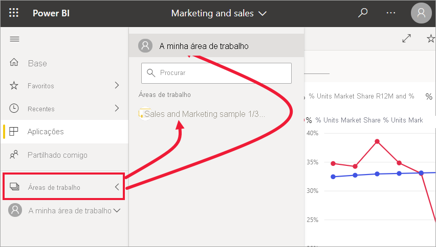

**A Minha Área de Trabalho** armazena todos os conteúdos que criou e de que é proprietário. Considere-a a sua sandbox pessoal ou uma área de trabalho para o seu próprio conteúdo. Para muitos *consumidores* do Power BI, **A minha área de trabalho** permanece vazia porque a sua tarefa não envolve criar novos conteúdos.  Por definição, os *consumidores* consomem dados criados por outros utilizadores e utilizam esses dados para tomar decisões empresariais. Se vir que está a criar conteúdos, considere ler os [artigos do Power BI para *designers*](../power-bi-creator-landing.md).

As **Áreas de trabalho da Aplicação** incluem todos os conteúdos da aplicação específica.  Quando um *designer* cria uma aplicação, este agrupa todos os conteúdos necessários para tirar proveito dessa aplicação.  Selecione a área de trabalho Vendas e Marketing para ver o que o *designer* integrou na aplicação. 

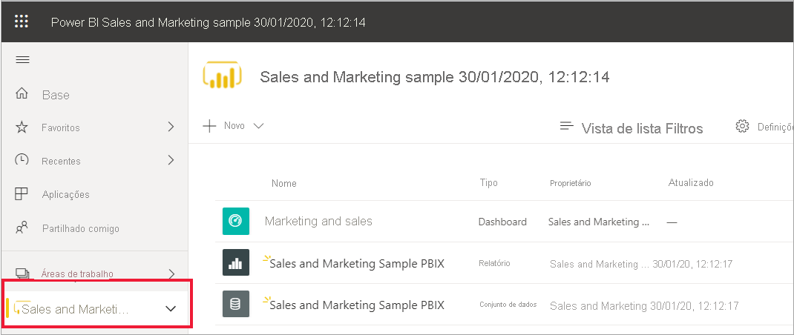

A área de trabalho da aplicação Vendas e Marketing contém um dashboard, um relatório e um conjunto de dados. Nem todas as aplicações irão conter estes três elementos de conteúdos. A aplicação pode conter apenas um dashboard ou três dashboards de cada tipo de conteúdo, ou mesmo 20 relatórios. Tudo depende de o que o *designer* incluir na aplicação. Os dados de Vendas e marketing incluem um conjunto de dados, visto que são um exemplo. No entanto, o mais comum é que as áreas de trabalho da aplicação para *consumidores* não incluam conjuntos de dados. 

Uma área de trabalho é muito mais do que uma simples listagem de conteúdos. Nesta página, pode aprender muito sobre os dashboards e relatórios da área de trabalho. Dedique alguns minutos para identificar o proprietário dos conteúdos, a data da última atualização, conteúdos relacionados e recomendações. Se a área de trabalho tiver uma descrição, essa poderá ajudá-lo a entender melhor os objetivos da área de trabalho e como pode continuar a utilizá-la para os seus objetivos empresariais. Caso a área de trabalho tenha muitos conteúdos, utilize as opções de pesquisa e de ordenação para encontrar rapidamente o que precisa.

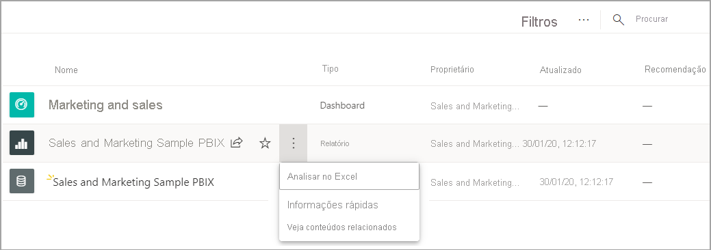

Uma área de trabalho também é uma das formas de aceder aos seus dados. Abra um dashboard ou relatório ao selecioná-lo na lista.  Adicione um dashboard ou relatório como favorito ao pairar o rato e ao selecionar o ícone de estrela. Se o *designer* lhe tiver dado [permissões de partilha](end-user-shared-with-me.md), também pode pairar com o rato para ver essa ação. 

Abra o dashboard ao selecionar o respetivo nome.

## Marcar um dashboard e um relatório como favoritos
Os **Favoritos** permitem-lhe aceder rapidamente aos conteúdos que são mais importantes para si. Acaba de aprender como adicionar um dashboard como favorito a partir de uma área de trabalho. Também pode criar favoritos diretamente a partir de um dashboard ou relatório.

1. Com o dashboard aberto, selecione **Favorito** na barra de menus.
   
   
   
   **Favorito** muda para **Anular favorito** e o ícone de estrela fica amarelo.
   
   

2. Para apresentar uma lista de todos os conteúdos que adicionou como favoritos, selecione a seta à direita de **Favoritos** no painel de navegação. Uma vez que o painel de navegação é uma funcionalidade permanente do serviço Power BI, tem acesso a esta lista a partir de qualquer local no serviço Power BI.
   
    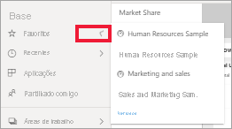
   
    Até ao momento, este utilizador do Power BI tem quatro favoritos. Os favoritos podem ser dashboards, relatórios ou aplicações.  

Para saber mais, veja [Favoritos](end-user-favorite.md)

## Localizar os seus conteúdos mais recentes

1. Tal como no caso dos Favoritos, pode ver rapidamente os conteúdos a que acedeu mais recentemente em qualquer parte do serviço Power BI ao selecionar a seta junto a **Recentes** no painel de navegação.

   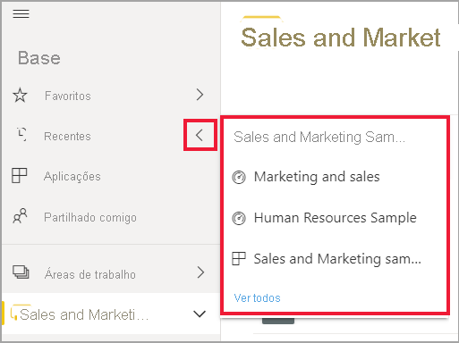

    Na lista de opções, selecione os conteúdos para os abrir.

2. Por vezes, poderá não querer apenas abrir os conteúdos recentes, mas sim ver informações ou realizar outras ações, como ver Informações ou exportar para o Excel. Nestes casos, abra o painel **Recentes** ao selecionar **Recente** ou o respetivo ícone no painel de navegação. Neste exemplo, o utilizador do Power BI tem mais do que uma área de trabalho, pelo que esta lista pode incluir conteúdos de todas as respetivas áreas de trabalho.

   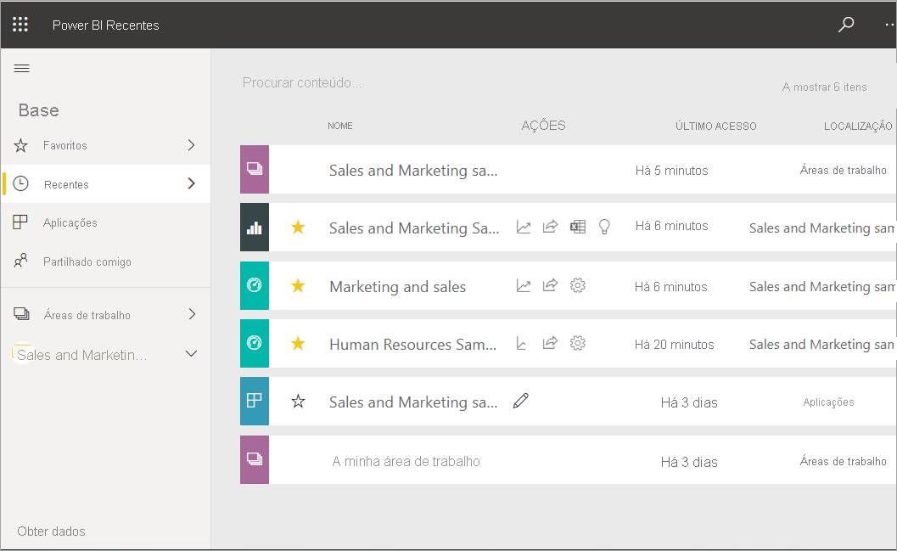

Para saber mais, veja [Recentes no Power BI](end-user-recent.md)

### Pesquisar e ordenar conteúdo
Nas primeiras vezes que utilizar o serviço do Power BI, terá poucos conteúdos. No entanto, à medida que os colegas começam a partilhar conteúdos consigo e começa a transferir aplicações, poderá ficar com longas listas de conteúdos. É nesse momento que irá perceber como é útil pesquisar e ordenar.

A pesquisa está disponível a partir de quase todas as partes do serviço do Power BI. Basta procurar a caixa de pesquisa ou o ícone de lupa de pesquisa.    

No campo Pesquisar, escreva o nome completo ou parcial de um dashboard, relatório, livro, aplicação ou proprietário. O Power BI pesquisa todos os seus conteúdos.

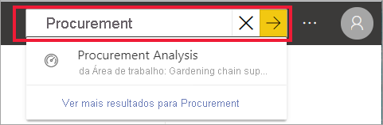

Também existem muitas formas de ordenar conteúdos. Paire o cursor sobre os cabeçalhos da coluna e procure setas que indicam que a coluna pode ser ordenada. Nem todas as colunas podem ser ordenadas. 

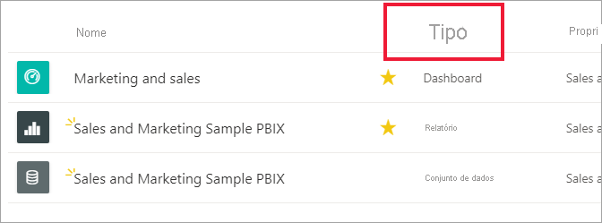

Em alternativa, procure o controlo de ordenação que está no canto superior direito da sua tela. Selecione se quer ordenar de forma ascendente ou descendente, por data, nome ou proprietário.  

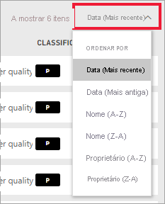

Para saber mais, veja [Power BI navigation: search and sort](end-user-search-sort.md) (Navegação no Power BI: procurar e ordenar)

## Home Page do Power BI
Vamos concluir este guia de início rápido onde começámos: na **Home Page** do Power BI. 

A Home Page reúne as ferramentas de pesquisa e ordenação, o painel de navegação e uma tela com *cartões* que pode selecionar para abrir os seus dashboards, relatórios e aplicações. Inicialmente, poderá ter poucos cartões na sua tela Home Page, mas isso irá mudar quando começar a utilizar o Power BI com os seus colegas. A sua tela Home Page também é atualizada com conteúdos recomendados e recursos de aprendizagem.

Para obter mais informações, veja [Home Page do Power BI](end-user-home.md).

## Limpar recursos
Depois de concluir este manual de início rápido, se quiser, pode eliminar o dashboard, o relatório e o conjunto de dados de exemplo.

1. Abra o serviço Power BI (app.powerbi.com) e inicie sessão.    
2. Abra a Home Page do Power BI, desloque-se para baixo até **Áreas de trabalho** e selecione *Vendas e marketing*.      

3. Paire o cursor sobre o dashboard, relatório ou conjunto de dados e selecione **Mais opções (…)**  > **Eliminar**. Repita o procedimento até que os três sejam removidos.

    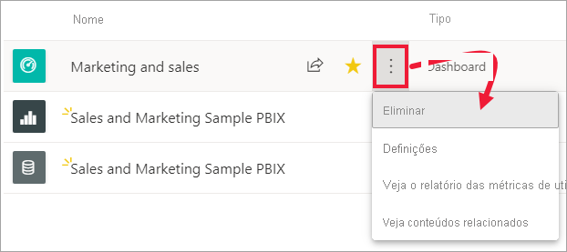

## Próximos passos

> [!div class="nextstepaction"]
> [Vista de leitura no serviço Power BI](end-user-reading-view.md)
