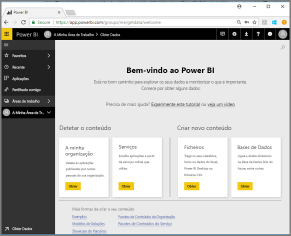

# Guia de Início Rápido: Introdução ao serviço Power BI

Agora que já conhece as noções básicas do Power BI, vamos ver como funciona o **serviço Power BI**. Conforme já foi mencionado, alguém na sua equipa poderá passar grande parte do seu tempo no **Power BI Desktop**, a combinar dados e a criar relatórios para outras pessoas. Por outro lado, poderá passar grande parte do seu tempo no serviço Power BI, a ver e interagir com conteúdos criados por outras pessoas (experiência de **consumo**). Neste guia de início rápido, irá importar dados de exemplo e utilizar esses dados para aprender a trabalhar com o serviço Power BI. 
 
## Pré-requisitos

- Se não estiver inscrito no Power BI, [inscreva-se para uma avaliação gratuita](https://app.powerbi.com/signupredirect?pbi_source=web) antes de começar.

- Leia [Conceitos básicos do serviço Power BI](end-user-basic-concepts.md)

## Abra o serviço Power BI e obtenha alguns dados
Iremos recolher alguns dados de exemplo para utilizar com o nosso guia do serviço Power BI. Fornecemos todos os tipos de dados de exemplo para que possa explorar. Desta vez, utilizaremos os dados sobre lojas de revenda.    
1. Aceda a app.powerbi.com e selecione a ligação para **Exemplos**. 

    

2. Selecione **Exemplo de Análise de Revenda > Ligar**.

    

    O serviço Power BI importa o exemplo e mostra o dashboard. Os dashboards são um elemento que distingue o serviço Power BI do Power BI Desktop. O exemplo também inclui um relatório e um conjunto de dados, que veremos mais tarde.

    

Assista à apresentação da Amanda sobre a nova experiência de navegação do serviço Power BI.  Em seguida, siga as instruções passo a passo abaixo do vídeo para explorar por si.

<iframe width="560" height="315" src="https://www.youtube.com/embed/G26dr2PsEpk" frameborder="0" allowfullscreen></iframe>

## Ver conteúdo (dashboards, relatórios, livros, conjuntos de dados, áreas de trabalho, aplicações)
Vamos começar por observar como está organizado o conteúdo básico (dashboards, relatórios, conjuntos de dados, livros). Os conteúdos são apresentados dentro do contexto de uma área de trabalho. Neste momento, terá apenas uma área de trabalho chamada **A Minha Área de Trabalho**. Normalmente, os consumidores não precisam de ou utilizam outras áreas de trabalho. A Minha Área de Trabalho armazena todos os conteúdos de que é proprietário. Considere-a a sua sandbox pessoal ou uma área de trabalho para o seu próprio conteúdo. A Minha Área de Trabalho é o local onde o exemplo de Análise de Revenda que acabou de transferir é guardado. 

Na Minha Área de Trabalho, o conteúdo está organizado em quatro separadores: Dashboards, Relatórios, Livros e Conjuntos de dados.

Selecione uma área de trabalho no painel de navegação esquerdo (navegação esquerda) e os separadores do conteúdo associado (dashboards, relatórios, livros, conjuntos de dados) preenchem o ecrã do Power BI à direita.

Se for um novo utilizador, só verá uma área de trabalho: **A Minha Área de Trabalho**.

Nesses separadores (também conhecidos como *vistas de conteúdos*), verá informações sobre os conteúdos, assim como as ações que pode realizar com esses conteúdos.  Por exemplo, a partir do separador Dashboards pode abrir um dashboard, procurar, ordenar e mais.

Abra o dashboard ao selecionar o respetivo nome.

## Marcar um dashboard e um relatório como favoritos
Os **Favoritos** permitem-lhe aceder rapidamente aos conteúdos que são mais importantes para si.  

1. Com o dashboard aberto, selecione **Favorito** no canto superior direito.
   
   
   
   **Favorito** muda para **Anular favorito** e o ícone de estrela fica amarelo.
   
   

2. Para apresentar uma lista de todos os conteúdos que adicionou como favoritos, no painel de navegação esquerdo, selecione a seta à direita de **Favoritos**. Uma vez que o painel de navegação esquerdo é uma funcionalidade permanente do serviço Power BI, tem acesso a esta lista a partir de qualquer local no serviço Power BI.
   
    
   
    Neste momento, só temos um favorito. Os favoritos podem ser dashboards, relatórios ou aplicações.  

1. Outra forma de marcar um dashboard ou um relatório como favorito é a partir do separador **Dashboards** ou **Relatórios** da vista de conteúdo.  Abra o separador **Relatórios** e selecione o ícone de estrela à esquerda do nome do relatório.
   
   

3. Abra o **painel** *Favoritos* ao selecionar **Favoritos** no painel de navegação esquerdo ou ao selecionar o ícone de estrela .
   
   
   
   Agora tem dois favoritos. Um deles é um dashboard e o outro é um relatório. Aqui, pode abrir, procurar, remover o favorito ou partilhar conteúdos com colegas.

4. Selecione o nome do relatório para o abrir no editor de relatórios.

    

Para saber mais, veja [Favoritos](end-user-favorite.md)

## Localizar os seus conteúdos mais recentes

1. Tal como no caso dos Favoritos, pode ver rapidamente os conteúdos a que acedeu mais recentemente em qualquer parte do serviço Power BI ao selecionar a seta junto a **Recentes** no painel de navegação esquerdo.

   

    Na lista de opções, selecione os conteúdos para os abrir.

2. Por vezes, poderá não querer apenas abrir os conteúdos recentes, mas sim ver informações ou realizar outras ações, como ver Informações ou exportar para o Excel. Nestes casos, abra o painel **Recentes** ao selecionar **Recente** ou o respetivo ícone no painel de navegação esquerdo. Se tiver mais do que uma área de trabalho, esta lista incluirá conteúdos de todas as suas áreas de trabalho.

   

Para saber mais, veja [Recentes no Power BI](end-user-recent.md)

### Pesquisar e ordenar conteúdo
A vista de conteúdos torna mais fácil procurar, filtrar e ordenar os conteúdos. Para procurar um dashboard, relatório ou livro, escreva na área de pesquisa. O Power BI filtra apenas o conteúdo que tenha a cadeia de pesquisa como parte do nome.

Uma vez que tem apenas um exemplo, não é necessário procurar e ordenar.  Porém, quando tiver longas listas de dashboards, relatórios, livros e conjuntos de dados, procurar e ordenar será muito útil.

Também pode ordenar o conteúdo por nome ou proprietário. Repare na seta para cima à direita de **Nome**. Estamos a ordenar 83 itens alfabeticamente pelo nome, na ordem ascendente. Para alterar a sequência de ordenação para descendente, selecione **Nome**. A seta para cima altera-se para uma seta para baixo.

Nem todas as colunas podem ser ordenadas. Paire com o cursor sobre os cabeçalhos de coluna para descobrir quais podem ser ordenados.

Para saber mais, veja [Power BI navigation: search and sort](end-user-search-sort.md) (Navegação no Power BI: procurar e ordenar)

## Limpar recursos
Depois de concluir este manual de início rápido, se desejar, pode eliminar o dashboard, o relatório e o conjunto de dados de exemplo da Análise de Revenda.

1. Abra o serviço Power BI (app.powerbi.com) e inicie sessão.    
2. No painel de navegação à esquerda, selecione **Áreas de Trabalho > A Minha Área de Trabalho**.  
    Reparou na estrela amarela a indicar que é um favorito?    
3. No separador **Dashboards**, selecione o ícone **Eliminar** de caixote do lixo junto ao dashboard Retail Analysis (Análise de Revenda).    

    

4. Selecione o separador **Relatórios** e faça o mesmo para o relatório Retail Analysis (Análise de Revenda).
1. Selecione o separador **Conjuntos de Dados** e faça o mesmo para o conjunto de dados (Análise de Revenda).

## Próximos passos

> [!div class="nextstepaction"]
> [Vista de leitura no serviço Power BI](end-user-reading-view.md)