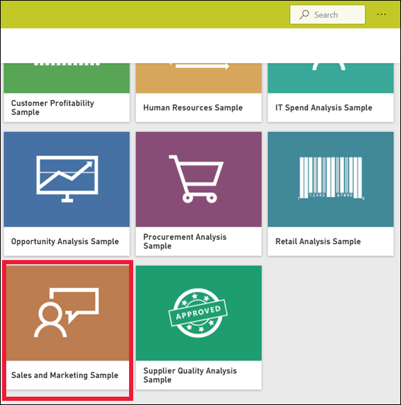
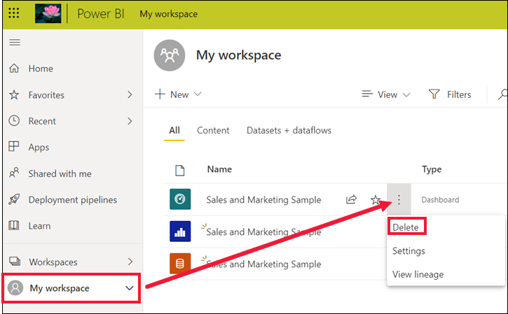

# Guia de Início Rápido: Introdução ao serviço Power BI

[!INCLUDE [power-bi-service-new-look-include](../includes/power-bi-service-new-look-include.md)]

Agora que já conhece as [noções básicas do Power BI](end-user-basic-concepts.md), vamos ver como funciona o **serviço Power BI** . Conforme já foi mencionado no artigo anterior, os colegas na sua equipa poderão passar grande parte do seu tempo no **Power BI Desktop** , a combinar dados e a criar relatórios, dashboards e aplicações para outras pessoas. Eles são *designers* . Quanto a si, poderá passar grande parte do seu tempo no serviço Power BI, a ver e interagir com conteúdos criados por outras pessoas (experiência de **consumo** ). É um *utilizador empresarial* . Este início rápido é para *utilizadores empresariais* . 

   
 
## Pré-requisitos

- Se não estiver inscrito no Power BI, [inscreva-se para uma avaliação gratuita](https://app.powerbi.com/signupredirect?pbi_source=web) antes de começar.

- Leia [Conceitos básicos do serviço Power BI](end-user-basic-concepts.md)

- A visualização de conteúdo do Power BI (relatórios, dashboards, aplicações) criado por *designers* requer uma das duas condições:
    - uma licença do Power BI Pro
    - A sua organização precisa de uma subscrição do Power BI Premium e que o conteúdo seja partilhado consigo a partir da capacidade Premium.    
    [Saiba mais sobre licenças e subscrições](end-user-license.md).     

    Para os fins deste início rápido, não estamos a exigir que nenhuma destas condições seja cumprida. A Microsoft disponibilizou-lhe diretamente o conteúdo de amostra a partir da interface do serviço Power BI. Usaremos este conteúdo de amostra para aprender a usar o serviço Power BI. 

## Abrir o serviço Power BI

Para começar, abra o serviço Power BI (app.powerbi.com). 
1. Se o painel de navegação à esquerda estiver fechado, selecione o ícone do painel de navegação  para expandi-lo. 

1. No canto inferior esquerdo, selecione **Obter dados** . Iremos recolher alguns dados de exemplo para utilizar com o nosso guia do serviço Power BI. Fornecemos todos os tipos de dados de exemplo para que possa explorar. Desta vez, utilizaremos os dados sobre marketing e vendas. 

   

1. Após abrir o ecrã **Obter dados** , selecione **Amostras** .

   

1. Selecione **Vendas e Marketing** > **Ligar** . 

   

5. O serviço Power BI instala a amostra na sua **A minha área de trabalho** .  **A minha área de trabalho** é o seu sandbox privado para aprendizagem e experimentação.  É a única pessoa que pode ver o conteúdo em **A minha área de trabalho** . A amostra inclui um dashboard, um relatório e um conjunto de dados. Normalmente, os *utilizadores empresariais* não receberão conjuntos de dados, mas esta amostra foi desenhada para todos os utilizadores e inclui um.

    

    Como *utilizador empresarial* , a maior parte do conteúdo que é partilhado consigo não incluirá acesso direto aos conjuntos de dados subjacentes. Os conjuntos de dados estão incluídos, uma vez que os exemplos do Power BI são criados para todos os clientes do Power BI.   

    Para saber mais sobre as amostras, veja [Obter amostras para o Power BI](../create-reports/sample-datasets.md).

## Ver conteúdos (dashboards e relatórios)
Os conteúdos são organizados dentro do contexto de uma área de trabalho. Todos os utilizadores empresariais têm pelo menos uma área de trabalho. É denominada **A minha área de trabalho** . Quando os colegas *designers* partilham conteúdo consigo, pode acabar com áreas de trabalho adicionais.  Por exemplo, se um *designer* lhe atribuir permissões de acesso a uma das respetivas áreas de trabalho, essa área de trabalho será mostrada no site do Power BI.  

**A Minha Área de Trabalho** armazena todos os conteúdos que criou e de que é proprietário. Considere-a a sua sandbox pessoal ou uma área de trabalho para o seu próprio conteúdo. Para muitos *utilizadores empresariais* do Power BI, **A minha área de trabalho** permanece vazia porque a tarefa não envolve criar novos conteúdos.  Por definição, os *utilizadores empresariais* consomem dados criados por outros utilizadores e utilizam esses dados para tomar decisões empresariais. Se vir que está a criar conteúdos, considere antes ler os [artigos do Power BI para *criadores de relatórios*](../index.yml).

Uma área de trabalho é muito mais do que uma simples listagem de conteúdos. Nesta página, pode aprender muito sobre os dashboards e relatórios da área de trabalho. Dedique alguns minutos para identificar o proprietário dos conteúdos, a data da última atualização, sensibilidade de dados e recomendações, se for o caso. Selecione **Mais ações (...)** para apresentar uma lista de ações para o dashboard e o relatório.   

Para saber mais, veja [Áreas de trabalho](end-user-workspaces.md).

Uma área de trabalho também é uma das formas de aceder aos seus dados. Numa área de trabalho, pode abrir um dashboard ou relatório ao selecioná-lo na lista.  Pode adicionar um dashboard ou relatório como favorito ao pairar o rato e ao selecionar o ícone de estrela. Se o *designer* lhe forneceu [permissões de partilha](end-user-shared-with-me.md), também pode partilhar aqui. 

1. Selecione o nome do dashboard para o abrir. Os dashboards são algo que distingue o serviço Power BI do Power BI Desktop. [Saiba mais sobre os dashboards](end-user-dashboards.md)

    

2. As ações que pode executar num dashboard são apresentadas na barra de menus superior.    

    

3. Passe o rato sobre um mosaico do dashboard e selecione **Mais opções (...)** para ver as opções que tem para interagir com esse mosaico.

    

4. Selecione um mosaico do dashboard para abrir o relatório que serviu para criar esse mosaico. O relatório abre-se na página que contém esse elemento visual no mosaico. Aqui, selecionei o mosaico do dashboard com o mapa de árvore. O serviço Power BI abre a página de relatório **Categoria YTD** .

    

    Os relatórios têm várias secções. À esquerda está a lista clicável de páginas de relatório. Na parte superior, está a barra de menus que contém as ações que pode executar com o relatório.  As opções disponíveis dependerão da função e da permissão que o *designer* do relatório lhe atribuiu. À direita está o painel **Filtros** . E a tela central contém o próprio relatório. Semelhante ao dashboard, há ações que pode executar para todo o relatório, para elementos visuais individuais e também para uma única página de relatório. 

    Saiba mais sobre relatórios [relatórios do Power BI](end-user-reports.md).

## Utilizar o painel de navegação à esquerda
O painel de navegação torna-se mais útil quando os colegas partilham conteúdo consigo. Nesta secção do Início rápido, colocaremos a amostra de *Vendas e marketing* de lado e examinaremos um dashboard e um relatório que pertencem a um *utilizador empresarial* do Power BI que tem muito conteúdo partilhado.

1. A **Home Page** é a página inicial predefinida quando inicia sessão no serviço Power BI. A Home Page é um ótimo ponto de partida e uma maneira alternativa de navegar no seu conteúdo. O conteúdo na Home Page é organizado por favoritos, recentes, frequentes e em destaque. A Home Page também apresenta as suas áreas de trabalho e aplicações mais recentes. Basta selecionar um item para abri-lo.

    A Home Page reúne as ferramentas de pesquisa e ordenação, o painel de navegação e uma tela com *cartões* que pode selecionar para abrir os seus dashboards, relatórios e aplicações. Inicialmente, poderá ter poucos cartões na sua tela Home Page, mas isso irá mudar quando começar a utilizar o Power BI com os seus colegas. A sua tela Home Page também é atualizada com conteúdos recomendados e recursos de aprendizagem.

   

    Para saber mais, veja [Home Page do Power BI](end-user-home.md)

2. **Favoritos** e **Recente** têm ambos setas. Selecione uma seta para ver rapidamente os cinco principais favoritos ou os cinco conteúdos visitados mais recentemente. Na lista de opções, selecione os conteúdos para os abrir. 

   

    Para ver sua lista completa de favoritos ou recentes, selecione a palavra ou o ícone. Estas listas de conteúdo fornecem detalhes adicionais sobre os relatórios, as aplicações e os dashboards.

    

    Para saber mais, veja [Recentes no Power BI](end-user-recent.md) e [Favoritos no Power BI](end-user-recent.md).

4. Selecione **Aplicações** para apresentar todas as aplicações que foram partilhadas consigo ou que tenha instalado. Selecione também **Partilhado comigo** para ver os dashboards e os relatórios partilhados consigo. Como está apenas a começar com a serviço Power BI, estas áreas de conteúdo estarão vazias. 

    Saiba mais sobre [Aplicações](end-user-apps.md) e [Partilhado comigo](end-user-shared-with-me.md).

### Pesquisar e ordenar conteúdo
Nas primeiras vezes que utilizar o serviço do Power BI, terá poucos conteúdos. Mas à medida que os colegas começam a partilhar conteúdos consigo e começa a transferir aplicações, poderá acabar por ter longas listas de conteúdos. É nesse momento que irá perceber como é útil pesquisar e ordenar.

A pesquisa está disponível a partir de quase todas as partes do serviço Power BI. Basta procurar a caixa de pesquisa ou o ícone de lupa de pesquisa.    

No campo Pesquisa, escreva o nome completo ou parcial de um dashboard, relatório, livro, aplicação ou proprietário. O Power BI pesquisa em todo o seu conteúdos.

Também existem muitas formas de ordenar conteúdos. Paire o cursor sobre os cabeçalhos da coluna e procure setas que indicam que a coluna pode ser ordenada. Nem todas as colunas podem ser ordenadas. 

Em alternativa, procure a opção **Filtros** de Pesquisa, junto ao canto superior direito das suas listas de conteúdo. Encontre conteúdo rapidamente ao selecionar o tipo de conteúdo, o proprietário ou qualquer outro campo disponível.

Para saber mais, veja [Power BI navigation: search and sort](end-user-search-sort.md) (Navegação no Power BI: procurar e ordenar)

## Localizar o proprietário
Finalmente, encerraremos este início rápido com uma dica útil. Se tiver dúvidas sobre um dashboard, relatório ou aplicação, pode contactar o proprietário. Com o conteúdo aberto, selecione a lista pendente do título para apresentar o proprietário. O proprietário pode ser uma pessoa ou um grupo.

## Limpar recursos
Depois de concluir este manual de início rápido, se quiser, pode eliminar o dashboard, o relatório e o conjunto de dados de exemplo.

1. Abra o serviço Power BI (app.powerbi.com) e inicie sessão.    
2. Abra a Home Page do Power BI, desloque-se para baixo e selecione **A minha área de trabalho** .      

3. Paire o cursor sobre o dashboard, relatório ou conjunto de dados e selecione **Mais opções (…)**  > **Eliminar** . Repita o procedimento até que os três sejam removidos.

    

## Próximas etapas

> [!div class="nextstepaction"]
> [Vista de leitura no serviço Power BI](end-user-reading-view.md)
