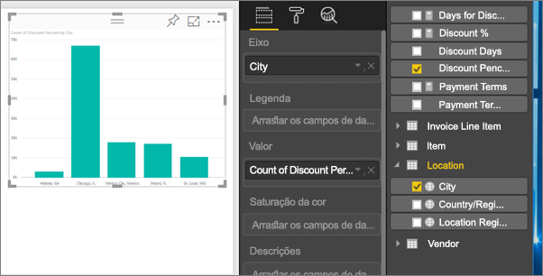
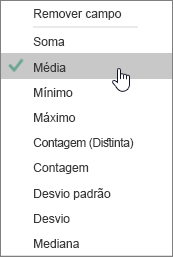
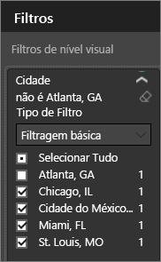
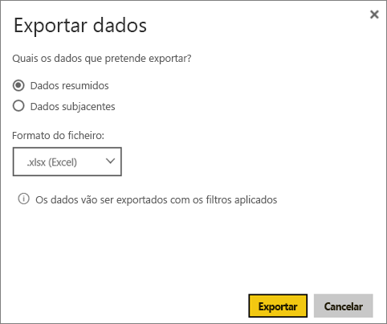

# Exportar dados de visualizações
Se pretende ver os dados que são utilizados para criar uma visualização, pode [apresentar os dados no Power BI](end-user-show-data.md) ou exportar esses dados para o Excel como um ficheiro .xlsx ou .csv.   

Veja o Will a exportar os dados a partir de uma das visualizações no seu relatório, a guardá-los como um ficheiro .xlsx e a abri-lo no Excel. Em seguida, siga as instruções passo-a-passo abaixo do vídeo para experimentar.

<iframe width="560" height="315" src="https://www.youtube.com/embed/KjheMTGjDXw" frameborder="0" allowfullscreen></iframe>

## A partir de uma visualização num dashboard do Power BI
1. Selecione as reticências no canto superior direito da visualização.

    
2. Escolha o ícone **Exportar dados**.

    
3. Os dados são exportados para um ficheiro .csv. Se o elemento visual estiver filtrado, os dados transferidos também estarão filtrados.    
4. O browser pedirá para guardar o ficheiro.  Depois de guardado, abra o ficheiro .csv no Excel.

    

## A partir de uma visualização num relatório
Para acompanhar, abra o [relatório de Exemplo de análise de aprovisionamento](../sample-procurement.md) na [Vista de edição](end-user-reading-view.md). [Adicione uma nova página em branco do relatório](../power-bi-report-add-page.md). Em seguida, siga os passos abaixo para adicionar uma agregação e um filtro de nível de visualização.

1. Crie um novo gráfico de colunas.  No painel Campos, selecione **Localização > Cidade** e **Fatura > Percentagem de desconto**.  Poderá ter de mover o campo **Percentagem de Desconto** para o conjunto de campos Valor. 

    
2. Altere a agregação para **Percentagem de desconto** de **Contagem** para **Média**. Na área Valor, selecione a seta à direita de **Percentagem de desconto** (poderá dizer **Contagem de Percentagem de Desconto**) e escolha **Média**.

    
3. Adicione um filtro a **Cidade** para remover **Atlanta**.

   

   Agora, estamos prontos para experimentar ambas as opções para exportar dados. 

4. Selecione as reticências no canto superior direito da visualização. Escolha **Exportar dados**.

   
5. No Power BI Online, se a sua visualização tiver uma agregação (um exemplo seria se tivesse alterado a **Contagem** para *média*, **soma** ou *mínimo*), terá duas opções: **Dados resumidos** e **Dados subjacentes**. No Power BI Desktop, só terá a opção **Dados resumidos**.Para obter ajuda para compreender agregados, veja [Agregados no Power BI](../service-aggregates.md).

    
6. Selecione **Dados resumidos** > **Exportar** e escolha .xlsx ou .csv. O Power BI exporta os dados.  Se tiver aplicado filtros à visualização, os dados exportados irão exportar como filtrados. Quando seleciona **Exportar**, o browser pede-lhe para guardar o ficheiro. Depois de guardado, abra o ficheiro no Excel.

   **Dados resumidos**: selecione esta opção se quiser exportar dados do que vê nesse elemento visual.  Este tipo de exportação mostra-lhe apenas os dados (colunas e medidas) que escolhe para criar o elemento visual.  Se o elemento visual tiver uma agregação, irá exportar os dados agregados. Por exemplo, se tiver um gráfico de barras que mostra 4 barras, irá obter 4 linhas de dados. Os dados resumidos estão disponíveis como .xlsx e .csv.

   Neste exemplo, a nossa exportação de Excel mostra um total para cada cidade. Uma vez que filtrámos Atlanta, este campo não está incluído nos resultados.  A primeira linha da nossa folha de cálculo mostra os filtros que foram utilizados quando extraímos os dados do Power BI.

   
7. Agora, experimente selecionar **Dados subjacentes** > **Exportar** e escolher .xlsx. O Power BI exporta os dados. Se tiver aplicado filtros à visualização, os dados exportados irão exportar como filtrados. Quando seleciona **Exportar**, o browser pede-lhe para guardar o ficheiro. Depois de guardado, abra o ficheiro no Excel.

   >[!WARNING]
   >Exportar dados subjacentes permite aos utilizadores ver todos os dados detalhados – todas as colunas nos dados. Os administradores do serviço Power BI podem desativar esta definição para a sua organização. Se for proprietário de um conjunto de dados, pode definir as colunas proprietárias como "ocultas", para que não sejam apresentadas na lista de campos no Desktop ou no serviço Power BI.

   **Dados subjacentes**: selecione esta opção se quiser ver os dados no elemento visual ***e*** dados adicionais do modelo (veja o gráfico abaixo para obter detalhes).  Se a sua visualização tiver uma agregação, selecionar *Dados subjacentes* removerá a mesma. Quando seleciona **Exportar**, os dados são exportados para um ficheiro .xlsx e o browser pede-lhe para guardar o ficheiro. Depois de guardado, abra o ficheiro no Excel.

   Neste exemplo, a nossa exportação de Excel mostra uma linha para cada linha de Cidade no nosso conjunto de dados e a percentagem de desconto para essa entrada individual. Por outras palavras, os dados são simplificados e não agregados. A primeira linha da nossa folha de cálculo mostra os filtros que foram utilizados quando extraímos os dados do Power BI.  

   

## Exportar detalhes de dados subjacentes
O que vê quando seleciona **Dados subjacentes** pode variar. Poderá precisar da ajuda do seu Administrador ou departamento de TI para compreender estes detalhes. No Power BI Desktop ou no serviço Power BI, na vista de relatório, é apresentada uma *medida* na lista Campos com um ícone de calculadora . As medidas são criadas no Power BI Desktop e não no serviço Power BI.

| O elemento visual contém |                                                                              O que verá na exportação                                                                              |
|-----------------|-------------------------------------------------------------------------------------------------------------------------------------------------------------------------------------|
|   Agregados    |                                                 O *primeiro* agregado e dados não ocultos da tabela inteira desse agregado                                                  |
|   Agregados    | Dados relacionados: se o elemento visual utilizar dados de outras tabelas de dados que estão *\*\*relacionados*\* com a tabela de dados que contém o agregado (desde que a relação seja \*:1 ou 1:1) |
|    Medidas     |                                      Todas as medidas no elemento visual *e* todas as medidas da tabela de dados que contém uma medida utilizada no elemento visual                                      |
|    Medidas     |                                       Todos os dados não ocultos de tabelas que contêm essa medida (desde que essa relação seja \*:1 ou 1:1)                                       |
|    Medidas     |                                      Todos os dados de todas as tabelas que estão relacionados com tabelas que contêm as medidas através de uma cadeia \*:1 ou 1:1                                      |
|  Apenas medidas  |                                                   Todas as colunas não ocultas de todas as tabelas relacionadas (para expandir a medida)                                                   |
|  Apenas medidas  |                                                             Dados resumidos de todas as linhas duplicadas de medidas de modelo.                                                              |

## Limitações e considerações
* O número máximo de linhas que podem ser exportadas do **Power BI Desktop** e do **serviço Power BI** para .csv é 30 000.
* O número máximo de linhas que podem ser exportadas para .xlsx é 150.000.
* Exportar com os *Dados subjacentes* não irá funcionar se a origem de dados for uma ligação em direto do Analysis Services e a versão for mais antiga que 2016 e as tabelas no modelo não tiverem uma chave exclusiva.  
* Exportar com os *Dados subjacentes* não irá funcionar se a opção *Mostrar itens sem dados* estiver ativada para a visualização a ser exportada.
* Ao utilizar DirectQuery, a quantidade máxima de dados que podem ser exportados é 16 MB. Esta limitação pode ter como consequência exportar menos do que o número máximo de linhas, sobretudo se existirem muitas colunas, os dados serem difíceis de comprimir e outros fatores que aumentam o tamanho do ficheiro e diminuem o número de linhas exportadas.
* Se o elemento visual utilizar dados de mais do que uma tabela de dados e se não existir uma relação entre essas tabelas no modelo de dados, só serão exportados os dados da primeira tabela. 
* Atualmente, não são suportados elementos visuais personalizados e elementos visuais R.
* A exportação de dados não está disponível para utilizadores fora da sua organização que utilizem um dashboard que foi partilhado com os mesmos. 
* No Power BI, é possível mudar o nome de um campo (coluna) ao fazer duplo clique no campo e escrever um novo nome.  Este novo nome é designado por *alias*. Um relatório do Power BI pode ficar com nomes de campos duplicados, mas o Excel não permite duplicados.  Por isso, quando os dados são exportados para o Excel, os alias dos campos são revertidos para os respetivos nomes de campos (colunas) originais.  
* Se existir um caráter unicode no ficheiro .csv, o texto no Excel pode não aparecer corretamente. Contudo, se abrir o ficheiro no Bloco de notas, o texto será apresentado corretamente. Exemplos de carateres unicode são símbolos de moeda e palavras estrangeiras. A solução para este problema consiste em importar o ficheiro csv para o Excel, em vez de abrir o csv diretamente. Para tal:

  1. Abrir o Excel
  2. No separador **Dados**, selecione **Obter dados externos** > **Do texto**.
* Os administradores do Power BI têm a capacidade de desativar a exportação de dados.

## Passos seguintes
[Dashboards no Power BI](end-user-dashboards.md)  
[Relatórios no Power BI](end-user-reports.md)  
[Power BI - Conceitos Básicos](end-user-basic-concepts.md)

Mais perguntas? [Experimente perguntar à Comunidade do Power BI](http://community.powerbi.com/)

