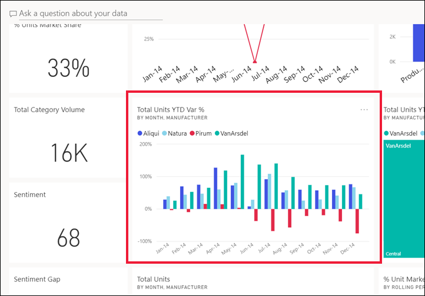
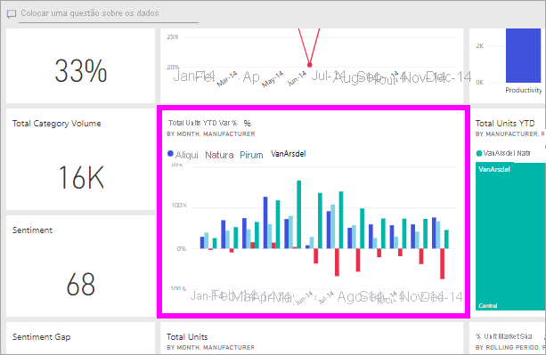

# Exportar dados de um visual

[!INCLUDE[consumer-appliesto-yyny](../includes/consumer-appliesto-yyny.md)]

Para ver os dados que são utilizados para criar um elemento visual, [poderá apresentar os dados no Power BI](end-user-show-data.md) ou exportá-los para o Excel. Este artigo mostra-lhe como exportar para o Excel.

A exportação de dados para o Excel requer uma licença Power BI Pro, ou para que o dashboard ou relatório seja partilhado consigo utilizando a capacidade Premium. Para saber mais, veja [Qual é a minha licença?](end-user-license.md). 

> [!IMPORTANT]
> Se não conseguir exportar para o Excel, é possível que o autor do relatório ou o seu administrador de Power BI tenha desativado esta funcionalidade. Isto é muitas vezes feito para proteger os dados privados.

## Dados de exportação de um visual num dashboard

1. Comece num dashboard do Power BI. Aqui, estamos a utilizar o dashboard da aplicação de ***exemplo Marketing e vendas** _. Pode [transferir esta aplicação em AppSource.com](https://appsource.microsoft.com/en-us/product/power-bi/microsoft-retail-analysis-sample.salesandmarketingsample).

    

2. Paire o cursor sobre um elemento visual para ver _ *Mais opções** (...) e clique para apresentar o menu de ação.

    

3. Selecione **Exportar para .csv**.

4. O que acontece a seguir depende do browser que estiver a utilizar. Poderá ser-lhe solicitado que guarde o ficheiro ou pode ver uma ligação para o ficheiro exportado na parte inferior do browser. Por predefinição, a exportação é guardada na pasta Transferências local. 

    

5. Abra um ficheiro no Excel. 

    > [!NOTE]
    > Se não tiver permissões para os dados, não poderá exportar ou abrir no Excel. Contacte o proprietário do painel ou o administrador power BI para solicitar permissões de exportação. 

    

## Dados de exportação de um relatório
Pode exportar dados de um elemento visual num um relatório com o formato .csv ou .xlsx (Excel). 

1. Num dashboard, selecione um mosaico para abrir o relatório subjacente.  Neste exemplo, estamos a selecionar o mesmo elemento visual de acima, *Total de Unidades Ano Até à Data % Var*. 

    

    Dado que este mosaico foi criado no relatório *Exemplo de Vendas e Marketing*, é este relatório que é aberto. O relatório é aberto na página que contém o elemento visual do mosaico selecionado. 

2. Selecione o elemento visual no relatório. Repare no painel **Filtros** à direita. Este elemento visual tem filtros aplicados. Para saber mais sobre os filtros, veja [Utilizar filtros num relatório](end-user-report-filter.md).

    

3. Selecione **Mais opções (...)** no canto superior direito da visualização. Escolha **Exportar dados**.

    

4. Verá opções para exportar dados resumidos ou dados subjacentes. Se estiver a utilizar a aplicação *Exemplo de Vendas e marketing*, os **Dados subjacentes** estarão desativados. São necessárias permissões adicionais para ver mais dados do que os apresentados no visual (dados subjacentes). Estas permissões protegem os dados de serem indevidamente vistos, reutilizados ou partilhados com qualquer pessoa que não seja o público pretendido.

    **Dados resumidos**: selecione esta opção se quiser exportar dados do que vê atualmente no elemento visual.  Este tipo de exportação mostra-lhe apenas os dados que foram utilizados para criar o estado atual do elemento visual. Se o elemento visual tiver filtros aplicados, os dados exportados também serão filtrados. Por exemplo, para este elemento visual, a sua exportação incluirá apenas os dados para 2014 e para a região central, e apenas os dados para quatro dos fabricantes: VanArsdel, Natura, Aliqui e Pirum. Se o seu elemento visual tiver agregações (soma, média, entre outros), a exportação também será agregada. 
  

    **Dados subjacentes**: selecione esta opção se desejar exportar dados para o que vê no elemento visual **além** de dados adicionais do conjunto de dados subjacente.  Tal pode incluir dados contidos no conjunto de dados, mas não utilizados no elemento visual. Se o elemento visual tiver filtros aplicados, os dados exportados também serão filtrados.  Se o seu elemento visual tiver agregações (soma, média, entre outros), a exportação irá remover a agregação, simplificando os dados. 

    

5. O que acontece a seguir depende do browser que estiver a utilizar. Poderá ser-lhe solicitado que guarde o ficheiro ou pode ver uma ligação para o ficheiro exportado na parte inferior do browser. Se estiver a utilizar a aplicação do Power BI no Microsoft Teams, o ficheiro exportado é guardado na pasta Transferências local. 

    

    > [!NOTE]
    > Se não tiver permissões para os dados, não poderá exportar ou abrir no Excel. Contacte o proprietário do relatório ou o seu administrador power bi para solicitar permissões de exportação. 

6. Abra um ficheiro no Excel. Compare a quantidade de dados exportados para o que exportamos a partir do mesmo visual no painel de instrumentos. A diferença é que esta exportação inclui **Dados subjacentes**. 

    

## Considerações e resolução de problemas
Há muitas considerações relacionadas com a exportação para o Excel. Esta é uma daquelas funcionalidades que os designers de relatórios e administradores de Power BI podem desativar para indivíduos ou mesmo para toda uma organização. Fazem isto para garantir que os dados privados não sejam expostos ao público errado. 

Se descobrir que não consegue utilizar esta funcionalidade, contacte o titular do relatório e o seu administrador para perceber por que razão não consegue exportar dados de um determinado visual ou de todos os visuais. Pode ser que esta funcionalidade tenha sido propositadamente desativada e talvez possam ser ativadas para si.  Outras vezes, pode haver razões particulares para uma exportação não funcionar.  Pode estar relacionado com permissões, conteúdos de dados, tipo de dados, tipo visual, como o designer nomeou os campos, e muito mais. Ao contactar o titular ou administrador do relatório, encaminhe-os para estes artigos: Configurações de [inquilinos administrativos,](../guidance/admin-tenant-settings.md) [segurança ao nível da linha](../admin/service-admin-rls.md)e [proteção de dados](../admin/service-security-data-protection-overview.md).

- Há um limite para o número de linhas que podem ser exportadas para o Excel.  Para .xlsx ficheiros, o limite é de 150.000 linhas.  Para .csv ficheiros, o limite é de 30.000 linhas. 

- O conjunto de dados pode ter RLS (segurança de nível de função) aplicado aos dados. Isto significa que alguns dados podem estar escondidos de si porque não é apropriado para si vê-lo.  Por exemplo, se você é um gestor de pessoas, o conjunto de dados de RH pode ter RLS aplicado que apenas lhe permite ver dados para funcionários que reportam diretamente a você. 

- Certos tipos de visuais não são suportados. Estes incluem visuais personalizados, visuais R, e muito mais. 

## Passos seguintes

[Apresentar os dados utilizados para criar um elemento visual](end-user-show-data.md)