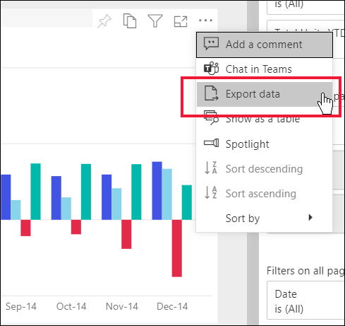
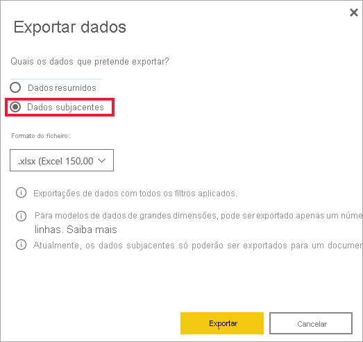

# Exportar dados de um visual

[!INCLUDE[consumer-appliesto-yyny](../includes/consumer-appliesto-yyny.md)]

[!INCLUDE [power-bi-service-new-look-include](../includes/power-bi-service-new-look-include.md)]

Para ver os dados que são utilizados para criar um elemento visual, [poderá apresentar os dados no Power BI](end-user-show-data.md) ou exportá-los para o Excel. A opção para exportar os dados requer um certo tipo de licença ou permissões de edição para o conteúdo. Se não conseguir exportar, contacte o administrador do Power BI ou o suporte técnico de TI. 

A exportação de dados requer uma licença do Power BI Pro ou que o dashboard ou relatório seja partilhado consigo através da capacidade Premium. Para saber mais, veja [Qual é a minha licença?](end-user-license.md). O autor do relatório poderá ter desativado a exportação de dados do relatório. Se não conseguir exportar dados, contacte o autor do relatório.

## A partir de um elemento visual num dashboard do Power BI

1. Comece num dashboard do Power BI. Aqui, estamos a utilizar o dashboard da aplicação de ***exemplo Marketing e vendas** _. Pode [transferir esta aplicação em AppSource.com](https://appsource.microsoft.com/en-us/product/power-bi/microsoft-retail-analysis-sample.salesandmarketingsample
).

    

2. Paire o cursor sobre um elemento visual para ver _ *Mais opções** (...) e clique para apresentar o menu de ação.

    

3. Selecione **Exportar para .csv**.

4. O que acontece a seguir depende do browser que estiver a utilizar. Poderá ser-lhe solicitado que guarde o ficheiro ou pode ver uma ligação para o ficheiro exportado na parte inferior do browser. 

    

5. Abra um ficheiro no Excel. 

    > [!NOTE]
    > Se não tiver permissões para os dados, não poderá exportar ou abrir no Excel.  

    

## A partir de um elemento visual num relatório
Pode exportar dados de um elemento visual num um relatório com o formato .csv ou .xlsx (Excel). 

1. Num dashboard, selecione um mosaico para abrir o relatório subjacente.  Neste exemplo, estamos a selecionar o mesmo elemento visual de acima, *Total de Unidades Ano Até à Data % Var*. 

    

    Dado que este mosaico foi criado no relatório *Exemplo de Vendas e Marketing*, é este relatório que é aberto. O relatório é aberto na página que contém o elemento visual do mosaico selecionado. 

2. Selecione o elemento visual no relatório. Repare no painel **Filtros** à direita. Este elemento visual tem filtros aplicados. Para saber mais sobre os filtros, veja [Utilizar filtros num relatório](end-user-report-filter.md).

    

3. Selecione **Mais opções (...)** no canto superior direito da visualização. Escolha **Exportar dados**.

    

4. Verá as opções para exportar Dados resumidos ou Dados subjacentes. Se estiver a utilizar a aplicação *Exemplo de Vendas e marketing*, os **Dados subjacentes** estarão desativados. No entanto, pode encontrar relatórios onde ambas as opções estejam ativadas. Eis uma explicação da diferença.

    **Dados resumidos**: selecione esta opção se quiser exportar dados do que vê atualmente no elemento visual.  Este tipo de exportação mostra-lhe apenas os dados que foram utilizados para criar o estado atual do elemento visual. Se o elemento visual tiver filtros aplicados, os dados exportados também serão filtrados. Por exemplo, para este elemento visual, a sua exportação incluirá apenas os dados para 2014 e para a região central, e apenas os dados para quatro dos fabricantes: VanArsdel, Natura, Aliqui e Pirum. Se o seu elemento visual tiver agregações (soma, média, entre outros), a exportação também será agregada. 
  

    **Dados subjacentes**: selecione esta opção se desejar exportar dados para o que vê no elemento visual **além** de dados adicionais do conjunto de dados subjacente.  Tal pode incluir dados contidos no conjunto de dados, mas não utilizados no elemento visual. Se o elemento visual tiver filtros aplicados, os dados exportados também serão filtrados.  Se o seu elemento visual tiver agregações (soma, média, entre outros), a exportação irá remover a agregação, simplificando os dados. 

    

5. O que acontece a seguir depende do browser que estiver a utilizar. Poderá ser-lhe solicitado que guarde o ficheiro ou pode ver uma ligação para o ficheiro exportado na parte inferior do browser. 

    

    > [!NOTE]
    > Se não tiver permissões para os dados, não poderá exportar ou abrir no Excel.  

6. Abra um ficheiro no Excel. Compare a quantidade de dados exportados com os dados que exportámos a partir do mesmo elemento visual no dashboard. A diferença é que esta exportação inclui **Dados subjacentes**. 

    

## Passos seguintes

[Apresentar os dados utilizados para criar um elemento visual](end-user-show-data.md)