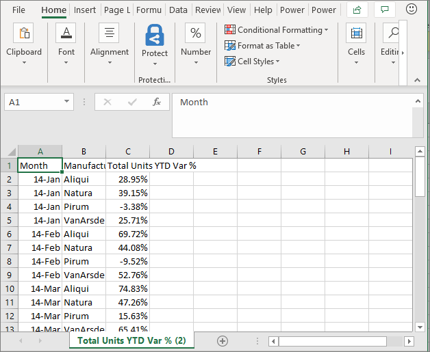

# Exportar os dados do visual
Se gostaria de ver os dados que são utilizados para criar um elemento visual, [pode exibir esses dados no Power BI](end-user-show-data.md) ou exportar esses dados para o Excel. A opção para exportar os dados requer um determinado tipo ou licença e editar permissões para o conteúdo. Se não conseguir exportar, contacte o administrador do Power BI. 

## A partir de um elemento visual no dashboard do Power BI

1. Comece no dashboard do Power BI. Aqui, estamos usando o dashboard a partir da ***exemplo de Marketing e venda*** aplicação. Pode [transferir esta aplicação AppSource.com](https://appsource.microsoft.com/en-us/product/power-bi/microsoft-retail-analysis-sample.salesandmarketingsample-preview?flightCodes=e2b06c7a-a438-4d99-9eb6-4324ce87f282).

    

2. Coloque o cursor sobre um elemento visual para revelar as reticências (...) e clique para exibir o menu de ação.

    

3. Selecione **exportar para Excel**.

4. O que acontece em seguida depende do browser que está a utilizar. Poderá ser-lhe pedido para guardar o ficheiro ou seu Maio vir uma ligação para o arquivo exportado na parte inferior do navegador. 

    

5. Abra o ficheiro no Excel.  

    

## A partir de um elemento visual num relatório
Pode exportar dados a partir de um elemento visual num relatório como. csv ou. xlsx (Excel) formato. 

1. Num dashboard, selecione um mosaico para abrir o relatório subjacente.  Neste exemplo, vamos selecionar o mesmo elemento visual acima, como *% do Total de unidades de YTD Var*. 

    

    Uma vez que este mosaico foi criado a partir da *exemplo vendas e Marketing* relatório, o que é o relatório que é aberta. Além disso, ele abre a página que contém o elemento visual de mosaico selecionado. 

2. Selecione o mosaico no relatório. Observe que o **filtros** painel à direita. Este elemento visual tem filtros aplicados. Para saber mais sobre os filtros, veja [utilizar os filtros num relatório](end-user-report-filter.md).

    

3. Selecione as reticências no canto superior direito da visualização. Escolher **exportar dados**.

    

4. Verá as opções para exportar dados Summarized ou de dados subjacente. Se estiver a utilizar o *exemplo vendas e marketing* aplicação, **dados subjacentes** será desativada. Mas pode encontrar relatórios em que ambas as opções estão ativadas. Aqui está uma explicação sobre a diferença.

    **Dados resumidos**: selecione esta opção se pretender exportar dados para o que vê no elemento visual.  Este tipo de exportação mostra apenas os dados que foi utilizados para criar o elemento visual. Se o elemento visual tem filtros aplicados, os dados, exportar também estarão filtrados. Por exemplo, para este elemento visual, a exportação irá incluir apenas dados de 2014 e a região central e apenas os dados para quatro dos fabricantes: VanArsdel, Natura, a Aliqui e Prirum.
  

    **Dados subjacentes**: selecione esta opção se pretender exportar dados para o que vê no elemento visual **plus** dados adicionais do conjunto de dados subjacente.  Isto pode incluir dados que estão contidos no conjunto de dados, mas não utilizados no elemento visual. 

    

5. O que acontece em seguida depende do browser que está a utilizar. Poderá ser-lhe pedido para guardar o ficheiro ou seu Maio vir uma ligação para o arquivo exportado na parte inferior do navegador. 

    

7. Abra o ficheiro no Excel. Compare a quantidade de dados exportados para os dados que exportou a partir do mesmo elemento visual no dashboard. A diferença é que esta exportação inclui **dados subjacentes**. 

    

