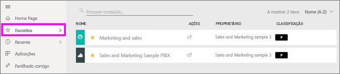
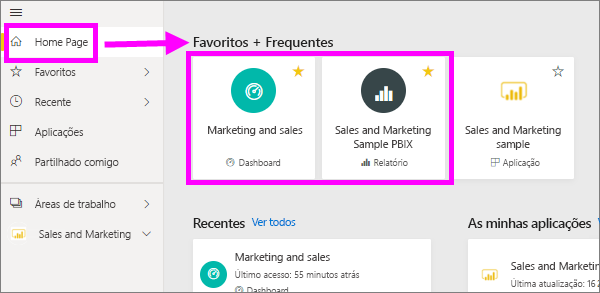
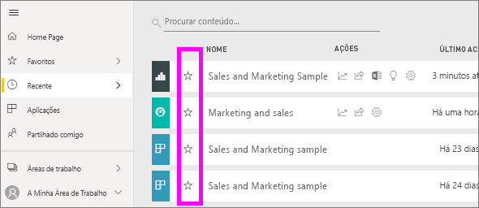
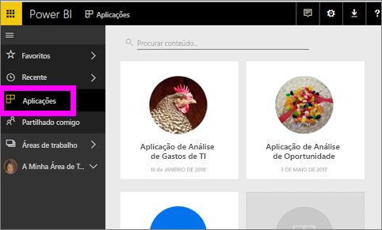
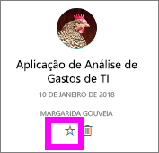
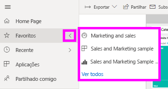
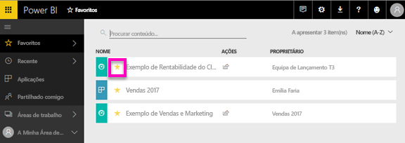

# Marcar dashboards, relatórios e aplicações como favoritos no serviço Power BI
Ao tornar um conteúdo *favorito*, poderá aceder ao mesmo rapidamente na lista de conteúdos **Favoritos** e na **Home Page do Power BI** > **Favoritos + frequentes**.  Os favoritos são conteúdos aos quais acede com mais frequência e são identificados com uma estrela amarela.

   

   

Também pode selecionar um único dashboard como um [dashboard em destaque](end-user-featured.md) no serviço Power BI.

## Adicionar um dashboard ou relatório como *favorito*

1. Abra um dashboard ou relatório que utiliza frequentemente. Até os conteúdos que foram partilhados consigo podem ser marcados como *favoritos*.

2. No friso superior do serviço Power BI, selecione **Favorito** ou o ícone de estrela .
   
   
   
   Também pode partilhar um dashboard ou um relatório de qualquer local que apresente o ícone de estrela, como Home Page, Recentes, Aplicações e Partilhado comigo. 
   
   

## Adicionar uma aplicação como *favorita*

1. No painel de navegação, selecione **Aplicações**.

   

2. Paire o rato sobre uma aplicação para apresentar mais detalhes.  Selecione o ícone de estrela   para definir como favorito.
   
   

## Trabalhar com *favoritos*
1. Para aceder aos favoritos, selecione a seta de lista de opções à direita de **Favoritos**.  Aqui pode selecionar um item favorito para o abrir. São listados apenas cinco favoritos (por ordem alfabética). Se tiver mais de cinco, selecione **Ver tudo** para abrir a lista de conteúdos favoritos (ver o passo 2, abaixo). 
   
   
2. Para ver **todos** os conteúdos adicionados aos favoritos, no painel de navegação esquerdo selecione **Favoritos** ou o ícone Favoritos .  
   
    
   
   Aqui pode realizar várias ações: abrir, identificar os proprietários e até partilhar com os seus colegas.

## Remover conteúdos dos favoritos
Já não precisa de utilizar um relatório com tanta frequência?  Pode anulá-lo como favorito. Ao remover conteúdos dos favoritos, estes são removidos da sua lista Favoritos, mas não do Power BI.

1. No painel de navegação esquerdo, selecione **Favoritos** para abrir o ecrã **Favoritos**.
   
   
2. Selecione a estrela amarela junto aos conteúdos que pretende remover dos favoritos.

> [!NOTE]
> também pode remover um dashboard, relatório ou até uma aplicação dos favoritos. Basta abrir e desselecionar o ícone amarelo.   
> 
> 
## Limitações e considerações
Atualmente, ao tornar uma aplicação favorita, todos os relatórios e dashboards dessa aplicação tornam-se automaticamente favoritos. Não é possível marcar os relatórios ou dashboards individuais de uma aplicação como favoritos. 

## Próximos passos
[Power BI - Conceitos Básicos](end-user-basic-concepts.md)

Mais perguntas? [Pergunte à Comunidade do Power BI](http://community.powerbi.com/)

