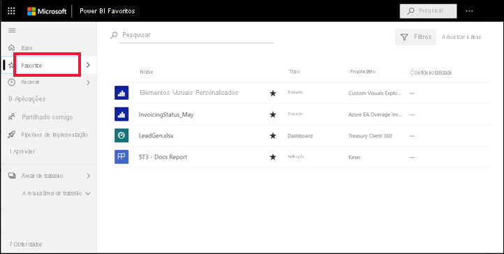
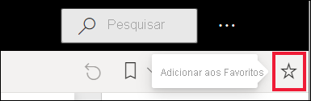
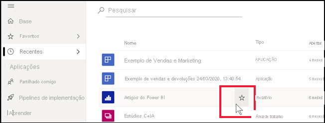
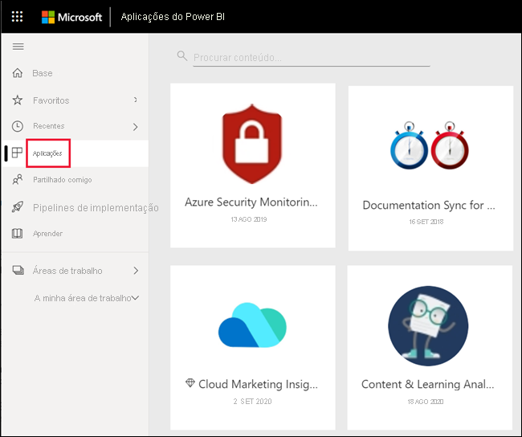
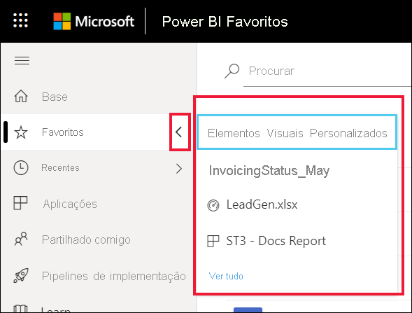
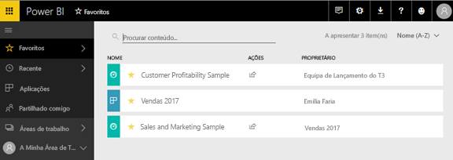
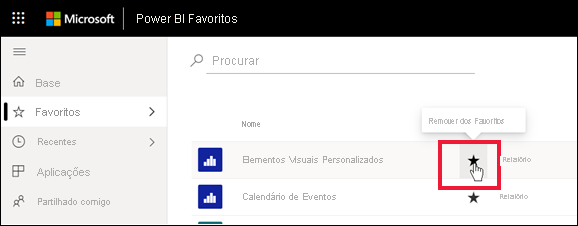

# Marcar dashboards, relatórios e aplicações como favoritos no serviço Power BI

[!INCLUDE[consumer-appliesto-yyny](../includes/consumer-appliesto-yyny.md)]

Ao marcar um conteúdo como *favorito*, poderá aceder ao mesmo rapidamente na lista de conteúdos **Favoritos** e na **Home Page do Power BI** > **Favoritos + Frequentes**. Os favoritos são conteúdos aos quais acede com mais frequência e são identificados com uma estrela preenchida.

   

   

## Adicionar um dashboard ou relatório como favorito

1. Abra um dashboard ou relatório que utiliza frequentemente. Até os conteúdos que foram partilhados consigo podem ser marcados como favoritos.

2. Na barra de menus superior do serviço Power BI, selecione **Favorito** ou o ícone de estrela .
   
   
   
   Também pode partilhar um dashboard ou um relatório de qualquer local que apresente o ícone de estrela, como Home Page, Recentes, Aplicações e Partilhado comigo. 
   
   

## Adicionar uma aplicação como favorita

1. No painel de navegação, selecione **Aplicações**.

   

2. Paire o rato sobre uma aplicação para apresentar mais detalhes. Selecione o ícone de estrela  para definir como favorito.
   
   

## Trabalhar com favoritos
1. Para aceder aos favoritos, selecione a seta de lista de opções à direita de **Favoritos**. A partir daí, pode selecionar um favorito para o abrir. São listados até cinco favoritos por ordem alfabética. Se tiver mais de cinco, selecione **Ver tudo** para abrir a lista de conteúdos favoritos. 
   
   
2. Para ver todos os conteúdos que adicionou como favoritos, no painel de navegação, selecione **Favoritos** ou o ícone de Favoritos  . 
   
    
   
   A partir daí, pode realizar outras ações. Pode abrir um favorito, identificar os proprietários e até partilhar favoritos com os seus colegas.

## Remover conteúdos dos favoritos
Se já não utilizar um relatório tanto como antes, pode removê-lo dos favoritos. Quando remove conteúdos dos favoritos, estes são removidos da lista Favoritos, mas não do Power BI.

1. No painel de navegação, selecione **Favoritos** para abrir o ecrã **Favoritos**.
   
   
2. Selecione a estrela preta junto aos conteúdos que pretende remover dos favoritos.

> [!NOTE]
> Também pode anular o favorito de um dashboard, relatório ou aplicação. Basta abrir e selecionar a estrela preta para a transformar numa estrela branca. 
> 
> 
## Limitações e considerações
Atualmente, ao tornar uma aplicação favorita, todos os relatórios e dashboards dessa aplicação tornam-se automaticamente favoritos. Não é possível marcar dashboards ou relatórios de aplicações individuais como favoritos. 

## Passos seguintes
- [Power BI: conceitos básicos](end-user-basic-concepts.md)
- Mais perguntas? Experimente perguntar à [Comunidade do Power BI](https://community.powerbi.com/).

